# 1. IT 사업 기획 이해하기
## DX/AX 이해

### DX
#### [ 기본 개념 ]
기업에서 발생하는 모든 일과 서비스를 IT의 기술을 이용해서 더 편리하게, 더 효율적으로 만들어내는 것

#### [ 기본 목적 ]
- 비용 절감 : 사람이 하는 일을 IT를 통해 자동화하여 인건비 절감 방안
- 기회 증가 : IT를 통해 기존 비즈니스의 다양한 기회 증가 (마케팅, 영업, 지원 등)
- 새로운 컨셉 : 기존의 비즈니스를 기반으로, IT를 이용한 새로운 서비스 모델 생성
- 업무 개선 : IT를 이용해 업무를 더 효율적으로 혹은 편리하게

### AX
**DX 중에 AI가 포함된 영역**

**효율성 향상**
- 반복적이고 규칙적인 업무를 AI로 자동화하여 비용 절감
- 데이터 기반의 예측 분석을 통해 미래 상황을 예측하고 적절히 조치

**새로운 가치 창출**
- AI를 통해 기존에는 불가능했던 새로운 제품과 서비스 개발
- 더불어 AI 기술을 활용하여 기존의 비즈니스 모델을 혁신하고 새로운 수익 창출 기회 생성

**경쟁력 심화**
- 차별화된 AI 기술을 활용하여 산업군에서 경쟁 우위를 확보
- 빠르게 변하는 시장 변화에 민접하게 대응하고 새로운 기회 포착

### [ 발주 입장의 DX/AX 프로세스 ]

**1. 내 비즈니스 이해**
- 내가 하는 업무의 이해 - 개선, 발전, 혁신 방향 및 서비스 방향 이해

**2. 레퍼런스 검색 및 IDEA 컨셉**
- 내가 하는 업무의 선두, 경쟁자, 유사 산업군, 다양한 IT 사례 검색 및 이를 통한 IDEA 도출

**3. IDEA 분석**
- 도출한 IDEA를 발전시키기 위한 레퍼런스 분석 및 IDEA 분석

**4. 상상력 스케치**
- 분석된 내용을 기반으로 상상력을 통한 상세한 서비스 모델 스케치

**5. IT 전문가 검토요청**
- 정리된 서비스 모델의 실현 가능성 분석 - 개발 가능 여부, 기간, 비용, 제약 등

**6. 수익성 분석**
- IDEA를 시스템화(개발) 하는데 들어가는 비용의 효율성 분석. 즉, 수익성 분석

**7. 의사 결정 및 발주 진행**
- IDEA 확인, 기술검토 완료, 비용 분석 이후 보고를 통한 진행 의사 결정 및 발주 진행

------------------------------------
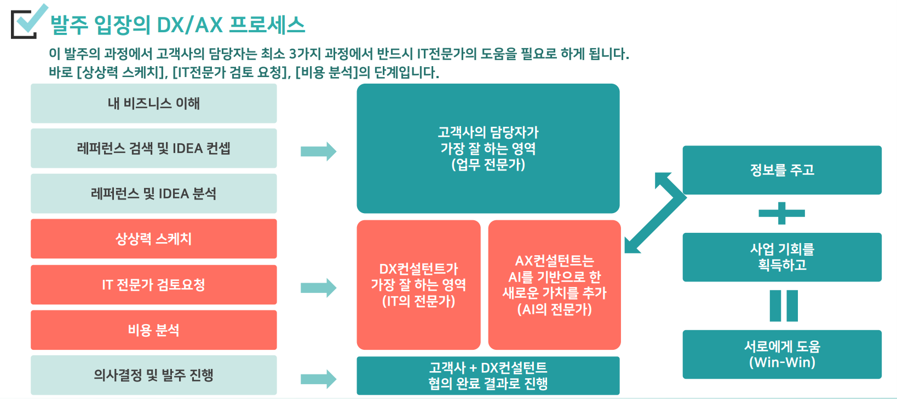

### [ DX/AX 프로세스 중 IT 전문가 지원 필요 부분 ]

**1. 상상력 스케치**
- 고객은 IT 전문가가 아니므로, 자신이 상상해 낼 수 있는 DX 기술의 한계가 있음.
- IT 전문가의 도움을 통해 보다 혁신적인 상상력을 만들어 내는 도움 필요

**2. IT 전문가 검토 요청**
- 아무리 좋은 아이디어와 상상력을 가져도, 해당 서비스에 대한 실현이 불가능하다면 아무런 의미가 없음.
- 실현 가능성과 함께 비전문가가 못보는 기술적 한계나 이슈 등을 파악하는 것이 필요함.

**3. 비용 분석**
- DX를 적용하는 데는 분명 비용적 한계가 있음.
- 기업이 보유한 예산 내에서 최적의 효율성을 보여주는 기획을 비전문가는 할 수 없음.

---------------------------------------------------
### DX/AX 컨설팅 주요 작업
**1. 상상력 스케치** - 서비스 기획
- 고객이 원하는 시스템의 가장 이상적인 형태를 비용과 실현 가능성을 검토하여 그려내는 작업
- 고객이 이해하기 쉽게 서비스(시스템) 구성도, 주요 기능 리스트 형태로 제공
- AI를 기초로 한 다양한 서비스 아이디어 적용

**2. IT 전문가 검토 요청** - 개발 검토
- 서비스 기획 진행 중 내부 개발자 및 전문가들과 소통을 진행하여, 개발의 가능 여부, 다양한 외부 업체들과 연계 검토
- 적용 가능한 최적의 서비스를 찾아냄

**3. 비용 분석** - 개발 비용 분석
- 서비스 기획에 맞춘 작업 시 발생하는 개발 공수, H/W 비용, S/W 비용, 내부 수익 등을 분석
- 고객에게 최적화된 비용을 제안

# 2. AX 컨설팅 사업 이해하기

### AX
**DX 중에 AI가 포함된 영역**

**효율성 향상**
- 반복적이고 규칙적인 업무를 AI로 자동화하여 비용 절감
- 데이터 기반의 예측 분석을 통해 미래 상황을 예측하고 적절히 조치

**새로운 가치 창출**
- AI를 통해 기존에는 불가능했던 새로운 제품과 서비스 개발
- 더불어 AI 기술을 활용하여 기존의 비즈니스 모델을 혁신하고 새로운 수익 창출 기회 생성

**경쟁력 심화**
- 차별화된 AI 기술을 활용하여 산업군에서 경쟁 우위를 확보
- 빠르게 변하는 시장 변화에 민접하게 대응하고 새로운 기회 포착

-------------------------------------

## 비즈니스 관점의 AI 차이

### [ 분석형 AI ]
- 기업이 제공하는 AI의 기술 범주 안에서 서비스 제공 가능
- **자사의 분석형 AI 기술의 범위와 차별화된 성능을 이해하는 것이 중요**
- 실제 B2B 기반 Project는 많은 경우 분석형 AI 중심
- 분석형 AI도 클라우드 기반 API 형태로 제공하기도 함

### [ 생성형 AI ]
- 생성형 AI 전문 업체가 제공하는 API 기반 기능 중심 서비스
- 특정 서비스 범주에 묶이지 않은 자유로운 서비스 기획 필요
- **생성형 AI 전문 업체가 제공하는 다양한 API 서비스 종류와 범위를 많이 아는 것이 중요**
- 기획에 적극 적용 가능하는 것이 중요 - 실제 B2B 기반 Project는 생성형 AI는 보조적인 역할

## AX 컨설팅 방법
### [ 분석형 AI VS 생성형 AI ]

**자사 기능 중심의 서비스 VS 다양한 API 활용, 아이디어 중심 서비스**

**정확도 혹은 성능을 보장하는 서비스 VS 정확도 혹은 성능 개념 없는 다양한 컨텐츠 중심의 서비스**

---------------------------------------------------------------

### [ AI 기반 서비스 기획 히스토리 ]
- 기존에는 분석형 AI, 직접 개발하는 회사의 B2B 서비스 중심
    - AI 회사라는 개념이 강했음
- 자동화, 효율성, 기능성 중심의 AI 서비스 기획
    - 자사의 AI 기술이 핵심
- AI기술 & 생성형 AI & 클라우드 발달 API 기반 AI 개발
    - 어떤 회사든 AI를 적용 가능한 형태로 변화
- [API 사용료 < 서비스 수익]이 나오는 모든 분야에 기획 제공 가능한 형태로 발전

--------------------------------------------

### [ AI 관련 채용 트랜드 ]
- 잡코리아 - AI 기획자, AI 사업전략 카테고리 추가
- 많은 AI에 관심이 높고, 많은 AI 서비스를 알고, AI를 이용해서 서비스 기획을 할 수 있는 사람을 찾음

------------------------------------------------

### [ 준비 단계 ]

**자사가 분석형 AI 시스템 회사인 경우**
- 자사의 AI 기능과 활용 범위에 대해서 깊이 있게 탐구
- 자사의 AI와 함께 적용 가능한 내부/외부 기술에 대한 탐구
- 어떤 서비스 기획이든 이 기술을 적용시키는 방법에 대한 탐구

### [ 실행 단계 ]
- 고객을 만나서 요구사항 분석
- 준비단계의 AI 기능을 적용 기초로 하는 서비스 기획
- 서비스 기획에 대한 개발팀 검증
    - 가능성, 비용
- 해당 서비스에 반드시 자사의 AI가 들어가야 하는 당위성 설계
    - 비용, 성능, 기능 등

-------------------------------

## AX 관점의 AI 기획

### [ AX 관점 AI 기획 큰 그림 ] p.42
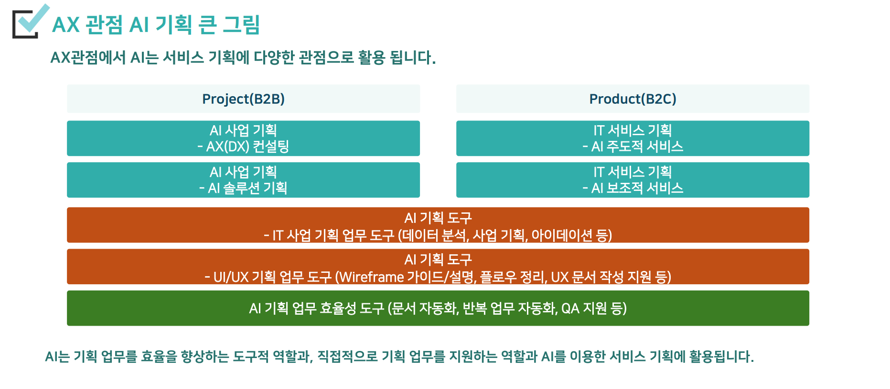

---------------------------------------------------

#### [ AI 사업 기획 - AX(DX) 컨설팅 ] p.43
고객의 요구를 AI 기반으로 컨설팅하여 문제를 해결 해주고, 사업을 만드는 기획을 해주는 AX 컨설팅

**자사가 가진 원천 기술 기반**

#### [ AI 사업 기획 - AI 솔루션 기획 ] p.44
B2B 고객을 대상으로 자사의 AI 기반 기술을 솔루션화 하는 사업 기획

**자사의 기술을 솔루션 형태로 기획**

#### [ IT 서비스 기획 - AI 주도적 서비스 ] p.45
B2C 서비스 형태의 AI가 제공하는 기능을 중심으로 하는 프로덕트 기획 출시 

**API 형태로 제공되는 AI를 신규 Product의 핵심 기능으로 기획**

#### [ IT 서비스 기획 - AI 보조적 서비스 ] p.46
자사의 메인 서비스가 이미 존재, AI를 적용해서 서비스를 업그레이드 ( 기능, 품질, 재미, 사용성 등 )

**API 형태로 제공되는 AI를 신규 Product의 핵심 기능으로 기획**

-----------------------------------------------

## AI 기획 필요 요소

### [ 전통적인 필요 요소 ]
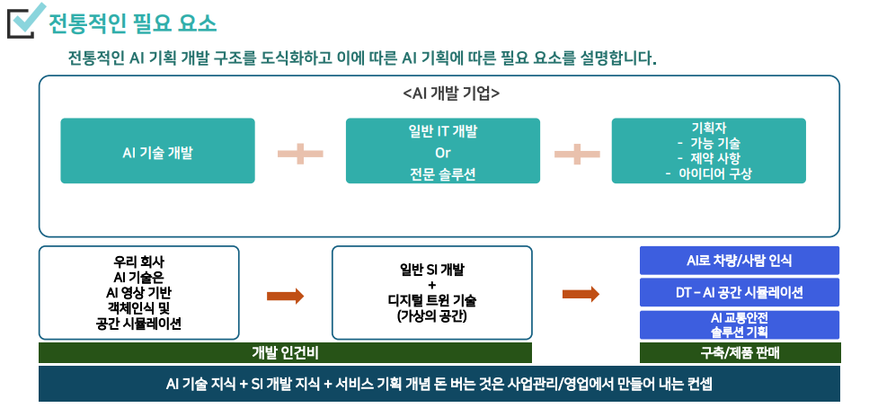

------------------------------------------------

### [ 현재 트랜드 ]
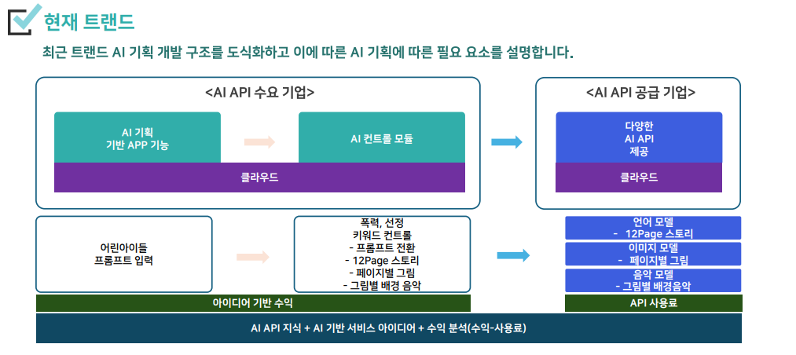

----------------------------------------------

### AI 기획 필요 요소

|  | **과거** | **앞으로** |
|:---:|---|---|
| **필요지식** | AI에 대한 높은 기술적 지식 ( 어디까지 만들 수 있는가?) | 급변하는 ai에 대한 폭 넓은 사용성 중심 지식 ( 어디까지 사용할 수 있는가?) |
| **핵심 역량** | AI의 기술 기반의 설계 역량 | (B2B) 고객 Needs 파악, 설계, 설득 - 커뮤니 케이션 역량 (B2C) AI 기반의 아이데이션과 성공을 증명할 데이터 분석 역량 (시장, 마케팅) |
| **BM 관점** | - AI 개발 투자 - 솔루션 기반 수익 | - AI API 이용료 - AI 활용 개발 - 서비스 수익 |

-----------------------------------------------------

## [ 분석형 AI 기반 AX 사례 ]

### [ 제조업 ]

**생산 제조의 효율화를 위해 다양한 분석형 AI를 적용**

- 예측 유지보수 (Predictive Maintenance)
    - 센서 데이터 분석을 통해 설비 고장 시점을 예측하여 비가동 시간 감소
- 불량 검출 (Defect Detection)
    - 머신러닝 기반 비전 시스템을 활용해 제품의 결함 자동 판별
- 공정 최적화 (Process Optimization)
    - 머신러닝으로 온도, 습도, 기계 설정 등을 최적화해 생산 품질 향상
- 에너지 효율화 (Energy Optimization)
    - 공장의 전력 소비 패턴을 분석해 에너지 절감 방안 도출

-----------------------------------------------------------

### [ 유통 / 물류 ]

- 수요 예측 (Demand Forecasting)
    - 판매 트렌드 분석으로 재고 최적화 및 생산 계획 수립
- 개인화 추천 시스템 (Personalized Recommendation)
    - 소비자 행동 데이터를 분석해 맞춤형 제품 및 서비스 추천
- 물류 경로 최적화 (Route Optimization)
    - 실시간 교통 데이터 분석으로 최적 배송 경로 설정
- 스마트 매장 관리 (Smart Store Management)
    - CCTV 및 센서 데이터를 기반으로 매장 내 고객 행동 분석

------------------------------------------------------------

### [ 금융업 ]

- 사기 탐지 (Fraud Detection)
    - 비정상적 금융 거래 패턴을 분석해 사기 행위 탐지
- 신용 평가 모델 (Credit Scoring)
    - 고객 데이터를 분석해 대출 승인 및 금리 결정 자동화
- 투자 포트폴리오 최적화 (Investment Optimization)
    - 머신러닝 기반으로 주식, 채권 등 자산 배분 최적화
- 맞춤형 금융 서비스 제공 (Personalized Banking)
    - 고객의 소비 성향을 기반으로 맞춤형 금융 상품 추천

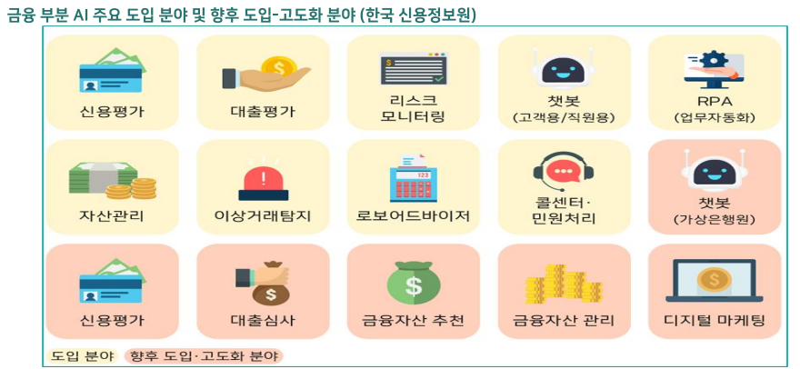

-------------------------------------------------------------

### [ 헬스케어 ]
- 질병 진단 보조 (Medical Diagnosis Support)
    - MRI, CT 등 의료 영상 분석으로 암, 폐질환 등 질병 자동 진단
- 약물 개발 최적화 (Drug Discovery Optimization)
    - 화합물 데이터를 분석해 신약 개발 비용 및 기간 단축
- 환자 재입원 예측 (Readmission Prediction)
    - 환자 치료 이력과 건강 데이터를 분석해 재입원 가능성 예측
- 건강 관리 코칭 (Health Coaching)
    - 웨어러블 기기 데이터를 통해 사용자 맞춤형 운동 및 식단 제안

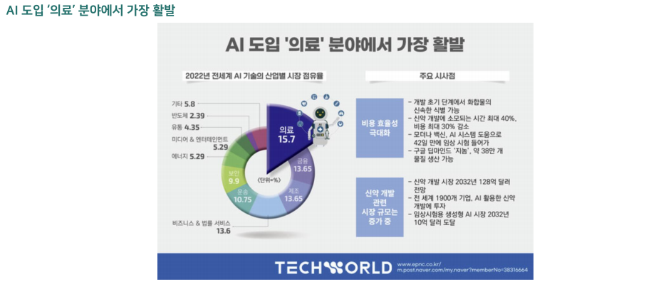

--------------------------------------------

### [ 마케팅 & 고객 서비스 ]

- 고객 이탈 분석 (Churn Prediction)
    - 고객 행동 데이터를 기반으로 이달 가능 고객 예측 및 사전 대용
- 챗봇 및 고객 응대 자동화 (시 Chatbots)
    - NLP 기반 시 챗봇으로 고객 상담 자동화 및 상담사 지원
- 소설 미디어 분석 (Social Media Analysis)
    - 트렌드 분석, 감성 분석을 통해 마케팅 전략 최적화
- 맞춤형 콘텐츠 추천 (Content Recommendation)
    - 머신러닝 기반으로 사용자의 관심사에 맞는 콘텐츠 제공

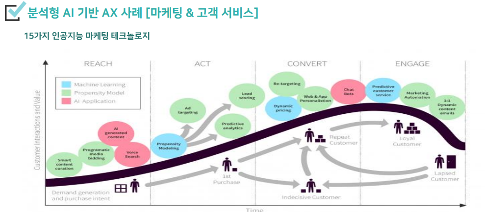

--------------------------------------------

### [ 교육 ]
- 강의 자료 및 학습 콘텐츠 생성
    - 특정 주제에 맞는 강의 요약 자료. 퀴즈 생성
- 맞춤형 학습 프로그램 설계
    - 학생의 학습 패턴을 분석해 개인화된 학습 로드먭 생성
- 언어학습 시 튜터
    - 실시간으로 언어 학습 대화를 진행하고 피드백 제공
- 시험 문제 및 평가 항목 생성
    - 특정 학습 목표에 맞는 시험 문제와 평가 기준 자동화

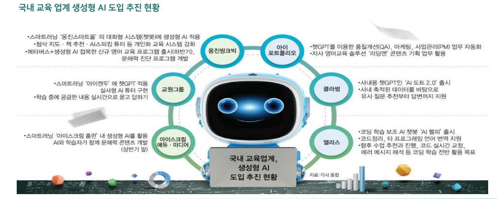

-------------------------------------------------

### [ 미디어 & 콘텐츠 ]

- 광고 콘텐츠 자동 생성
    - 마케팅 캠페인용 카피. 이미지, 동영상을 자동으로 생성
- 영상 편집 및 자동화
    - 장시간의 영상 데이터를 요약하거나 자동 편집
- 뉴스 및 기사 자동 작성
    - 실시간 이벤트 및 주요 뉴스 데이터를 기반으로 기사 생성
- 소셜미디어 콘텐츠 제작
    - 인기 해시태그, 트렌드를 분석해 자동으로 게시글 생성

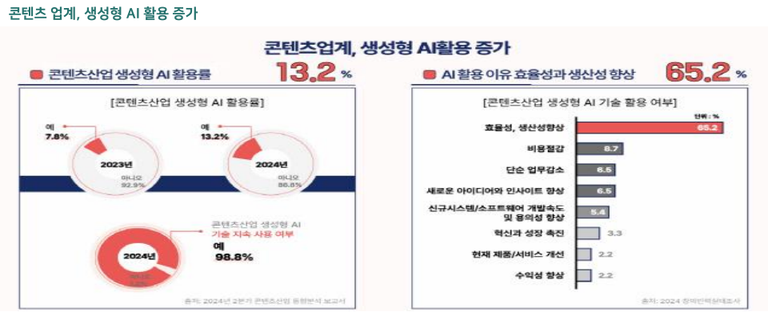

------------------------------------------------

### [ 기업 운영 및 HR ]

- 채용 공고 자동 생성
    - 직무 요구 사항을 입력하면 최적의 채용 공고 문구 자동 생성
- 직원 성과 리뷰 작성
    - 직원 성과 데이터를 기반으로 평가 보고서를 자동 생성
- 고객 피드백 요약 및 분석
    - 대규모 피드백 데이터를 분석해 핵심 인사이트 도출
- 업무 자동화 (RPA + 생성형 시)
    - 반복적인 데이터 입력 및 보고서 작성을 자동화

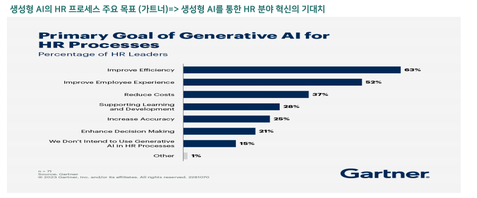

-----------------------------------------

# 3. IT 서비스 기획 지식
## IT 기획 업무 프로세스

**1. 고객 미팅 or 고객 분석**
- 하나, 고객 요청에 따른 미팅 및 현장 방문 통한 현장의 요구 환경 분석
- 둘, 고객 요청 없이 사업을 제안하기 위한 분석 (고객의 Needs를 찾아내고 제안하는 과정)

**2. 서비스 기획**
- 고객의 문제를 해결하기 위한 구체적인 DX 해결 방법 정리 및 자료화
(AI, 디지털 트윈 기술 기반)

**3. 고객 설명 및 설득**
- 서비스 기획 자료를 기반 고객 설명 및 설득

**4. 사업 분석 (비용, 진행)**
- 해당 사업의 예상 비용 설명
- 사업 진행과 관련 일정, 방법 등 설명

**5. RFI 제공**
- 고객에 대한 설득 완료 후
- 사업 발주 시 필요한 기능 사항을 제공

-----------------------------------------------

### [ 고객 미팅 기반 요구사항 분석 ]

고객의 요구사항을 잘 확인하는 것이 핵심 
많은 정보의 제공과 소통을 통해 WIN-WIN 구조를 만듦

### [ 고객 분석 기반 요구사항 분석]

고객은 시스템을 모르거나 필요성을 느끼지 못하는 상태 
자사의 서비스가 꼭 필요함을 설득하기 위한 분석 과정

**서비스 개요**
- 회사 소개
    - 저희는 시 전문 회사입니다.
- 서비스 제안 배경
    - 고객님 반복적 업무가 불편하셨죠?
- 서비스 제안 목적
    - 고객님의 반복 업무를 시를 통해 자동화 시켜드리겠습니다.
- 서비스 제안 범위
    - 저희가 제공하는 서비스는 00 범위의 서비스 입니다.
- 기대 효과
    - 저희 시 서비스를 도입하시면, 비용 절감과 500% 업무 효율이 향상됩니다.

### [ 서비스 기획 ] p.72
고객 요구사항을 분석 정리 후 서비스 기획을 진행

**1. 요구사항 정리**
- 고객 요구사항 분석 내용을 정리하예 제안 방향을 정하는 문서를 작성

**2. 전체 서비스 기획- 기술 정리**
- 전체 서비스 기획에 대한 큰 그림을 작성
- 자세한 내용 전에 [적용 기술] + [핵심 기술]
- 자체 수행 or 외부 협력업제 협업 필요 여부 검토

**3. 서비스 기획 - 초안 자료 작성**
- 전체 기술이 정리된 서비스 기획 초안 자료를 작성

**4. 개발 검토**
- 개발팀(리더)과 검토를 통해서, 적용된 기술에 대한 검증을 진행

**5. 원가 분석**
- 고객에게 제안하는 금액이 아닌 매입 원가를 분석

---------------------------------------

### 고객 미팅 방법 [프로세스]

**1. 고객사 분석**
- 사전에 고객사에 대한 가능한 많은 분석
- 소통 시 분석된| 결과 기반 대화 효율적임

**2. 사전 질의 사항 정리**
- 고객 미팅에서 서비스 기획을 위해서 필요한 정보를 사전에 정리하며 미팅에서 효과적으로 확인할 수 있도록 함

**3. 고객 미팅**
- 사전 질의 정리된 내용을 중심으로 고객의 요구사항이나 현황을 파악하는 중심의 미팅을 진행

**4. 현장 방문**
- 구축하는 시스템에 따라 차이가 있겠지만. 가능한 현장 방문 혹은 개선해야 할 시스템 등의 정보를 가능한 적극적으로 확인하는 것 필요

**5. 요구사항 분석**
- 고객 미팅이 끝나면 가능한 빨리 요구사항을 정리 분석하는 작업 진행

----------------------------------------

# 4. IT 서비스 기획 상세 방법
## IT 서비스 기획 종류
1. 고객 요청에 의한 IT 서비스 기획
2. 회사가 보유하고 있는 IT 서비스를 고객에게 제안

### 1. 고객 요청

- 고객이 원하는 요구사항을 듣고
- 해당 요구사항을 분석하고
- **우리 회사의 기술 기반으로 최대한 좋은 서비스 방안을 찾아서 기획**
- 고객과 검토 및 조정하면서 고객을 설득

#### [ 서비스 기획 - 서비스 기획 초안 자료 작성 ]
**요구사항 구분**
- 전체 요구 사항 중 일반적인 요구사항과 서비스의 액심이 되는 중요한 요구사항을 구분

**전체 구성도 작성(시스템 or 서비스)**
- 핵심 요구사항 내용을 기준으로 전체적인 서비스 혹은 시스템을 이해 할 수 있는 그림 작성

**핵심 요구사항 기획 자료 작성**
- 책심 요구사항 해결을 위한 방안(기획, 구성, 개발 방식 등)을 자료로 작성

**일반 요구사항 정리 자료 작성**
- 일반 요구사항은 상황에 따라 기획자료 제외
- 작성시 간단하게 엑셀 기반 텍스트 형대로 지리 방안 정리

**외부 기술 분석**
- 외부에 지원이 필요한 기술에 대해서는 [기술 범위]와 [매입 원가]를 정리 분석

--------------------------------------------------------------------------

#### [ 서비스 기획 - 요구사항 구분 ]

1. **정리된 요구사항을 점검**하여 놓치는 항목 사항이있는 지 점검
2. 우리 회사가 **가능한 서비스인지** 점검 **[ 가능/협력사/불가능 ]** 구분
3. 분석된 요구사항 중 **핵심 요구사항**에 대하여 **어떻게 구현할 지**에 대한 컨셉을 **[ 적용 방안 ]** 컬럼에 정리

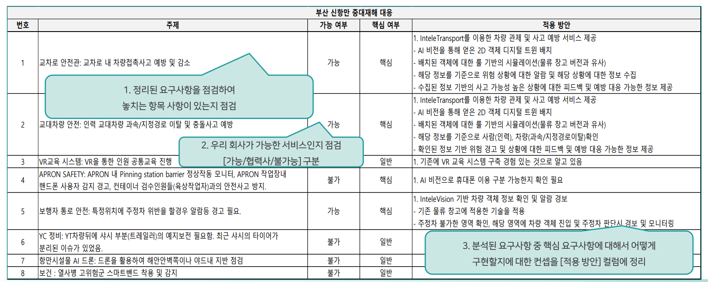

--------------------------------------------------------------------------

#### [ 전체 서비스 구성도 작성 ]

**1. 전체 서비스 구성도 작성**
- 고객이 이용하는 서비스 관점에서. 서비스를 한눈에 이해할 수 있도록 작성

**2. 전체 시스템 구성도 작성**
- IT 기술 및 시스템 관점에서, 도입되는 S/W, H/W, 기술, 솔루션 등을 한눈에 파악하고,전체 시스템의 구조를 이해할 수 있도록 작성

**3. 핵심 서비스 상세 구현 방안**
- 고객이 요구하는 핵심 서비스에 대한 상세 작성

-------------------------------------------------------------------------

**1. 전체 서비스 구성도 작성**

**[ 1안 : 서비스 포지셔닝 기반 서비스 구성도 ]**

1. 실제 현장에 핵심 서비스 기준 **포지셔닝**
2. 핵심 서비스 별 **주요 적용 기술** 작성

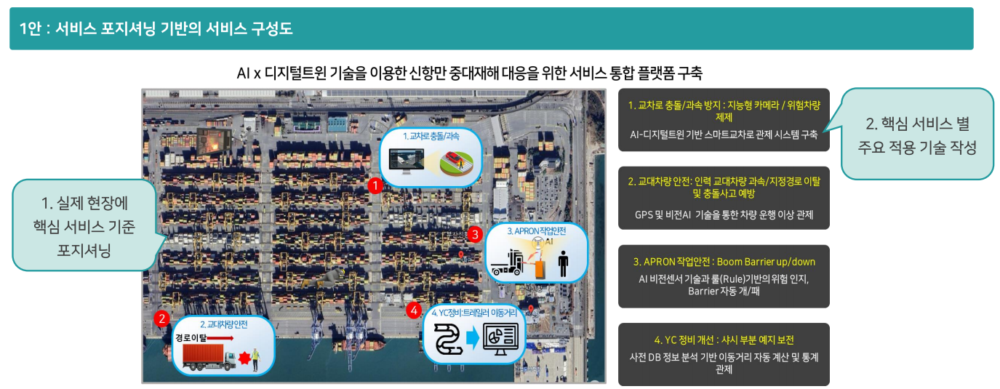

**[ 2안 : 프로그램 기능 중심의 서비스 구성도 ]**

1. 구축될 시스템에 대한 **예상 그림**을 보여줌
2. 시스템을 통해서 **제공 받을 수 있는 기능**을 설명

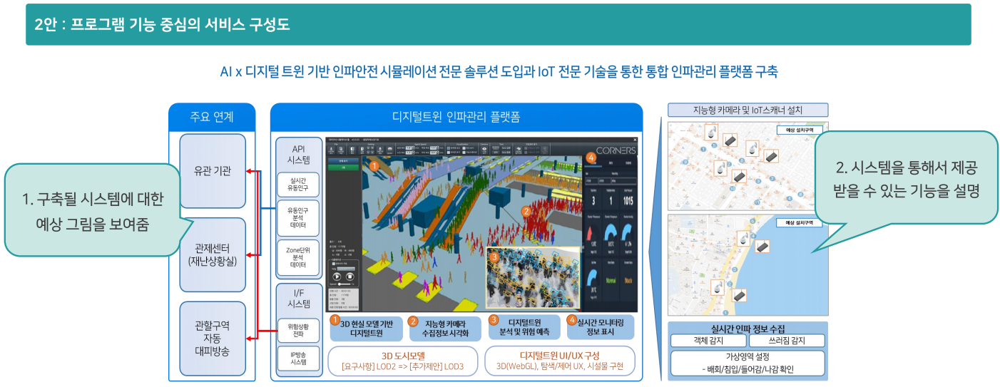

**[ 3안 : 사용자 서비스 중심의 서비스 구성도 ]**

1. 사용자가 받게 될 서비스에 대한 **순차적 설명** (이용 스토리에 기반)
2. **중요한 서비스**의 경우 **전체적인 프로세스**를 표현

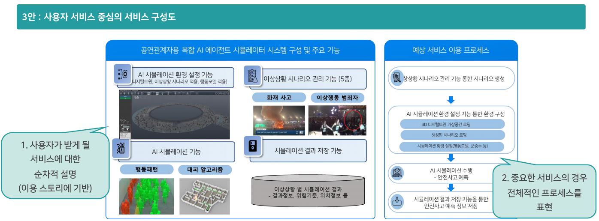

----------------------------------------------------------------

**2. 전체 시스템 구성도**

**[ 1안 : 도입 장비 중심의 시스템 구성도 ]**

1. **전체 구성 요소**를 다 별도 PPT 장표에 추출 정리
2. **핵심**으로 제공되는 시스템을 **가운데**에 두고 나머지 시스템을 배치
3. 배치한 **장비에 필요한 연결**을 추가, 연결 추가 시 **이동하는 정보** 작성

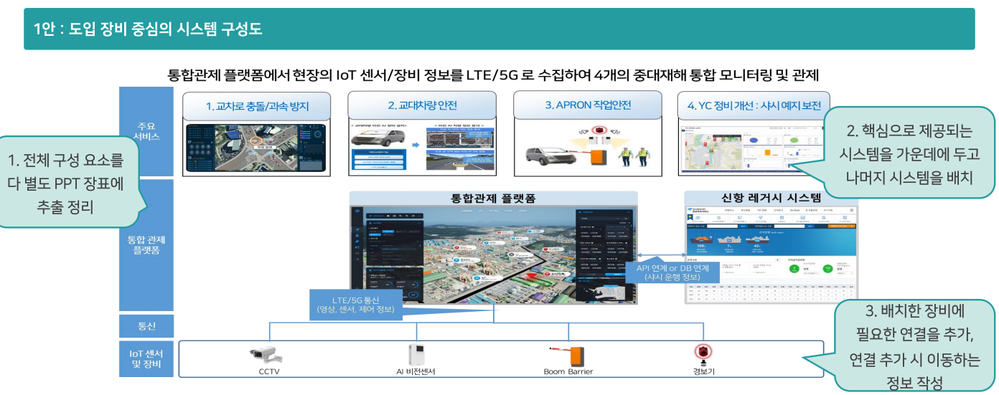

**[ 2안 : 서비스 대상 중심의 시스템 구성도 ]**

1. 핵심이 되는 **시스템과 장비**를 **가운데** 배치
2. **좌우**에 서비스를 **이용하는 주체**를 배치

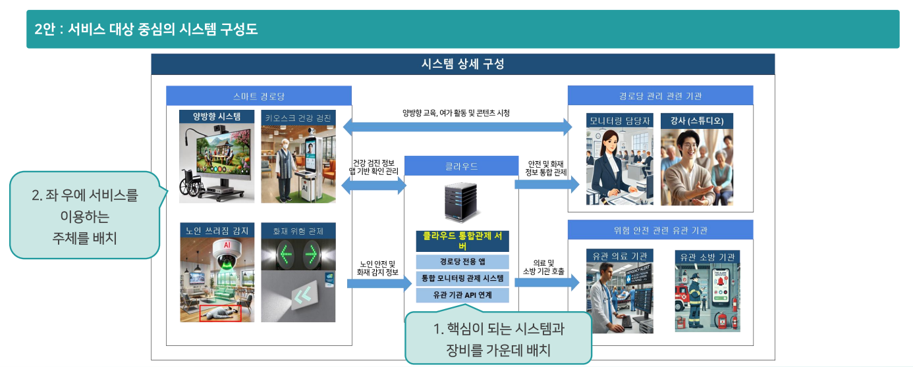

------------------------------------------------------------------

**3. 핵심 서비스 구현**

**[ 1안 : 서비스 흐름도 형태의 서비스 구현 ]**

- **사용자 입장**에서 서비스를 사용하는 **흐름**을 표현, 그 안에서 자연스러운 기술 적용

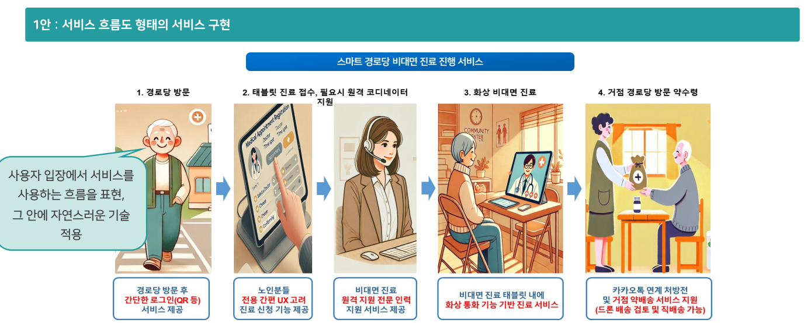

**[ 2안 : 서비스 기능 중심의 서비스 구현 ]**

- **제공되는 기술**을 **가운데** 두고, 해당 기술을 입증하는 자료 및 차별화 **자료를 주변에 배치**

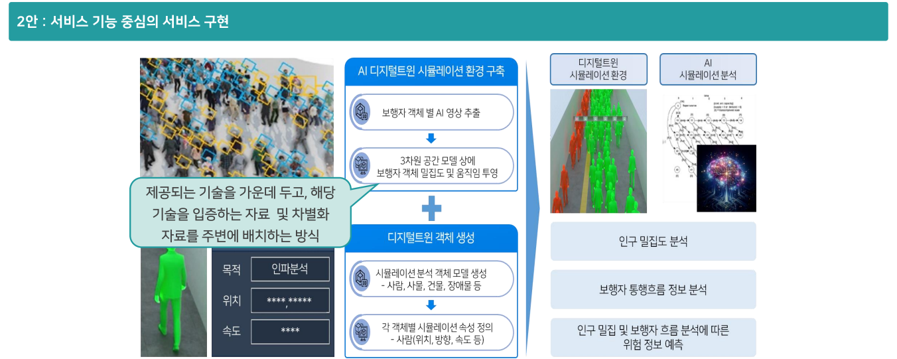

**[ 3안 : 상세 서비스 구성 중심의 구현 ]**

- **업무 프로세스**를 상세하게 분석하고 분석한 내용을 **프로세스 흐름도**로 작성
- **고객이 원하는 주체 중심**에 따라서 작성
- 시작과 끝은 '둥근 사각형', 분기는 '마름모', 일반적인 프로세스나 액션은 '사각형'으로 표현

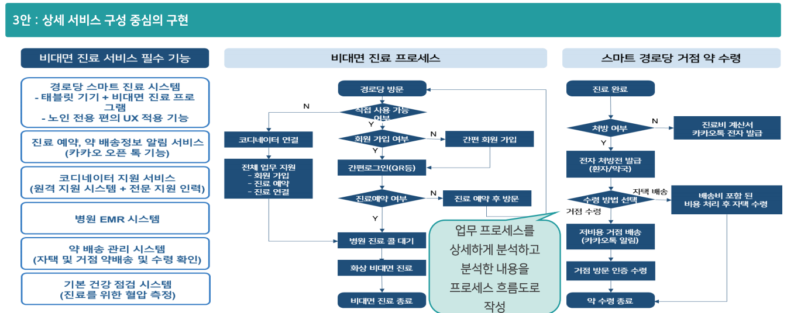

**[ 4안 : 구체적인 구축 방안 중심의 구현 ]**

- 문제 해결을 위한 구체적인 기술과 적용 방법 등의 설계를 작성
- 

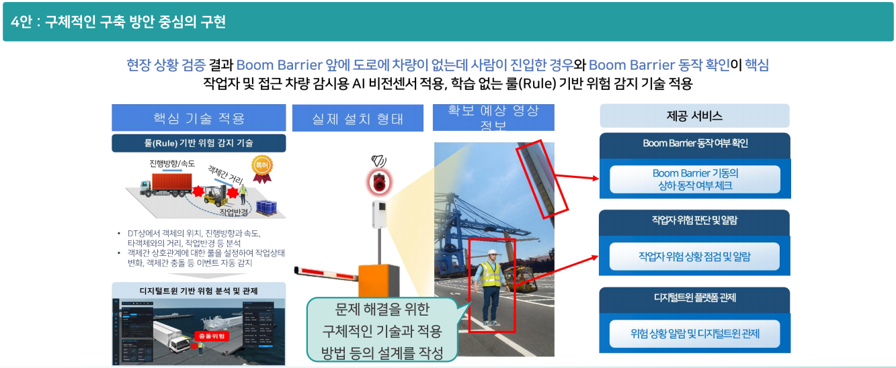

------------------------------------------------------------------------------