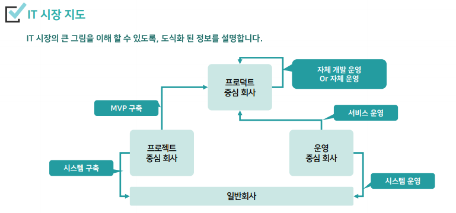
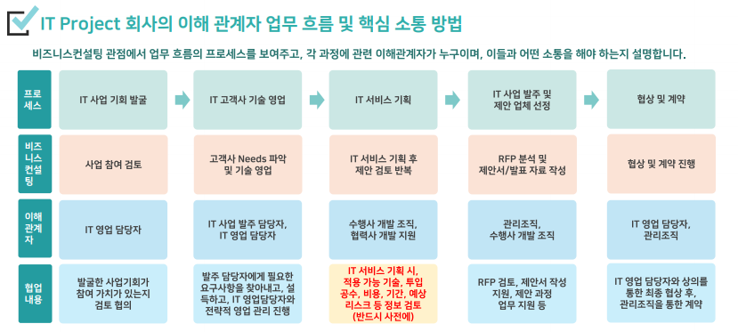
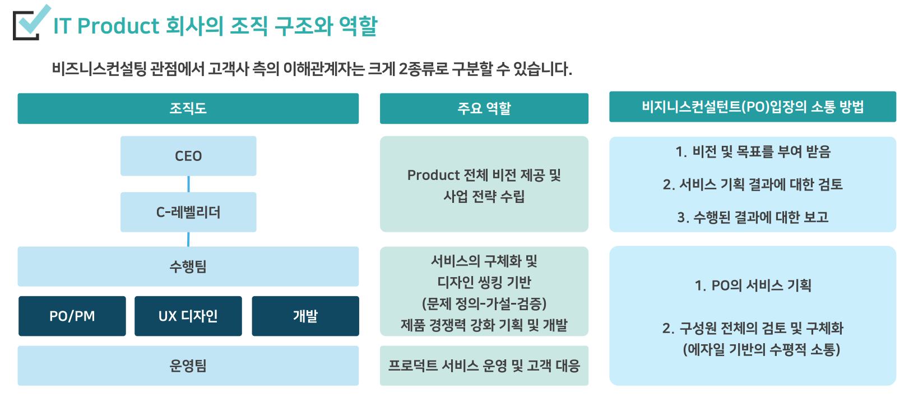
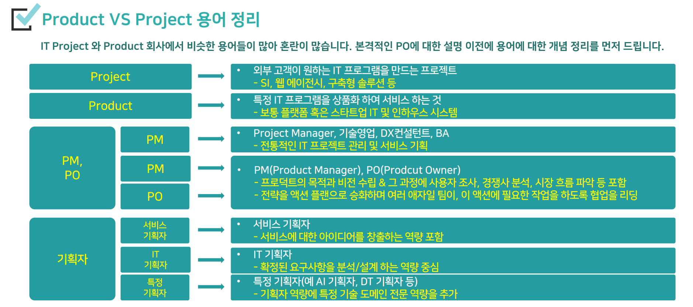
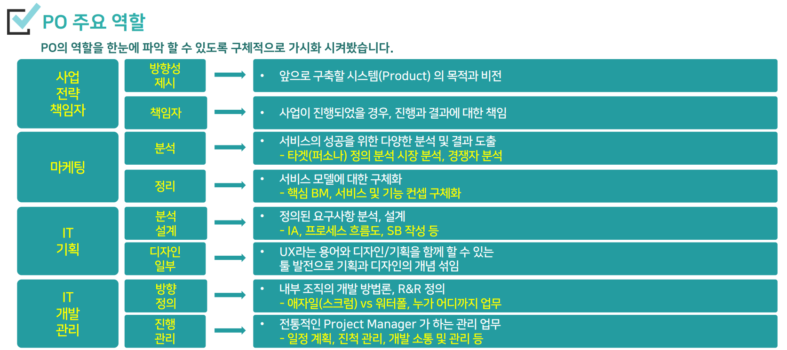

# IT 비즈니스 컨설팅 이해

## 1. IT 비즈니스 컨설팅 기본 이해
### IT 비즈니스 컨설팅의 역할
고객에게 **[ 서비스 기획 ]** 에 대한 컨설팅, 회사의 영업 기회를 높여주는 일을 함.
----
### IT 사업 주요 단계
사업 발주 → 수행업체 선정 → 발주 관점 프로젝트 관리

IT 서비스 기획 → IT 서비스 제안 → 프로젝트 관리

----
### IT 비즈니스 컨설턴트의 핵심 역량
1. 기술 영업 역할 - 고객이 원하는 서비스를 구체적으로 기획하는 역할
2. 기획 제안 역할 - 고객이 운하는 서비스를 구체적으로 기획하는 역할
3. 사업 기획 역할 - 다양한 사업의 전략적 구조 및 협업 관계 기획 역할
4. 사업 관리 역할 - 사업 수주 과정부터, 수행, 수행이후까지 관리하는 역할

----
- 개발자를 이해하는 것이 필요
- 실제에서는 넓은 범위의 역할을 진행. 
- 넓은 범위를 수행하거나, 특정 역할만 집중적으로 수행할 수도 있음.
----

**1. 기술 영업**
- 고객 요구사항 분석 - 어떻게 대응할 지 생각
- 기술적 질의 응답 및 설득 - 고객 입장에서는 IT 전문가라고 인식할 가능성이 높음
- 비용 분석 및 영업 과정 전략적 관리 - 사업의 모양을 전략적으로 기획
- 기본 고객 관리

**2. 기획 제안**
- 고객 요구에 따른 서비스 기획 - 고객이 원하는 것을 매력적으로 만드는 역할
- 개발과의 기술 검토 - 우리 회사에서 개발 가능한 범주 내에서 사업을 기획해야 함.
- 제안 자료 작성 역할 - 고객의 제안서 작성을 돕는 역할
- RFI 작성 역할

**3. 사업 기획 역할**
> 전략을 설계하고 협업을 계획하는 역할
- 진행중 발생하는 다양한 전략적 사업 구조 설계
- 협력사 검색 및 협업 구조 설계
- 제안 전략 수립 및 수행
- 계약 진행 및 관리

**4. 사업 관리 역할**
- 계약 이후 사업 수행 시 진행 관리
- PM으로 직접 관리 가능
- 별도 PM으로 진행되는 프로젝트 사업관리
- 프로젝트 완료 이후 관리 및 2차 영업

----
#### [ 핵심 역량 ]
**1. 기획을 위한 IT 지식 역량**
**2. 문서를 만드는 역량 - 기획 문서, 제안서, 발표 자료 등**
**3. 소통 역량 - 이해관계자들 간의 소통 역량 / 고객, 내부 개발팀, 협력회사 등**
**4. 프로젝트 관리 역량 - 프로젝트 진행 관리, 이슈/문제 해결, 새로운 기회 탐색**

----

### IT 시장 지도

----
#### [ BM 관점 이해 ]
1. **프로젝트 회사** - 많은 프로젝트 수주, 많은 개발
- **[눈 앞에 있는 기업 고객]** 사업을 잘 수주하는 방법 중심의 비즈니스 컨설팅
2. **프로덕트 회사** - 매력 있는 서비스, 더 많은 유저 더 많은 이용
- **[눈에 보이지 않는 일반 고객]** 서비스를 매력있게 기획하는 중심의 비즈니스 컨설팅

## 2. IT 회사별 업무 이해
### 회사 분류
------------------------------
#### 1. SI 회사
System Integration 

**[ 기본 개념 ]**

**요구사항 분석 기초 개발** - 고객이 원하는 시스템을 프로젝트로, 아무것도 없는 상태에서 개발 진행 
- **상세한 기능**과 **복잡한 프로세스 중심 개발** - 다양한 시스템 개발에 참여 가능한 회사
- **정말 잘 할 수 있는 사업**에 참여하는 것이 중요 - 프로젝트 기반, 처음부터 시작 Risk
- **특정 분야 전문 SI** 혹은 **솔루션 회사**로 발전 - 프로젝트를 수행하다 보면 특정 분야의 비중이 커짐

**[ 비즈니스 컨설팅 관점 ]** 

- 인건비 기반 수익 모델, 기술과 경험과 조직 역량 기반의 영업 활동
- 영업 기회 - RFP 기반 SI 발주 사업 발굴, 기존 고객사 신규 사업 발굴
- 사업 수주 - 경쟁 제안 수주 : 제안 작업, 수의계약 : IT컨설팅(사업기획, DX컨설팅)

**자기 회사의 기술을 가지고 비즈니스 컨설팅 중심의 영업을 하는 핵심 회사**
#### [ SI 회사 종류 ]

**1. 을 급 SI 회사**
- SI 프로젝트 직접 수주 가능 회사
- 직접 영업 역량 필요
- 최대한 많은 영업과 수주

**2. 병 급 SI 회사**
- SI  프로젝트 수주 역량 부족으로 하도급 개발
- 을 급 SI 회사 관계 중심 역량
- 을 급보다 낮은 역량으로 낮은 금액으로 수주하여 개발

**3. 특정 도메인 전문 SI 회사**
- SI 영역 중 특정 도메인에 전문화 된 회사
- 해당 도메인 업무 및 전문 지식 중심의 역량 필요
- 사업 분야 뿐만 아니라 공공/민간 도 하나의 구분 | 영업의 역량도 다르다!
- 사업 발주와 평가가 민간은 동일, 공공은 다름

**4. 특정 기술 전문 SI 회사**
- IT 기술 중 특정 기술의 역량이 강한 회사 (IoT,AI 등)
- 해당 기술에 대한 전문 지식 중심의 역량 필요

-------------------------
#### 2. 솔루션 회사
**[ 기본 개념 ]**

**고객이 고민하고 있는 문제를 해결하기 위한 시스템을 미리 만들어 놓은 회사**

- 솔루션 납품 + 커스터마이징 프로젝터
- 해당 분야 사업만 수행 가능 - 솔루션이 있으므로
- 일부 기능 커스텀 프로젝트 - SI에 비해 Risk가 낮음
    - 적용 가능한 많은 분야에 적용 필요
- 솔루션이 시장 상황에 따라 회사의 상황이 좋다/나쁘다 변화
    - 상황에 따라 SI 사업 병행하는 경우 많음

**[ 비즈니스 컨설팅 관점 ]**

- 솔루션 비용 기반 수익 모델, 자사의 솔루션이 가진 기능적 경쟁력 기반 영업
- 영업 기회
    - 솔루션 발주사업 발굴 및 SI 사업 협업, 마케팅 기반의 솔루션 판매
- 사업 수주 
    - 경쟁 제안 수주 : 제안 작업, 제품판매 : 조달등록, 인바운드 영업
- 자기 회사의 솔루션의 기능 경쟁력, 솔루션을 이용한 비즈니스 컨설팅 중심 영업

**[ 솔루션 회사 종류 ]**

**1. 기술중심 솔루션 회사**
- 솔루션의 기술 중심
- 솔루션의 기술이 SI나 다른 솔루션에 제공

**2. 프로젝트형 솔루션 회사**
- 완성된 솔루션을 커스터마이징 개발
- 솔루션 및 업무 도메인 지식 기반 영업 역량

**3. 서비스형 솔루션 회사**
- 완성된 솔루션을 SAAS 기반 서비스
- 솔루션 활용 요구 시장 확보 기반 영업 역량

**4. 제품형 솔루션 회사**
- 완성된 솔루션 제품 판매 이후, CS/AS 관리
- 제품 판매 기반 마케팅, 제품 등록, 홍보 역량

--------------------------
#### 3. 웹 에이전시 회사
**[ 기본 개념 ]**
- 기본은 요구사항 분석 기초 개발, But 비슷한 느낌의 개발 많음(재활용성)
- UI/UX 중심의 개발 - SI : 개발자 많음, 웹 에이전시 : 기획,디자이너 많음
- 기본적으로는 채널(고객이 보는) 사이트 개발
    - 개발은 외주 협력 업체 용역을 쓰는 경우도 많음
- SI 업체와 상호 보완 관계 개발 많음
    - SI 업체 사업 수주 시 기획, 디자인 협력업체로 참여
    - 웹 에이전시 사업 수주 시, 개발 협력업체 이용

**[ 웹 에이전시 회사 종류 ]**

**회사 규모에 따라서 업무 규모 달라짐**
1. **10인 미만 회사**
- 간단한 웹 페이지, 작은 고객사, 반복적 일
- 인바운드 혹은 주로 인맥 기반 영업 역량

2. **10인-50인 회사**
- 웹 기반 SI성 사업, 중소 고객사, 반복+새로운 일
- SI 업체 협업 중심 영업 및 UI/UX 기반 제안

3. **50인-100인 회사**
- 기술력 높은 개발, 기획/디자인 특화, 새로운 일
- SI 업체 협업 중심 영업 및 UI/UX 기반 제안

4. **100인 이상 회사**
- 플랫폼/솔루션화, 큰 규모
- UI/UX 기반 제안 사업 수주 역량

----------------------------
#### 4. IT 프로덕트 회사
**[ 기본 개념 ]**
- 개발된 IT Product를 통한 **서비스**로 돈을 버는 회사
- 개발이 목적이 아닌 **도구** 
    - 많은 개발보다는 **성과**를 만드는 개발 중요
- Product Manager, Product Owner, UX 디자이너
    - 에자일, 사일로, 피그마, 노션, 지라
- 눈에 보이지 않는 고객을 위한 서비스
    - 데이터 기반 사고, 문제정의-가설-검증
    - 퍼소나, 유저저니맵, GA

**[ 비즈니스 컨설팅 관점 ]**
- IT 프로덕트 **서비스를 통한 수익 모델**
    - 많은 개발보단, **실적을 내는 개발**
- **초기 투자 기반 성장**
    - 투자비용으로 인프라(고객)를 성장시켜 사업을 만드는 구조
- 영업 기회
    - **고객 분석** 및 **마케팅** 기반의 IT 서비스 영업
- 거의 대부분의 서비스 모델이 **플랫폼** 형태
    - 수요자와 공급자를 핵심 서비스로 연결

**[ 성장 과정 ]**
1. **MVP**
- 초기 사업 모델 시장 진입
- 배달의 민족 → 전화번호 앱
2. 서비스 정체성
- MVP 기반 시장의 상황과 반응을 보며 빠르게 변화
- 에자일의 컨셉
- 배달의 민족 → 배달앱으로 전환
3. 서비스 시장 정착 및 성장
- 서비스가 시장에 안정적으로 정착
- "우리가 남이가! 배달의 민족아이가!" **공격적 마케팅**
4. 문화를 만들어가는 회사
- 회사의 정체성 수립과 개발의 문화를 리딩
- 배민 일 더 잘하는 11가지 방법

-------------------------
#### 5. IT 컨설팅 회사

**[ 기본 개념 ]**

 **IT 컨설팅 용역 기반**
- IT 개발과 관련된 컨설팅을 수행하면서 돈을 버는 회사
    - ISP, ISMP, BPR 등
- 기본 컨설턴트들의 인건비 기반 사업 모델
- 컨설턴트를 보유한 회사의 BM에 따라 다양한 형태의 컨설팅 진행
- 큰 분류 : 수행을 통한 수익 모델 / 수행 이후 IT 사업 수주를 통한 수익 모델
----
**[ IT 컨설팅 회사 종류 ]**

**회사의 핵심 BM에 따라 구분**

**1. IT 개발 컨설팅**
- IT 개발과 관련된 컨설팅 수행
- ISP, ISMP, EA/ITA

**2. IT 솔루션 컨설팅**
- 특정 솔루션의 경우 해당 솔루션 도입을 위한 컨설팅 (업무 개선, 조직 개선, 신규 서비스 등)
- ERP 솔루션 컨설팅

**3. DX 컨설팅**
- IT 사업 기획과 비슷한 개념
- 고객사의 DX 관련 Needs에 자사가 가지고 있는 솔루션, 기술을 이용한 개발 방법 제안
- 이후 사업 수주가 목적

**4. AX 컨설팅**
- AI 발전을 통해서 이전 DX에서 AX로 전환

------
#### 6. 인력소싱 회사
**[ 기본 개념 ]**

**IT 개발 인력을 찾아서 연결**
- IT 개발과 관련된 인력을 소싱해 주는 회사
- 인건비 차액이 수익 모델
    - 고객에게 받은 인건비 - 지출되는 인건비 = 수익
- 다양한 고객사를 관리하며 인력 혹은 협력사 연계
    - 고객사 & 개발업체 & 운영업체 등 다양한 고객사
- IT 비즈니스 컨설턴트 입장에서는 IT 사업 시 인력 수급과 함께 시장의 현황과 다양한 정보 수집의 채널

-----------------------------------------
#### 7. IT 대기업 게열사
**[ 기본 개념 ]**

**국내 대기업들이 IT사업을 위해서 만든 계열사**
- 대기업의 IT 계열사
    - 삼성SDS, LG CNS 등
- 기본 수익 모델은 계열사들의 SI/SM 사업 기반 & 회사마다 모기업의 특성을 살린 다양한 서비스 확장
- 종합상사 : 솔루션, SI, SM, 기타 다양한 수익 모델
- 최초 계열사 IT 업무 중심의 성장
    - 공정거래위원회 제약에 따른 경쟁시대

--------------------------------
#### 8. IT 리더 회사
**[ 기본 개념 ]**

**네카라쿠배당토 같은 회사**

- IT 사업의 성공과 함께 문화를 기반으로 IT 시장 리딩
- 대부분 Product로 코로나 전후 시기 많은 사업 기회를 잡으며 성장
- IT Product의 품질을 높이기 위해 좋은 IT 인력을 보유하고 성장하기 위해 노력
- 노력의 중심에 문화를 이용
    - 배민 : 일을 더 잘하는 11가지 방법, 우아한 문화, 수평 문화
    - 토스 : 핵심 가치, 사일로 중심 운영, 자율성 부여, 성과 책임
- 핵심 개념 기반으로 사업 확장
    - 배민 : 배달 → 식품 - 마트
    - 당근 : 지역중고거래 → 지역기반 연결 및 커뮤니티
----
#### 9. IT 스타트업 회사
**[ 기본 개념 ]**
- 다양한 IT 기반 ITEM으로 시작, 회사를 성장시켜 가는 회사
- 대부분 토자 기반 창업 (예창패→초창패→창도패→시드→시리즈)
- 창업을 대하는 태도 
    - 성공을 위한 창업 & 경험을 만드는 창업
- 알찬 스타트업을 발굴하여 사업 기회 활용

----
#### [ 회사 구분 정리 ]
- IT Project 회사 (눈에 보이는 고객)
    - SI 회사
    - 솔루션 회사
    - 웹 에이전시 회사
    - IT 컨설팅 회사(일부)
    - IT 대기업 계열사
- IT Product 회사 (눈에 안보이는 고객)
    - IT 프로덕트 회사
    - IT 리더 기업
----
### 1. IT Project 회사
#### **[ 수익 구조 ]**
- 개발 비용을 기반으로 수익을 만듦, 기본적으로 Project 사업
- Project 수주가 가장 중요
- 더 큰 이익을 위해서는 높은 비용의 Project를 수주해서(매출), 낮은 비용으로 수행(매입)
- 비즈니스 컨설턴트는 Project 수주를 잘 하는 것과 함께 더 높은 수익을 내는 구조를 만드는 것이 중요
- 관련된 이해관계자를 파악, 그들과 소통과 함께 전략적 대응을 하는 것이 중요

----

#### [ 이해 관계자 ]
1. 고객사측
- 사업 수주를 위해서 가장 중요한 대상, 분석과 설득의 과정 필요
- 사업 발주 담당자, 구매 담당자(구매 처리/결정)
2. 수행사(자사)측
- 사업 기획 및 수행을 위해서 가장 중요한 대상. 함께 설계,검토,수행관리를 진행
- IT 영업, 비즈니스 컨설턴트, 개발조직, 관리조직
3. 협력사측
- 사업 기회 확장 및 수익 향상을 위해 중요한 대상, 함께 설계,검토,협상을 진행
- IT 솔루션 협력사, 개발 협력사 등

------------

**[ 고객사측 ]**

**1. IT 사업 발주 담당자**
- 고객사에서 IT 사업을 기획하고 발주하는 담당자
- 가능한 가까운 관계 유지, 적극적으로 서비스 기획 내용을 전달하고 설득해야 하는 대상
- **IT Project 사업에서 가장 중요한 이해관계자**

**2. 구매 담당자**
- 구매팀 업무 처리 혹은 구매에 영향을 줄 수 있는 담당자
- 직접적인 소통이 많지 않지만, 소통을 하는 경우 의견을 정확히 듣고 확인해서 구매 과정에서 문제가 생기지 않도록 관리

------------------

**[ 수행사측 ]**

**1. IT 영업 담당자**
- IT 사업의 기회를 발굴해주는 담당자
- 영업이 기회를 찾으면, 비즈니스 컨설턴트가 기회를 만들어 내는 구조(병행가능)
- 수익에 대한 전략을 함께 고맨하는 파트너
**2. IT 개발 조직**
- 자사 내에 IT 개발 조직, 개발의 의견을 전달 및 의사결정을 할 수 있는 리더급이 중요
- 서비스 기획 시, 가능여부, 투입 공수, 개발 기간, 리스크 등을 제공해주는 중요 지원자
**3. 관리조직**
- IT 기술영업, 제안의 과정에서 다양한 지원자 역할을 하는 조직 (회사마다 다양한 구조)
- 사업 진행 여부 판단, 제안서 작성, 인력 리소스 관리 분배 등

-----------------------------

**[ 협력사측 ]**

**1. IT 기술 영업 담당자**
- 자사의 역량을 벗어난 사업의 기회가 있을 경우 해당 기술을 제공할 수 있는 업체의 영업 담당자
- 협업 관계 정의 및 비용 협상 등의 역할 담당

**2. IT 개발 지원 담당자**
- 협력사에서 제공하는 솔루션, 기술 등의 개발 관련 업무를 지원하는 담당자
- 협력사의 기술 범위, 가능여부, 투입 공수, 개발 이슈 등 다양한 정보 제공의 채널

----

#### [ 이해 관계저 업무 흐름 및 핵심 소통 방법 ]

----------------------------

### 2. IT Product 회사

#### [ 수익구조 ]
- 개발한 시스템 상품으로 서비스 수익 창출, 기본적으로 서비스 사업 수행
- Product 서비스의 활성화가 수익의 중심
- **더 큰 이익**을 위해서는 많이 개발하기보다 **많이 사용**하도록 개발
- 비즈니스 컨설턴트는 Product 서비스의 성공 가능성을 높이기 위해서 **정확한 분석과 예측과 검증**을 잘 하는 것이 중요

-----------------------------
#### [ 이해 관계자 ]

1. (수요/공급) 고객측
- Product 서비스를 이용할 실제 고객
- 직접적인 소통 불가능, 고객의 Needs를 다양한 분석 기반으로 파악해야 하는 대상
- 플랫폼과 같은 서비스 경우 수요 뿐만 아니라 공급측 고객 존재 (예 : 배달의 민족 가맹점주)
2. 수행사 C레벨 리더
- Product 서비스의 모델 정의와 방향 제공자
- 의사 결정의 주도권을 가진 담당자
3. 수행사(자사)측
- Product 발전을 위해서 함께 고민하고 지원을 주고 받는 조력자
- 수평적인 업무 지원 협의 담당자

-------------------------------------
**1. 고객측**

**1. 수요고객**
- 서비스의 최종 수요를 하는 고객
- 기본적으로 타겟 고객을 세분화하여 관리
- 눈에 보이지 않는 고객의 Needs 파악을 위해 다양한 기법을 통해 노력
- 디자인 씽킹, 데이터기반 사고, 사용자 분석 등

**2. 공급 고객**
- 서비스를 공급하는 고객
- 플랫폼 서비스의 경우 발생하는 고객
- 모든 고객을 직접 접근할 수는 없지만, 상황에 따른 직접 소통이 가능한 대상
- 확실한 수익 모델을 보여줘야 하는 대상

-----------------------
**2. 수행사측**

**1. CEO**
- 전체 화사의 리더
- Project의 경우 다양한 사업을 하므로 리더가 모든 사업의 관여도가 떨어지지만, Product의 경우 CEO의 영향이 큼

**2. C레벨 리더**
- CTO, CPO, CFO, COO등 다양한 리더로 Project 회사에도 동일하게 있지만, Product 회사에서는 훨씬 큰 영향력을 발휘함

**3. 수행팀**
- 비즈니스컨설팅 역할을 하는 PO/PM
- 개발을 하는 UX디자인, 개발 등 조직
- 에자일 기반 적극적이고, 수평적인 소통

-----------------------------------
#### **회사의 조직 구조와 역할**

-----------------------------

## 3. Project 회사 기획 업무

### Project 회사가 바라는 점

1. 설득
2. 관리

--------------------------------

### 설득의 역할 : DX(AX)컨설턴트

#### [ 주요 업무 ]
**1. IT 기술 영업**
- 고객을 it 기술 기반으로 영업 관리
- 고객의 기술 관련 질문, 상담 대응

**2. IT 서비스 기획**
- 고객이 필요로 하는 서비스를 구체적으로 기획
- 기획된 내용을 문서화하는 것이 핵심

**3. 제안 수행**
- 발주가 된 사업에 대해 제안을 하여 수행업체로 선정되도록 함
- 제안서 작성, 발표 가이드 등이 핵심

**4. 협력사 관리**
- DX 및 AX 사업을 기획 및 수행하기 위해서 만나는 다양한 협력사를 관리

------------------------------

#### 1. IT 기술 영업

전문적인 기술 기반의 영업

- SI 회사 - 고객이 구축할 시스템의 기능을 잘 정리, 이에 대한 구축 투입 공수와 일정을 잘 산정해 제공
- IT 솔루션 회사 - 솔루션이 가진 기능정보와 자사 솔루션의 경쟁력과 차별점을 잘 전달
- 웹 에이전시 회사 - UI/UX 기반의 지식정보와 고객사에 필요한 다양한 서비스 아이디어에 대한 제공
- 직접적인 제안 외에도 이미 관계를 맺은 고객에게 지속적으로 IT 지식 기반 지원을 통해 새로운 기회를 모색

-----------------------------

#### 2. IT 서비스 기획

단순한 기능 리스트업 형태의 서비스 기획부터 업무 개선, 인프라 개선, 새로운 기술 기반의 서비스 제안 등

- **단순한 WEP/APP 기반의 시스템**에 대해 **기능 중심**의 서비스 기획
    - 회사의 CRM 시스템 구축을 하고 싶어요
- **IoT 기술**을 기반으로 **DX를 통한 업무 개선**을 포함한 서비스 기획
    - 이번에 우리 중고차 매장을 무인화 하고 싶어요
- **인프라(H/W, S/W, 네트워크)를 개선**하는 서비스 기획
    - 현재 온프라미스로 노후화된 레거시 시스템을 인프라와 함께 클라우드로 전환하고 싶어요.
- **새로운 기술**에 대한 다양한 **아이디어** 기반의 서비스 계획
    - 우리 회사가 AX 혁신을 하려고 하는데, 업무 분석해서 AI 기반 개선 기획을 제안해주세요.

---------------------------------

#### 3. 제안 수행

- **고객 설득**을 성공적으로 완성하고 **수의 계약** 기반의 제안 작업
    - 서비스 기획이 좋아서, 고객이 우리와 하기로 했어. 기본 제안이 필요해
- **경쟁 입찰**을 통한 업체 선정 시, **1위 선정을 위한 제안** 작업
    - 이번에 스마트공장 사업이 RFP 나왔네요. 함께 제안해요.
- 보유한 **솔루션 고객에게 소개**하며 **Needs를 만들어 설득**하는 제안
    - 현재 종이계약을 저희 전자문서 솔루션으로 하세요.
- **컨소시엄** 혹은 **협력사** 형태의 파트너가되어 일부분 제안
    - 이번 스마트팜 사업에서 디지털트윈 부분은 저희가 제안해요.

-------------------------------------

#### 4. IT 협력사 관리

- **우리에게 없는 솔루션**을 보유한 업체와 협력 관계 관리
    - 이번 사업에서 AI 카메라가 필요한데 A사님의 제품을 제안하려 해요.
- 프로젝트를 수행할 **개발을 지원** 받는 협력 관계 관리
    - 저희가 이번 사업을 수주할 가능성이 높은데 개발자를 지원해주세요.
- **전략적 사업 수주**를 위한 협력 업체 관리
    - 이번 사업은 지역업체가 우선이라고 하네요. 마도(창구/책임자)를 서주시면...
- 개발 사업을 **턴키**로 맡기는 협력 관계 관리
    - 이번에 저희가 컨설팅해서 사업을 수주했는데, 개발을 모두 해주세요.

-------------------------------

### 관리의 역할 : Project Manager

#### [ 주요 업무 ]

**1. 프로젝트 관리 (직접 관리)**
- Project Manager로서 직접 전체 프로젝트를 관리
- 주요보고, 진척관리, 이슈관리, 위험관리 등

**2. 프로젝트 관리 (간접 관리)**
- 별도의 Project Manager를 두지만, 상황에 따라서 PM과 협력을 통한 프로젝트 관리 업무
- 고객 대응, 이슈 해결 등

**3. 운영 관리**
- 시스템 구축이 완료 된 이후 운영을 위한 관리 채널로서 역할
- CS/AS 서비스 채널, 신규 영업 기회 확인

----------------------------------

#### 1. 프로젝트 관리 (직접 관리)
- 프로젝트 진행과 관련된 주요 보고 수행
    - 착수/중간/종료 보고, 주간/월간 보고, 이슈 보고 등
- 프로젝트 진행중 발생하는 다양한 업무 협의
    - 외비 미팅, 내부 미팅, 업무 협의 등
- 개발 및 프로젝트 주요 업무 진척 관리
    - WBS(업무분업구조) 작성, 내부 진척 점검, WBS 일정 관리 등
- 프로젝트 진행중 발생하는 다양한 문제 관리
    - 이슈관리, 인력 관리, 범위 관리, 보안 관리 등

-----------------------------------

#### 2. 프로젝트 관리 (간접 관리)
- 고객의 요청으로 고객을 직접 대응해야 하는 경우
    - 서비스 기획부터 했으니, 전체 관리를 해주세요.
- 계약 관계에 의해서 수앵이 아닌 관리 중심의 PM 역할을 하는 경우
    - 이번 프로젝트에 3개의 업체가 컨소시엄을 구축했는데, 대표 관리 해주세요.
- 시스템 구축 자체는 크지 않은데 적용 범위가 넓은 경우
    - 이번 스마트 경로당 시스템 개발은 끝났고, 전체 적용은 직접 해주세요.
- 제안 PM 역할을 해서 마도 형태의 PM 업무 수행을 하는 경우
    - 사업 수주를 위해 PM님이 발표해주시면, 수행은 저희가 할게요.

-------------------------------------

#### 3. 운영 관리
- 프로젝트 종료 후 고객이 운영 인력에 대한 요청을 하는 경우
    - 저희가 자체 운영 인력이 부족해서, 운영 계약을 진행해요.
- 구축된 시스템에 대한 유지 보수 관리의 경우
    - 이번에 구축한 자동 쵤영 시스템이 자꾸 멈추네요.
- 운영 중 발생하는 다양한 이슈에 대한 해결의 경우
    - 이번에 운영하는 개발자님 태도가 너무 안좋아요.
- 운영 소통 과정에서 새로운 영업의 기회 구축의 경우
    - 이번에 구축한 시스템 고도화 할 건데, 서비스 아이디어 좀 부탁해요.

-------------------------------------

### 사업 별 비즈니스 기획 및 제안 전략

#### [ 서비스 기획 및 제안 기본 컨셉 ]

- 서비스 기획과 제안은 수주를 위한 작업
- 단순히 요구 내용을 기획서와 제안서로 만드는 것이 아님
- 다수의 경쟁 업체들과의 "**경쟁에서 이기기 위한 목적**"을 기반으로 진행
- 반드시 작업 시 전략을 가지고 진행하는 것이 기본
    - 가격, 기술력, 경험, 조건, 제품, 인력 등 다양

----------------------------------------

#### [ 서비스 기획 전략 ]
- **고객 Needs** 확인이 중요, **일반적인 요소**와 **핵심 목표** 파악
    - 고객은 일반적으로 "00시스템을 만들어야 하고 00가 잘 되어야 해"
- 서비스 기획 시 **핵심 목표를 구체화** 해주는 형태의 기획 및 설명
    - 고객은 보통 목표는 있지만 방안을 가지고 있지 않음
- 일반적인 기능 요소는 가능한 구체적으로 리스트업
- 핵심 기능 요소는 집중하여 고객 설득을 위해 상세히 정리하고, 이때 가능한 자사의 강점과 차별화된 역량이 반영되도록 정리

------------------------------------

#### [ 제안 전략 ]

- 고객이 정리한 RFP 상의 **요구사항 상세 분석**이 중요
- RFP의 내용을 **일반 기능 요소**와 **핵심 기능 요소**를 구분
- 일반 기능 요소는 구체적으로 정리
    - 기술적 차별화 어려움, 디테일한 개발 방안 작성으로 경쟁
- 핵심 기능 요소는 자사의 차별화 요소를 반영, 탁월한 결과를 주는 제안
    - 자사 강점이 기술적, 경험적, 기능적, 가격적 차별 요소로 적용되도록

경쟁력 있게 하는 것이 중요! 이 회사에 맡기면 전체 기능을 잘 만들고, 다른 회사보다 00부분에서 탁월하게 만들 수 있겠구나 하고 생각하게 하는 것이 핵심

----------------------------------

#### [ 제안서 VS 제안 발표 자료 ]
> **제안서**
- 제안서 : 사업과 관련된 모든 내용
    - 회사소개, 기술적 수행 방안, 개발방법론, 조직 관리방안 등
- 제안서는 RFP에 나온 모든 내용에 대해서 빠짐없이 대응 방안을 작성
- 양이 많고 평가자가 다 보고 판단하기 쉽지 않음
- 상세한 평가 기준이 아니라, 문제가 없는지 판단하는 근거로 많이 봄

> **제안 발표 자료**
- 제안의 내용 중 핵심만 정리한 제안 발표
- **실제 기술 평가**에 핵심적 영향을 끼치는 가장 중요한 자료
- RFP 중 **가장 중요한 내용** 및 **자사의 강점 어필** 및 **차별화가 잘 되는 내용** 중심 구성
- 모든 내용에 **명확한 차별화 포인트**를 두고 작성
- 정해진 시간에 **최대한 차별성**을 보여주도록 작성

-------------------------------------

#### [ 작성 전략 ]
- 일반적으로 제안서 양이 많아 전체를 각 담당자들에게 배분해서 작성
    - 전체를 이해하고 작성하기보다 각자 자기 자료만 작성
- 제안서 작성 이후 중요한 장표를 별도로 추출해서 발표자료 작성
    - → 중요 장표를 구분하지만 전체적인 흐름을 갖기 어려움
- 제안 발표 자료를 먼저 만들기
    - RFP 분석 후 핵심이 되는 내용 중심으로 기승전결 발표 스토리 구성
- 발표 자료 완성 후 전체 제안서에 취합. 나머지 부분은 역할에 따라서 분배 작성

-----------------------------------

### 사업별 제안 특징

#### [ SI 사업 제안 ]
- 사전에 어필할 시스템 X
- 1.경험 어필 | 동일한 사업 혹은 유사사업의 경험(레퍼런스)을 가지고 고객이 원하는 것을 잘 만들 수 있다는 표현
- 2.디테일 어필 | 제안 자료 내에 고객이 핵심적으로 원하는 개발을 어떻게 할지 구체적으로 보여주고 신뢰를 얻는 것이 핵심

"잘 하겠습니다" 보다 "이런 방법을 이용해서, 이런 결과가 나오도록 하겠습니다." 가 효과적

-------------------------------------

#### [ 솔루션 사업 제안 ]
- 사전에 회사에서 제안에 핵심이 되는 **솔루션을 가지고 있음**
- 솔루션의 **차별화 포인트**를 어필해야 함
- 우리만 제공하는 기능, 우리가 특별히 잘하는 기능
- 해당 솔루션이 적용되는 도메인에 대한 지식 차별화 포인트
    - 고객의 업무를 따라가는 것이 아니라, 리드해 줄 수 있는 포인트

"우리 솔루션이 좋습니다" 보다 '구체적으로 어떤 점이 좋은 지' 어필

-------------------------------------

#### [ 웹 에이전시 사업 ]

- 대부분 고객 중심의 서비스, 동일하지 않아도 UI/UX 기반 유사한 서비스를 구축한 경험 어필 가능
- 잘 만들어진 다수의 레퍼런스 중심 설명
- 실제 고객의 RFP 요구사항을 거의 UI/UX 디자인 완료 수준의 가이드 및 어필
- 별도의 제안PM이 제안 발표를 진행하는 경우가 많음

"이렇게 예쁘게 할 수 있고, 잘하겠습니다." 보다 '실제 화면을 구성'하는 제안을 많이 함.

UX라이팅 기법

-------------------------------------

#### [ 인프라 개선 사업 ]
- **기술적인 역량**이 정말 중요한 사업
    - ex) 온프레미스 → 클라우드
- **기존 레거시 시스템**의 H/W 및 S/W **분석**이 중요
- 분석된 내용을 근거로 명확한 보다 구체적이고 인프라적 해결 방법 제안이 중요
- 수행과 운영을 고려한 **비용적 장점 어필**도 중요

------------------------------------

#### [ 공공 사업 ]

- 공공의 가장 큰 특징 : 공정성을 위해 '**사업 발주자와 평가자가 다름**'
- 발주 사업에 대한 이해도가 낮고, 기술적 이해도가 낮은 평가자를 설득할 수 있는 별도의 전략 필요

------------------------------------

## 4. Product 회사 기획 업무

### IT 프로덕트 회사

#### [ 기본 개념 ]
- 개발된 IT Product를 통한 **서비스**로 돈을 버는 회사
- 개발이 목적이 아닌 **도구** 
    - 많은 개발보다는 **성과**를 만드는 개발 중요
- Product Manager, Product Owner, UX 디자이너
    - 에자일, 사일로, 피그마, 노션, 지라
- 눈에 보이지 않는 고객을 위한 서비스
    - 데이터 기반 사고, 문제정의-가설-검증
    - 퍼소나, 유저저니맵, GA

-------------------------

#### Product vs Project 용어 정리

---------------------------

#### < PO >

**[ 주요 역량 ]**

- 사업 전략 책임가
    - CEO 및 C-레벨 리더가 기본, PO에게 요구하기도 함
- 마케팅 및 분석 담당자
    - 시장에서 서비스가 성과를 내도록 분석 및 마케팅
- IT 서비스 기획 담당자
    - 핵심이 되는 서비스를 기획하고 화면으로 구성
- IT 개발 관리 담당자
    - 실제 진행하는 서비스를 개발 관리하는 리더

실제 현장에서 광범위한 역할 범위

------------------------------------

**[ 필요 역량 ]**

- 눈에 보이지 않는 사용자에 대한 분석
    - 데이터 기반 사고 및 분석 역량
- 분석된 사용자에게 필요한 기능 정의
    - 디자인 씽킹 기반의 기획 역량
- 다양한 고객을 상세하게 분석할 수 있는 역량
    - 다양한 사용자 분석 도구 및 기법
- 목표한 기능을 시장에 빠르고 효과적으로 적용하는 역량
    - 에자일 기반의 개발 진행

---------------------------------

**1. 데이터 기반 사고 및 분석 역량**
- DB 기반 데이터 (SQL, 트랜잭션 데이터)
    - 매출 실적, 판매 실적, 회원 가입 등 실적 기반 데이터 분석
- 로그 기반 데이터 (GA, 앰플리튜드, 믹스패널)
    - 퍼널 분석, 사용자 행동 패턴 분석
- 정성 데이터의 정량화 (설문)
    - 정량적으로 모으기 힘든 데이터를 정량의 형태로 만드는 분석
- 정성적 데이터 (퍼소나, 유저저니맵)
    - 수치화는 아니지만, 기획의 근거가 되는 정성적 데이터

-------------------------------

**2. 디자인 씽킹 기반의 기획 역량**
- 사람 중심, 창의적 문제 해결, 반복적 프로세스
- 공감 → 문제 정의 → 아이디어 도출 → 시제품 제작 → 테스트
- 최근 데이터 기반 사고와 결합하여 3단계로 많이 진행
    - 문제 정의 → 가설 → 검증

-----------------------------

**[ 다양한 사용자 분석 도구 및 기법 ]**

- 사용자 세그먼트 분석
    - 전통적 기법, 공통의 성향을 나눈 사용자 그룹에 대한 분석
- 퍼소나 분석
    - 최근 기법, 사용자 세그먼트보다 더 구체적이고 심층적으로 분석
- 사용자 행동 분석
    - 유저 플로우, 유저 저니맵 등 다양한 행동 분석 기법
- 결과 검증 분석
    - AB테스트, KPI 검증 설문 등

--------------------------

**[ 에자일 기반 개발 ]**

- 에자일 : 반복적이고 점진적인 개발을 통해 고객의 요구사항을 반영하는 개념 (컨셉)
- 에자일 선언문 4가지 가치와 12가지 원칙
    - 핵심은 요구사항을 빠르게 반영하고 대응
- 에자일 개발 방법론의 대표적 기법 : 스크럼
- 스크럼 : 반복적인 개발 주기(스프린트)를 통해 소프트웨어를 점진적으로 개발

--------------------------

**[ 스크럼 프로세스 ]**

-------------------------

**[ Product 회사 ]**
- 네카라쿠배당토 + 000
    - 대부분이 Product 기반 회사
- 인프라(사람) 기반의 성장 및 매출 구조
    - 투자를 많이 받아서 고객을 많이 늘리는 것이 가장 중요한 성장 동력
- 대부분 플랫폼 기반, 성공 시 고성장
    - 당근, 오늘의집, 에이블리
- 현재 트렌드는 슈퍼앱
    - 서비스의 확장

-------------------------

### 데이터 기반 사고

- 모든 계획 및 기획의 과정을 데이터를 통해서 생각하고 의사결정
- 다양한 데이터를 활용
- 디자인 씽킹 과정에 적용하여 수행

------------------------------------
