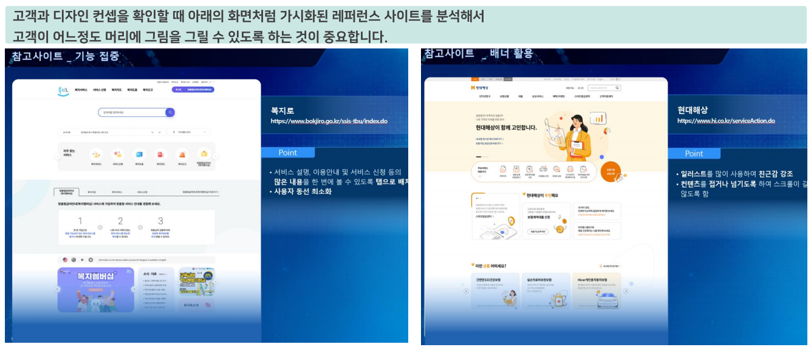

# 1. 디자인 단계 관리
## 1.1. 디자인 단계 개념

**기획자가 만든 스토리보드를 사용자들이 쓸 수 있는 예쁜 화면으로 만드는 과정**

## 1.2. 디자인 단계 프로세스

**1. 디자인 컨셉 확인**
- 고객이 원하는 디자인의 컨셉을 확인하는 단계

**2. 디자인 시안 작업**	
- 고객의 컨셉을 듣고 디자이너가 디자인을 예쁘게 진행한 생풀

**3. 시안 확정 및 Develop**	
- 디자인 시안을 보고 고객이 디자인을 확정하고, 확정된 디자인 시안을 좀 더 개선하는 과정
- 이 과정에서 지연이 제일 많이 일어남

**4. 전체 화면 디자인 작업**	
- 디자인 작업이 완료되면 디자인 가이드를 만들고 전체 화면에 대한 디자인을 하는 작업 과정

### 1.2.1. 디자인 컨셉 확인

- 고객은 디자인에 감이 없음. "컨셉을 잡아주세요"라고 하면 모호한 답변을 듣고 향후 디자인 시안과 고객의 의도와의 갭이 클 수 있음.
- 가능한 고객의 구체적인 요청을 들을 수 있도록 가이드하는 것이 좋음.

- **고객에게 만들어질 시스템의 디자인을 어떤 방향으로 하면 좋을지 물어보는 단계**
- 기본적으로는 아래의 질의로 진행 “우리 시스템의 디자인을 어떤 컨셉으로 하면 좋을까요?”
**[ PM이 효과적으로 일하는 방법 ]**
- 디자이너를 통해 유사한 레퍼런스를 미리 준비해 보여주면서 건셉을 찾으면 더 효과적
- 이와 함께 최근 디자인의 트랜드 등을 자료 혹은 설명을 통해 알려주고 확인

 

### 1.2.2. 디자인 시안 작업

- [x] 할 일 1 (완료)
- [ ] 할 일 2 (미완료)
  - [ ] 하위 할 일 2.1
  - [x] 하위 할 일 2.2
- [ ] 할 일 3
