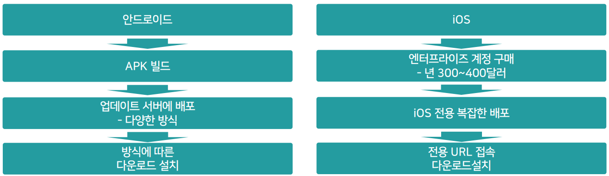
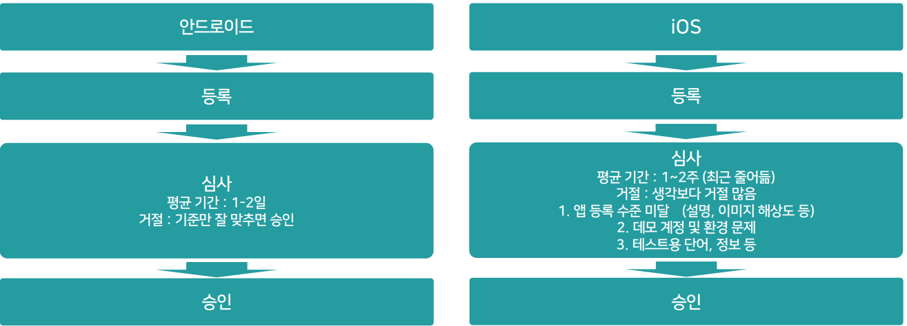
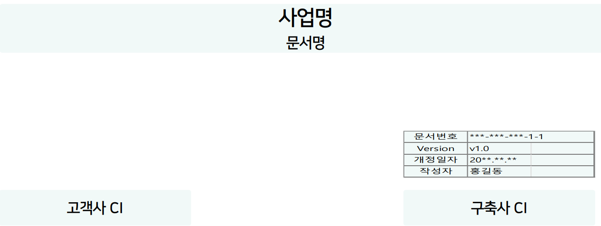

# 1. 디자인 단계 관리
## 1.1. 디자인 단계 개념

**기획자가 만든 스토리보드를 사용자들이 쓸 수 있는 예쁜 화면으로 만드는 과정**

## 1.2. 디자인 단계 프로세스

**1. 디자인 컨셉 확인**
- 고객이 원하는 디자인의 컨셉을 확인하는 단계

**2. 디자인 시안 작업**	
- 고객의 컨셉을 듣고 디자이너가 디자인을 예쁘게 진행한 생풀

**3. 시안 확정 및 Develop**	
- 디자인 시안을 보고 고객이 디자인을 확정하고, 확정된 디자인 시안을 좀 더 개선하는 과정
- 이 과정에서 지연이 제일 많이 일어남

**4. 전체 화면 디자인 작업**	
- 디자인 작업이 완료되면 디자인 가이드를 만들고 전체 화면에 대한 디자인을 하는 작업 과정

## 1.3. 디자인 컨셉 확인

- 고객은 디자인에 감이 없음. "컨셉을 잡아주세요"라고 하면 모호한 답변을 듣고 향후 디자인 시안과 고객의 의도와의 갭이 클 수 있음.
- 가능한 고객의 구체적인 요청을 들을 수 있도록 가이드하는 것이 좋음.

- **고객에게 만들어질 시스템의 디자인을 어떤 방향으로 하면 좋을지 물어보는 단계**
- 기본적으로는 아래의 질의로 진행 “우리 시스템의 디자인을 어떤 컨셉으로 하면 좋을까요?”

**[ PM이 효과적으로 일하는 방법 ]**
- 디자이너를 통해 유사한 레퍼런스를 미리 준비해 보여주면서 건셉을 찾으면 더 효과적
- 이와 함께 최근 디자인의 트랜드 등을 자료 혹은 설명을 통해 알려주고 확인

 

## 1.4. 디자인 시안 작업

**고객이 제시한 컨셉에 맞춰서 디자인의 샘플을 만드는 단계**

- 고객이 알려준 컨셉을 확인하고 이에 따른 디자인 샘플을 만드는 작업
- 보통 2-3개의 시안을 만듬

**[ PM이 효과적으로 일하는 방법 ]**
- 기획 문서 중 3-5개 정도의 스타일이 다른 대표적인 화면 선정해서 요청 (로그인, 메인, 리스트, 상세 등) 그리고 가능한 구체적 가이드

**디자이너가 작성한 시안**을 **PM은 사전에 검토**, 기본적인 디자인 퀄리티가 나왔는지 **확인 후 보완** 
보완이 완료된 후, **컨셉을 소개하는 PPT 자료**를 만들고 **가능한 디자이너가 직접 고객에게 소개**하도록 함

## 1.5. 디자인 시안 소개 자료

**고객의 빠르고 효과적인 선택을 위한 도움을 주는 자료**

 

## 1.6. 디자인 확정

고객은 **시안 중 1개의 안을 선택**하거나, 다 마음에 안드니 **새롭게 하라**고 할 수 있음 
대부분은 **시안 중 하나를 선택**하고, **해당 시안을 좀 더 보완(Develop)해서 적용**하는 방식으로 진행

## 1.7. 디자인 가이드

시안이 확정되면 전체 디자인 작업을 하기 위한 **디자인 가이드라인을 정리한 문서**를 만들고, 그 문서에 따라 전체 기획 화면에 대한 디자인을 진행

 

## 1.8. 전체 디자인 작업

**PM**은 디자인 작업이 **개발을 고려하여 순차적으로 진행되도록 관리**하는 것이 핵심 
디자인 작업이 진행되는 **중간 결과물**을 **빠르게 퍼블리싱에 전달**, **개발이 빨리 진행되도록** 하는 것이 중요

- 디자인 시안이 확정되면 본격적인 전체 화면에 대한 디자인 작업 진행
    - 보통 메인 디자이너 + 1~2명의 보조 디자이너가 함께 전체 화면 디자인을 진행함

**[ PM이 효과적으로 일하는 방법 ]**
- 디자인이 전체가 마무리 되는 일정관리 보다 개발의 우선순위에 따른 디자인 스케줄 작성
- 전체 디자인이 안 끝나도 우선 디자인 된 화면이 바로 퍼블리싱 및 개발에 이어지도록 관리

## 1.9. 퍼블리싱 작업

**디자이너가 만들어 준 디자인 파일을 **개발자가 작업 가능하도록 스타일을 잡고 실제 개발이 가능한 HTML, JSP 등 화면으로 만드는 일**

### 퍼블리싱 작업 관리 방법

**디자인이 나오는 대로 퍼블리서가 작업 가능하도록 전달해주는 것이 기본**

- 보통 초반 디자인+퍼블리서+개발리더가 모여서 회의를 통해 작업 순서, 일정, 방식을 정리

 

**[ PM이 효과적으로 일하는 방법 ]**

**퍼블리싱의 경우 사전 조건에 대한 검토 필수**
- 적용 브라우저 종류 및 해상도 등
- 작업 방식(PC, 모바일, 반응형 등)
- 웹 접근성 준수(유/무)
- 개발자들과 작업 범위 및 방식, 형상 관리 등

## 1.10. UI/UX 참조 지식

 

# 2. 개발 단계 관리

## 2.1. 개발 단계 관리 프로세스

**1. H/W 구성 협의**	
- 구축할 H/W 시스템에 대한 구성 협의
- 시스템 도입의 과정에 대한 관리

**2. 네트워크 구성 협의**
- 구축할 네트워크에 대한 구성 협의
- 네트워크 구성 범위에 따라 개발의 범위 자이 관리

**3. 개발 관리**
- 개발을 위한 다양한 관리

## 2.2. H/W 구성 협의

**만들어진 시스템이 동작할 H/W 구성을 협의**
- 안정성 및 효율성을 고려한 H/W 도입 방안 협의가 핵심

**[ PM이 효과적으로 일하는 방법 ]**
- 시스템의 안정성과 성능에 대한 고객의 의지와 비용 확인
    1. DB 백업 정책 (H/W, 미러링 등)
    2. H/W 다중화 작업

### 주요 H/W 종류

**WEB SERVER**	
1. 정적인 요소들이 동작하는 서버 (단순 html 문서, CSS, 」avascript, 이미지, 파일)
2. 아파치

**WAS**
1. Web Application Server 의 약자
2. 동적인 요소들이 동작하는 서버 (프로그램 로직, DB접속 등) 
3. WEB Server 기능도 포함
4. 톰캣

**DBSERVER**	
1. Database가 동작하는 서버

**[ 데이터는 단순한 정보, 그 데이터에 의미를 부여하는 것이 프로그램 개발의 과정 ]**
- DB서버 : 1000
- WAS : 잔고 - 1000
- Web서버 : 화면에 "당신의 잔고는 1000원" 임을 표시

### 다중화 구성 협의

**하나가 고장나면 서버 전체가 멈춰버리는 것을 방지하기 위해 다중화 구성을 함 (H/W 시스템 안정성)**

 

## 2.3. 네트워크 구성 협의

**어떤 네트워크 환경에서 서비스를 제공할 지에 대한 협의**

- 네트워크 구성의 핵심은 접근성

**[ PM이 효과적으로 일하는 방법 ]**
- 현재 고객이 생각하는 구축될 시스템의 서비스 대상이 누구인지 확인
- 해당 서비스 대상이 시스템에 접근하는데 문제가 없는 네트워크 환경이 되도록 검토
- 네트워크를 잘 아는 PM 이면 직접 아닌 경우 개발 PL과 함께 검토

### 네트워크 구성도

### 네트워크 구성 협의 방법

## 2.4. 개발 작업 관리

**설계이후 실질적인 개발이 진행되는 진적 관리**
- 개발에 병목이 생기지 않도록 관리하는 것이 핵심

**[ PM이 효과적으로 일하는 방법 ]**
- 사전 준비 철저
    - 기획/디자인/퍼블리싱이 가능한 빨리 나오도록 관리
- 개발의 병목 요소 제거
    - 의사결정 지연, H/W 및 S/W 도입지연 등

### 개발 기본 구조 이해

### 개발 작업 관리

**개발자 배치 등 개발 작업에 대한 이해가 필요함**

### 개발 기본 구조

**초기 환경 구성**
- PL 급 서버 개발자는 사업 초기 투입
- 시스템 구조 설계 및 개발 환경 구성

**백엔드 서버 개발**
- DB 및 아키텍져 설계
- 서비스 로직 개발

**프론트엔드 및 개발**
- 최종 사용자 UI 측 화면 개발

## 2.5. 웹, HTML, 웹브라우저 이해

**웹**
1.	World Wide Web 의 약자
2.	인터넷에 연결된 사용자들이 서로의 정보를 공유할 수 있는 공간

**HTML**	
1.	HyperText Markup Language
2.	웹에서 정보를 전달하기 위해 만들어진 언어

**웹 브라우저**	
1.	웹을 통해 전 달되는 정보를 보여주는 수단
2.	전달 받은 HTML을 화면에 보여주는 가능

### 웹 브라우저 이해

**웹 브라우저는 종류별로 다른 특성을 지님. 단, W3C의 공통 규격을 따름. (World Wide Web Consortium)**

**[ 익스플로러, 엣지, 크롬, 파이어폭스, 사파리 등 ]**

1. 사용자의 요청을 받아 주는 일
2. 받은 요청을 서버로 전달하고, 서버로 부터 결과물을 전달 받는 일
3. 서버로 부터 받은 정보를 해석하고, 그려주고, 동작 시켜 주는 일

## 2.6. 앱 배포 관리

**개발 테스트 폰 배포**
- 개발을 위한 테스트 폰에 개발 결과를 배포하는 방식

**내부 배포**	
- 기업 내에서 사용되는 앱의 경우 별도의 마켓을 이용하는 것이 아닌 기업 내부망에서 앱을 배포 가능하도록 하는 방식

**APP 스토어 배포**	
- APP 스토어에 개발된 앱을 배포하는 방식

### 테스트 폰
- 안드로이드는 제약 없이 설치 테스트 가능
- iOS는 사전 준비 없으면, 테스트 시 당황

### 내부 배포
- 안드로이드는 별도의 계정 비용 없음
- iOS는 별도의 비용 발생 (사전에 알아야 함)

### APP 스토어 배포

### APP 스토어 심사 거절 사유
**iOS의 심사 거절 주요 사유**

1. 앱 등록 수준 미달 (설명, 이미지 해상도 등)
2. 데모 계정 및 환경 문제 (심사 테스트 시 동작 안 하면 무조건 거절)
3. 테스트용 단어, 정보 등 (화면에 테스트 문구 등 주의)
4. 웹 뷰 중심의 입 (심사없이 콘텐츠 변경 가능, 적절한 기능 추가)
5. 사용자 등록 콘텐츠 문제 (사용자가 부적절한 콘텐츠 등록에 대한 방어)
6. 결제 문제 (결제 부분에 우회 경로 보일 경우)

# 3. 테스트 단계 관리
## 3.1. 테스트 개념
**정상적인 서비스를 할 수 있도록 검증하고 보완하는 단계**

### 1. 단위 테스트
- **개발자, 품질관리**
    - 개발이 완료된 기능 테스트
    - 각 화면별, 기능별 기본적인 오류 테스트
### 2. 통합 테스트
- **개발자, 품질관리, 현업 TFT
    - 단위테스트 후 안정된 시스템으로 전체 프로세스를 테스트
### 3. 인수 테스트
- **고객사, 실제 사용자**
    - 최종 고객이 시스템을 테스트
    - 오류 확인 뿐만 아니라, 시스템 이용의 편의성, 적합성 검증

## 3.2. 기본 테스트 관리 방법

[ 테스트 작업 진행 순서 ]

### 1. 테스트 계획서 작성
- 테스트 진행에 대한 계획을 수립

### 2. 테스트 케이스 작성
- 테스트를 위한 대상 및 진행 케이스 정리

### 3. 테스트 시나리오 작성 (단위, 통합, 인수)
- 테스트 케이스를 기초로 진행 시나리오 작성

### 4. 테스트 진행
- 최종 테스트 수행 및 보완

## 3.3. 테스트 계획서 작성 방법
### [ 구성 내용 ]

### 테스트 개요
- 테스트 진행과 관련된 개요
    - 사업정보, 테스트 목적 등

### 테스트 절차
- 테스트 진행을 위한 절자
    - 테스트계획, 케이스, 시나리오, 테人E, 보완 등

### 테스트 일정
- 테스트 절자에 따른 실제 일정 계획
    - 절차의 각 단계에 실제 일정과 담당자 기입

### 테스트 대상
- 실제 테스트를 진행할 대상 
    - 시스템 종류, 시스템 별 주요 기능(대메뉴 수준)

### 테스트 보완
- 테스트 결과에 대한 보완 방법
    - 보완절자, 담당자, 보완 방법

## 3.4. 테스트 케이스 작성 방법
### [ 작성 방법 ]

### 문서 양식
- 기본 엑셀 문서 혹은 표 형태로 작성

### 문서 항목
- 시스템명
- 요구사항|D : 요구사항 반영 여부 체크
- 테스트 케이스 :
    - 화면 기능 기준 : 대메뉴, 소메뉴, 중메뉴, 화면, 기능
    - 업무 기능 기준 : 업무 분류, 업무, 상세 작업

### 작성 주의 사항
- 모든 요구사항이 먭평 될 수 있도록 작성
    - 요구사항 상세 관리 안 하는 경우도 있음

### 기본 컨셉 
- **테스트를 할 케이스(대상)에 대한 상세 정리. 단, 진행되는 곳마다 다르게 진행**
    - [메뉴>화면 레벨도] [메뉴>화면>기능 레벨] [화면 기능 기준이 아닌 업무 단위 케이스] 등...

## 3.5. 단위 테스트 개념
**개발한 시스템의 단위 기능이 정상적으로 동작하는 지 확인**

## 3.6. 단위 테스트 시나리오 작성 방법

### [ 작성 방법 ]

### 메뉴 구조
- 대메뉴, 중메뉴, 소메뉴, 화면명, 화면ID

### 테스트 항목
- 화면에 실제 테스트 할 기능명

### 테스트 내용
- 실제 테스트를 진행하는 방법 설명 
    - EX) 조회 버튼을 클릭하면 *** 내용이 나오는지 확인

### 테스트 결과
- 테스트 결과 여부 및 오류 내용 
    - 정상, 비정상 표시, 오류 시 상세 내용 입력 필드

### 테스트 진행정보
- 테스트 담당자 명, 진행날짜 등

### 테스트 보완정보
- 오류 수정 담당자 및 예상 일정 등

## 3.7. 통합 테스트 개념
**전체 프로세스가 정상적으로 돌아가는지 확인하는 테스트**

## 3.8. 통합 테스트 시나리오 작성 방법

**[ 작성 방법 ]**

1. 단위 테스트 시나리오를 동일하게 통합테스트 시나리오로 만들고 테스트 대상만 변경하는 경우
- 문서 양식은 단위 테스트 시나리오와 유사
    - 테스트 데이터, 테스트 예상결과 등 컬럼 추가
2. 별도의 통합 테스트 시나리오를 만드는 경우
- 별도 작성시 중요한 것은 시나리오의 내용이 바뀌어야 함
    - 단위가 기능이라면, 통합은 업무 중심으로 , 실제 데이터로

## 3.9. 인수 테스트 개념

**개발된 기능이 요구사항대로 되었는지 검증이 목적인 테스트** 
하지만 실제로 고객은 검증과 함께 자신이 필요로 하는 기능에 대한 요구를 하는 경우가 많음

## 3.10. 인수 테스트 관리 방법

**별도의 인수 테스트 없이 통합 테스트 만으로 진행하는 경우도 많음**

### [ 진행 방법 ]

- 통상은 통합 테스트 시나리오를 가지고 진행
- 고객사와 협의를 통해 인수 테스트 담당자 지정
    - 통상 현장에서 업무를 수행하는 담당자가 진행
- 인수테스트 중에는 오류가 아니더라도 업무 담당자가 원하는 방향이 아닌 기능 의견 중심 취합
- 취합된 의견을 수행사-고객사 가 검토 후 반영 여부 확정
    - 진행 일정 고려 및 의견의 타당성 검증

## 3.11. 성능 테스트

### 1. 성능
- 시스템의 성능을 테스트
    - 응답 시간, 치리량 등
- 수기 테스트, 도구 측정

### 2. 부하 & 스트레스
- 시스템에 과부하가 결렸을 때, 정상 작동 여부 테스트
    - 기준정의, 부하환경 구축, 테스트 측정 도구

### 3. 보안
- 소프트웨어의 보안적인 측면 테스트
    - 물리적 보안, 논리적 보안

### APM : Application Performance Management
- 시스템 테스트를 위한 별도 관리 도구
- 운영 시 안정화 모니터링까지

# 4. 오픈 및 검수 단계 관리

## 4.1. 오픈 및 검수 단계 개념

**최종적으로 시스템을 고객에게 열어주고 관리하는 단계**

### 오픈
- 시스템을 고객이 사용할 수 있도록 만드는 것

### 안정화
- 서비스 오픈 이후, 발생하는 다양한 문제에 대해서 대응
    - 오류 수정, 성능 보완, 기능 개선

### 검수
- 고객사의 시스템 구축 시, 시스템 구축 완료를 확인 받는 것
- 검수 확인서에 도장을 찍음으로 완료

### 유지보수
- 시스템 구축 완료 이후 사후 관리
- 다양한 계약 방식 존재
    - ex 1) 구축비 15%, 안전한 운영
    - ex 2) 인력 계약, 운영 + 추가 개발

## 4.2. 배포 진행

### 서버 배포
- **운영 서버에 실제 프로그램 최종 결과물을 설치 하는 것**
- 즉시 서비스 운영이 가능함
- 네트워크 상의 문제가 없도록 사전 체크 필요

### APP 배포
- **안드로이드 & iOS 앱스토어에 앱을 등록하고, 등록된 앱을 오픈 하는 것**
- 얩스토어 등록 심사/승인은 사전에 받아야 함
- 오픈 일에 맞줘, 승인이 완료된 앱을 오픈 해줄 수 있음

## 4.3. 오픈 및 안정화 방법 
### 전환 계획
- 기존 시스템의 정보를 신규시스템으로 전환 (신규 오픈이 아닌 경우에만 해당)
    - 기존의 시스템을 중지
    - 신규시스템으로 데이터 전환 이관
    - 이관 데이터 검증

### 오픈 전개 계획
- 시스템 오픈을 위한 계획
    - H/W 및 네트워크 점검
	- 시스템 설치 : DB 초기화, S/W 설치 등
    - 설치 결과 점검 : 최종 테스트 점검
    - 시스템 초기화 : 테스트 데이터를 지우고 초기화 상태

### 오픈 및 안정화
- 오픈 : 오픈 전개 계획에 따른 수행
- 안정화 : 오픈 후 1주일 ~ 한달까지 (상황에 따라 다름)
    - 오류수정, 급한 요청 사항 반영 등

## 4.4. 데이터 전환 3단계

### 1차 전촨
- 최초 데이터 전환을 진행
- 이 과정에서 데이터 전환의 방법을 정리하고 데이터 전환 과정에 발생하는 많은 문제점을 해결
- 이와 함께 데이터 전환에 걸리는 시간을 확인
- 전환에 대한 시나리오를 작성

### 2차 전환
- 1차 전환에서 작성된 시나리오를 기반으로 전환 시작
- 2차 전환 시 발생하는 새로운 문제에 대해 해결 및 메뉴얼화
- 전환된 데이터의 정밀한 검증
- 오픈 전환을 위한 시나리오 작성

### 3차 전환
- 2차 전환까지 진행을 통해 준비된 시나리오에 따라 최종 전환 작업 진행
- 데이터 검증에 대한 철저한 확인 및 시스템 오픈

## 4.5. 오픈 및 안정화 방법

### 클로징
- 기존 운영된 시스템 서비스 종료
    - **사전에 서비스 이용자에게 전환 공지 및 관리 (언제 서비스 중단되고, 언제 신규 전환 오픈 하는지)**

### 데이터 전환
- 기존 운영 시스템 데이터 백업
- 백업된 데이터를 신규 시스템에 마이그레이션
- **마이그레이션 데이터 정합성 검증**

### 전환 점검
- 전환된 데이터 기준 신규 시스템 동작 점검 
    - **점검 과정에 테스트 데이터 등 데이터 유입, 변형**

### 데이터 초기화
- 최초 마이그레이션 상태로 데이터 초기화
    - **기존 시스템 백업데이터 마이그레이션 상태로 복원**

## 4.6. 오픈 유지보수 방법

### 무상 유지보수
- 시스템 구축 이후 일정 기간 동안 무상으로 유지 보수를 해주는 것
- 보통 RFP 및 계약서에 해당 조항 포함됨
- 일반적으로 1 년을 기준으로 함
- 에대, 오류 및 이상에 대한 유지보수임, 추가 개발 별개

### 유상 유지보수
- 무상 유지 보수 기간이 끝나고, 유상으로 유지 보수를 해주는 것
- 보통 1 년 단위 계약을 하며, 구축 비용의 10%~15% 정도를 기준으로 진행됨
- 이때, 오류 및 이상에 대한 유지보수임, 추가 개발 별개

### 추가 개발
- 오류 및 안정화를 넘어선 추가 개발
- 간단한 요구의 경우 유지 보수를 통해서 수행
- 지속적인 개선과 운영이 필요할 경우 별도의 운영 계약을 진행해야 하며, 비용  산정의 기준은 인건비 기준
- 추가 개발 양이 많을 경위 추가 프로젝트 진행하기도 함

## 4.7. 검수 개념
**고객에게 완료가 되었음을 확인 받는 작업**

### 검수 확인서 작성
- 구축된 시스템의 기능이 정리된 검수 확인서 작성
    - 아래 별도 설명

### 검수 진행
- 검수 확인서 기준, 고객이 실제 기능이 완료된 부분 최종 점검

### 최종 검수 확인
- 고객의 기능 점검이 완료되면, 검수 확인서에 날인을 함으로 완료
- 검수 확인 의미
    - 시스템 구축팀의 철수 가능 및 잔금 청구 기준

 

### 검수 확인서 작성 방법

 

# 5. IT 프로젝트 관리 기본 지식

## 5.1. 프로젝트 관리 기본 종류

### 필수 용어
- 프로젝트 진행 중 많은 사람과 소통하며 필요한 필수 용어 정보

### 문서 관리
- 프로젝트의 산출물을 작성 관리하는 기본 방법

### 데이터 표준화 및 품질관리
- 개발의 품질을 높이기 위한 데이터 표준화 및 품질관리 지식

## 5.2. 필수 용어 개념

**필수 용어에 대한 지식이 없는 경우, 당황하는 경우가 많음**

**프로젝트 진행 중 발생하는 주요 용어는 이미 설명하였음. 그 외에 자주 나오는 필수 용어 정리**

### 시스템 관련

#### 개비
- [改備] : 고칠 개, 갖출 비
- 현재 운영중인 시스템을 고치는 것을 의미
- 시스템은 유지, 고치는 사이즈가 작을 때

#### 고도화
- 현재 운영중인 시스템을 더 좋게 만드는 것
- 시스템은 유지, 고치는 사이즈는 크게

#### 리뉴얼
- 기존 시스템을 새롭게 만드는 것 (보통 B2C 기반 소규모 홈페이지 등에 사용)
- 시스템 자체를 바꿈, 사이즈가 작을 때 표현

#### 차세대
• 기존 시스템을 새롭게 만드는 것 (보통 B2B 업무용 시스템 등에 사용)
• 시스템 자체를 바꿈,사이즈가 클 때 표현

 

### IT 입찰 방식

#### 수의 계약
- 개발을 맡길 업체를 사전에 정하고, 협상을 통해서 계약 진행

#### 경쟁 입찰
- 개발 맡길 업체를 미리 정하지 않고, 제안과 견적(비용)을 심사하여 업체 선정 후 계약

#### 우선 협상
- 경쟁 입찰과 수의 계약의 중간 정도
- 경쟁 입찰 방식이지만, 후보 업체들을 미리 선정해서 그 중에서 경쟁

#### 투입 공수
- 투입될 개발 인력의 양(숫자)
- 투입 공수를 산정하라 = 이 개발을 진행하는 데에 들어갈 사람 숫자를 세라

#### M/M (맨먼스)
- 특정 개발을 위해 투입될 인력의 수
- 투입 공수의 단위로 이해하는 게 편함 ( 이번 프로젝트 공수는 15M/M정도 나옴 )

#### 턴키 방식
- 계약을 수주한 수행사가 처음부터 끝까지 책임을 지는 계약 방식

#### 용역 계약 방식
- 이거 개발하는데 몇 명을 얼마 기간동안 투입시키는 방식

 

### 고객사 시스템

#### 레거시
- 오래된 시스템

#### 기간계 시스템
- 회사의 사업과 관련된 업무 시스템 (ex 판매/구매 시스템, 재고 관리 시스템 등)

#### 그룹웨어
- 여러 명이 협동하여 일을 하도록 만든 S/W
- 통상 회사 직원들의 업무 소통을 위한 시스템 (ex 직원관리, 사내메일, 메신저, 결제 등)

#### ERP
- 전사적 자원 관리 시스템
- 회사에서 쓰는 모든 시스템을 통합한 것 (MIS + 자재관리, 물류관리, 판매관리 등)

### 평가

#### 정량 평가
- 정량적 = 숫자로 표현 가능한 것
- 평가 결과를 수치화 할 수 있는 평가

#### 정성 평가
- 정성적 = 숫자로 표현 불가능한 것
- 평가 결과를 수치화 할 수 없는 평가 (숫자로 표현 불가능한 것을 수치화 하는 능력이 필요)

#### KPI
- 평가를 위한 지표
- 시스템 도입과 관련해서는 도입 후 개선이 되는 항목들을 말함

#### ROI
- 투자 수익률
- 실제로는 고객이 시스템을 도입하면서 들어간 비용만큼 ROI가 나와야 합니다. 이런 식

## 5.3. 문서 관리 개념

**PM이 갖추어야 할 역량 중 하나, PMO, PA, QA, 사업 지원 등 사업 품질 관리 담당들이 문서를 잘 관리하도록 리딩하는 지식 필요** 
보통은 개발, 기획 등 시스템 개발과 관련 지식 베이스로 PM을 하므로, PM 중 생각보다 간단한 문서 관리 지식이 부족한 경우가 많음

**[ 문서 관리 기본 ]** 
**[ 전체적인 산출물 관리 방법 ]**

## 5.4. 기본 문서 서식

### [ 문서 양식 및 작업 기본 ]

**표지, 개정 이력, 버전 관리, 문서 관리 ID 부여 방식**

---

### 문서 표지

### 개정 이력

### 버전 관리 규칙
- **최초 작성은 v0.1, 문서의 초안 확정은 v1.0**
- 적은 변경 시 0.1, 0.2, 0.3 ...
- 문서의 큰 변경이 있을 경우 v2.0 ( 감리 단계별로 맞추기도 함, 설계 1.0, 종료 2.0 )
- 보통 1.대 즉 1.0, 2.0 등 큰 변화 시는 가능한 고객에게 공유
- 요구사항 정의서, WBS 등 주요 문서는 버전 변경 시, 반드시 고객 검토 및 컨펌을 받아야 함

### 문서 관리 ID 작성 규칙
- 가능한 산출물은 ID 관리를 하는 것이 좋음 ex) 요구사항 정의서 (X) → KOR-SI-AN-10-요구사항 정의서 (O)
- 좋은 점은 문서의 이름만 봐도, 어떤 업무의 어떤 위치에 문서가 있고 관리 되는 지 알 수 있음
    - KOR(이라는 사업의)-SI(시스템 개발 쪽)-AN(분석 단계 중)-10(제일 먼저 진행되는)-요구사항 정의서
- 채번 규칙은 일관성만 있으면 되며, 회사마다 다름. 단, 아래는 일반적으로 쓰는 가이드
    - 사업명 - 구분:개발/관리 - 진행단계 - 단계 순번 - 파일명

## 5.5. 전체 산출물 관리 방법
1) 사업 관리와 개발 관리 폴더 분리
2) 업무 단계 순서 별 폴더 관리
3) 3 단계부터는 업무 별 폴더 관리
4) 2 단계까지는 [순번-단계명칭-약어]로 폴더 관리
5) 3단계부터는 [순번-업무명칭]
1) 상세 문서는 폴더의 약어 기반 ID 채번

## 5.6. 데이터 표준화

**DB의 컬럼을 관리하는 표준에 맞게 관리하는 것**

### 명명 규칙
- 시스템이 복잡해지면 [Table]이 많아지고, 그 안에 사용되는 [컬럼]은 더 많아 지며 규칙 없으면 관리 어려움
- 이때 만들어질모든DB 컬럼의 용어가 일관성 있게 작명 되도록 규칙을 관리 하는 것

### 표준화 사전
- 실제 DB TABLE 설계에 사용할 모든 용어를 정리하고, 규칙에 따라서 영문화 사전화 시키는 것
    - 중복제거, 동의어 단일화, 동음어 구분 등

**공공 IT의 경우, 표준화를 기본으로 가져감. 하지만 민간의 경우, 선택인 경우가 많음** 
**이 부분은 제대로 안되면 개발 진행 당시보다 운영 중 큰 불편함을 줌**

## 5.7. 데이터 품질 관리

**DB의 컬럼 값을 일관적으로 관리하는 것**

### 일관성 유지
- 표준화 문서에 각 TABLE 컬럼에 대한 형식 정의까지 됨
- 해당형식 정의에 맞게 실제 TABLE 컬럼 타입이 만들어 졌는지 확인. 이를 통해 일관성 확보
    - 같은 날짜가 텍스트, DATE 등 다른 형식 혹은 20230221, 2023-02-21 등 다른 부분 관리 가능

### 오류 값 입력 방지
- 표준화에 따라 TABLE이 만들어 져도, 프로그램에서 오류 값을 만들 수 있음. 이에 대한 점검
- 전화 번호를 텍스트로 만들 경우, 프로그램에서 형식과 잘못된 입력을 막지 않으면 [" " , "," ,  "000"] 이런 식의 잘못된 값이 들어옴

**품질 관리가 제대로 되지 않으면, 향후 프로그램 확장이나 다양한 정보 관리에 문제가 생길 수 있음** 
**테스트를 진행 시, 관리 관점에서 이상한 값이 들어가면 안되는 곳에 이상한 값이 들어가는지 확인 후 보완 필요**

# 6. IT 사업 기획과 IT 프로젝트 관리 관계

## 6.1. IT 프로젝트를 하면서 알게 되는 것

### 고객사 구조
- IT Project 를 진행 시, 고객사의 내부 조직 구조 및 다양한 체계 정보를 알 수 있음

### 고객사 핵심 BM
- 고객사가 가지고 있는 핵심 BM 확인 가능 
- 고객사가 중요하게 여기는 방향 확인 가능

### 고객사 Pain Point
- 고객사에서 해결하고 싶어 하는 다양한 문제에 대한 정보 확인 가능

### 고객사 의사결정 과정
- 고객사가 시스템 개발을 위해 필요로 하는 다양한 의사 결정 과정에 대한 이해 가능

## 6.2. IT 사업 기획의 사업 기회
**DX 컨설턴트가 고객사의 내부 정보를 잘 아게 되면, 해당 사업에 제안할 수 있는 기회를 찾을 수 있음** 
**외부에서 바라본 고객과 내부에서 경험하는 고객은 완전 다름.**

