# 1. 프로젝트 관리 기본 개념 이해

## PM

**IT 프로젝트 진행 시 전체 프로젝트를 총괄하는 업무**

**1. Project Manager**
- IT  프로젝트 총괄 업무

**2. Product Manager**
- IT 상품 개발 및 개선 총괄 업무
- 프로덕트 매니저의 개념이 모호함 / PO(Product Owner)와 혼용되는 경우가 많음

기본은 IT Project 관리에 대한 설명 / 
관리적인 관점에서 IT Product 관리도 동일하게 이해

 

## PM의 역할

**1. 제안 / 수주**
- IT 개발 사업을 수주하기 위한 업무 지원

**2. 프로젝트 준비**
- 사업 수주 후 프로젝트 진행을 위한 준비

**3. 프로젝트 진행 관리**
- 개발 프로젝트 전체 진행 관리

**4. 이후 관리**
- 프로젝트 종료 과정부터 그 이후 관리

--------

### 1. 제안 / 수주

**1. 영업 지원**
- 신규 사업을 발굴하기 위한 영업 활동 지원

**2. 제안서 작성 지원**
- 고객이 발주한 사업에 대한 제안서 작성 지원

**3. 프로젝트 진행 관리**
- 작성된 제안서의 발표

**4. 수주**
- 수주가 확정된 이후 사전 협상 및 계약 지원

-----

### 2. 프로젝트 준비

**1. 투입 인력 계획**
- IT개발 사업을 진행할 인력에 대한 상세 계획

**2. 투입 인력 소싱**
- 인력 계획에 따른 투입 인력 확보 지원

**3. 사업 수행 계획**
- 사업 수행을 위한 계획서 (공공 필수, 민간 생략 가능)

**4. 기타 준비**
- 프로젝트 진행을 위한 장소, 방법 등 다양한 협의

> Q : 프로젝트 중간에 퇴사같이 인력 변동된 경우에는 바이어한테 통보 해주나요? 
> A : 핵심 인력의 경우에는 더 일 잘하는 대체 인력을 준비하고, 인력 교체 상황 최종 확인 제안   이외의 인력의 경우에는 비슷한 수준의 인력으로 대체하면 대부분 이해함

-------------------------

### 3. 프로젝트 진행 관리

**1. 진행 일정 계획 / 관리**
- IT 개발 프로젝트 진행을 위한 전체 일정 계획 (WBS)
- 해야될 업무를 상세하게 정의하고 작성

**2. 주요 보고 진행**
- 프로젝트 진행을 위한 주요보고 (주간, 월간, 착수, 중간, 종료)

**3. 개발 진행 관리**
- 개발 전 과정 관리 (기획. 디자인, 개발, 테스트 등)

**4. 이슈 관리**
- 프로젝트 진행중 발생하는 다양한 이슈 및 인력 관리

 

-----------------------

### 4. 이후 관리

**1. 검수**
- IT 프로젝트 완료 후, 최종 확인 절차인 검수까지 진행

**2. 안정화 지원**
- 개발된 IT 시스템 오픈 부터 안정화 지원

**3. 유지보수 지원**
- 프로젝트 종료 이후 계약 혹은 협의에 따른 유지보수 관리

**4. 신규사업 발굴**
- 프로젝트 진행 중 발생하는 다양한 이슈 및 인력 관리

 

-------------------------

## PM의 업무 범위

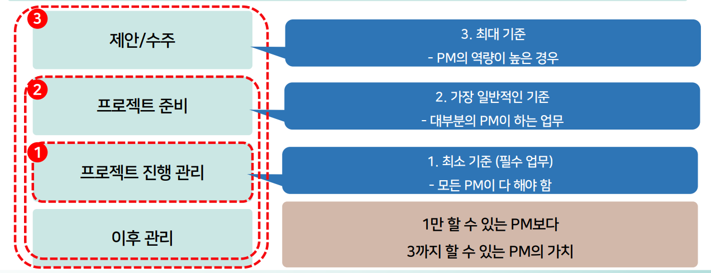

----------------------------------

## PM 구분

**1. 전문 PM**
- IT 프로젝트 관리만 전문으로 진행 (규모가 큰 프로젝트의 경우)

**2. 기획자 PM**
- 기획자가 PM업무를 같이 진행 (웹 에이전시 업체에서 많음)

**3. 개발자 PM**
- 개발자가 PM업무를 같이 진행 (기술 중심의 프로젝트의 경우)

**4. 기타**
- 프로젝트가 적은 경우 사업관리, 영업, 디자이너 등이 PM 업무를 병행하기도 함

 

-----------------------------

## IT 프로젝트 프로세스

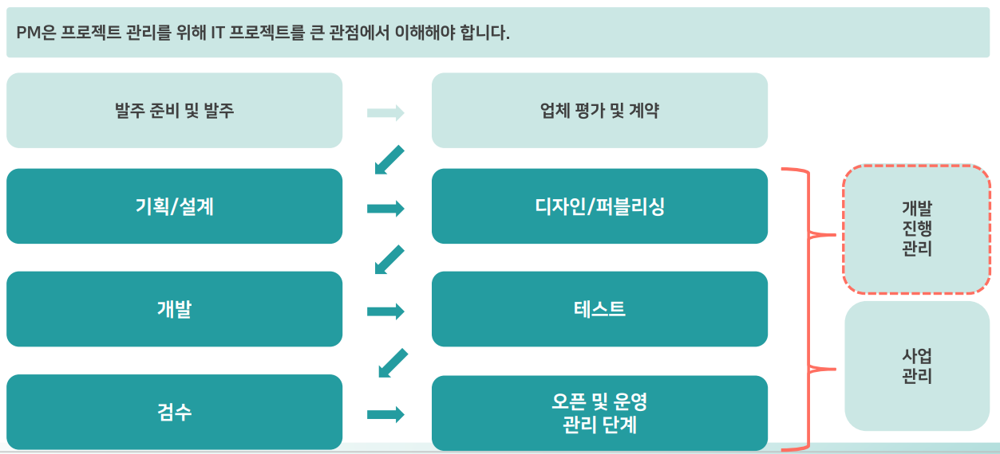

 

## IT 프로젝트 주요 관계자

**내가 만나서 소통할 대상이 어떤 일을 하며 그들과 소통하는 방법 필요** 
**주요 업무 관계자들 종류 및 업무(역할), 주요 소통하는 방법에 대한 설명**

### 1. 고객사측 주요 업무 관계자

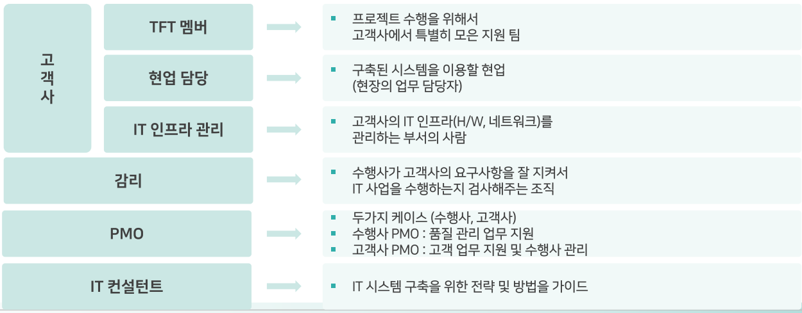

### 2. TFT 멤버

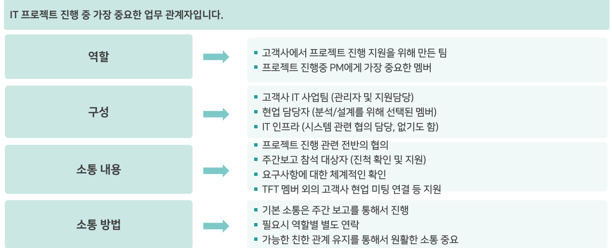

### 3. 현업 담당

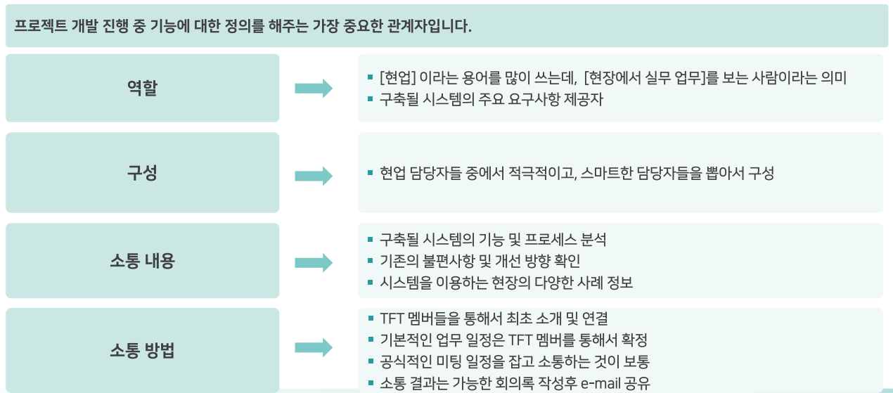

### 4. IT 인프라 관리

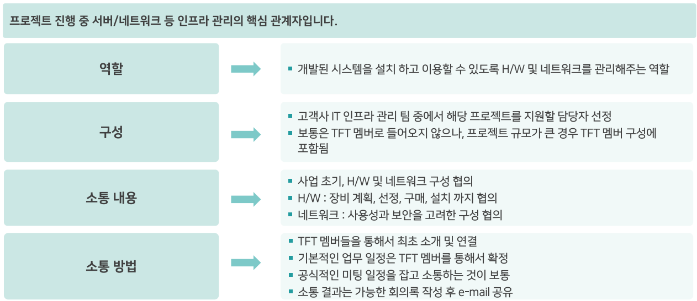

### 5. 감리

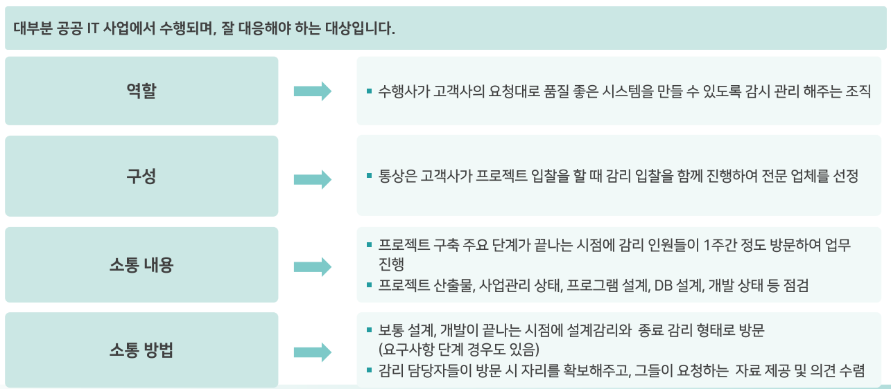

### 6.PMO

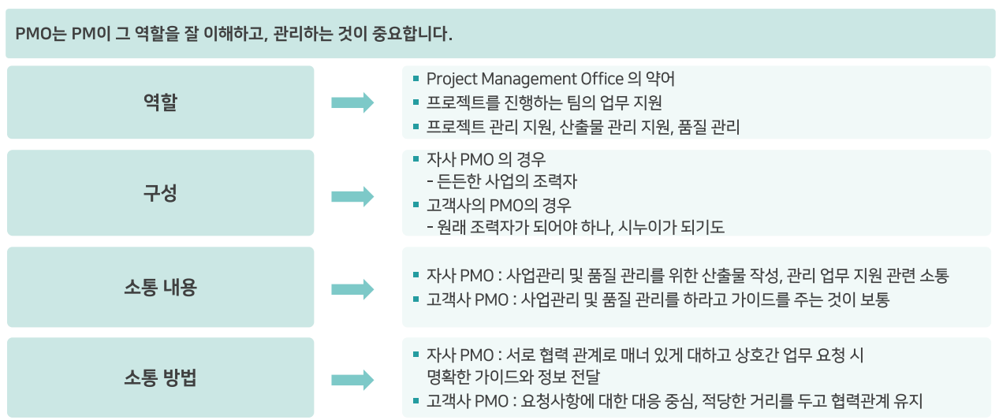

### 7. IT 컨설팅

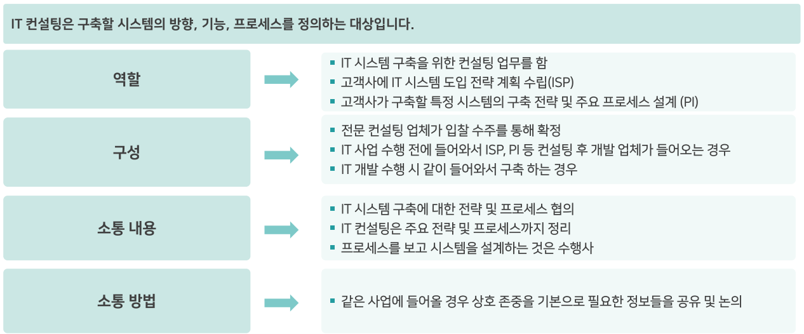

# 2, IT 시장과 개발 방법론 이해

## IT 개발 방법론 컨셉 이해

**IT 개발 프로세스를 진행하는 방법**

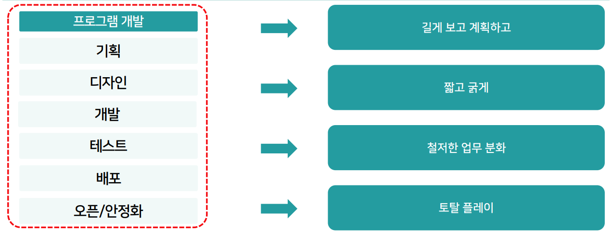

## IT 개발 방법론 종류

**1. 폭포수 모델 (Waterfall)**  
**2. 애자일(agile) (스크럼)**  
**3. 프로토타이핑 (prototyping)**  
**4. 스파이럴 (Spiral)**  

## Project vs Product

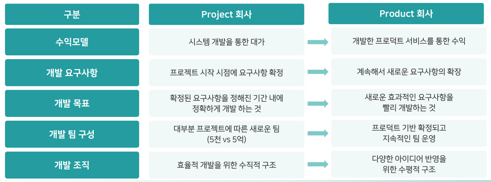

## Project 시장

**계약을 기반으로 항상 [목표 기간]과 [목표 요구사항] 확정 후 시작**  
**직접 소통 가능한 고객의 개념이 존재**  
**Project Manager의 책임과 권한 하에 주도적 운영**  
**Project의 목적에 따라서 새로운 멤버들과 업무**  

## Product 시장

**자신들이 가진 IT 시스템을 Product로 운영 발전 시키는 형태**
**Product 를 이용하는 사용자를 직접 만나지 않고, 데이터 기반 분석을 통해 요구를 찾아냄**
**Product Manager가 리드하지만, 개발 조직 구성원들과 수평적 관계 기반 수행**
**Product를 운영 발전 시키는 동일한 팀 기반의 관리 발전**

## 대표적인 개발 방법론

**대표적인 개발 방법론 : 폭포수모델(waterfall), 애자일(agile)**

### 1. 폭포수 모델 (Waterfall)

**전통적 방법론, 개발 프로세스를 1주기로 한번에 수행**

**1. 기본 개념**
- 폭포가 떨어지듯이 순차적으로 단방향으로

**2. 수행 방법**
- 프로젝트 기간동안 개발 사이클을 크게 1번 적용 진행
- 분석/설계 → 디자인 → 개발 → 테스트 → 오픈/안정화

**3. 장/단점**
- 장점 : 안정적이고, 관리가 용이한 방법론
- 단점 : 변화에 대한 대응이 어려움

**4. 적용 분야**
- 프로젝트형 개발, SI성 개발, 외주 개발
- 안정적 운영을 필요로 하는 조직

 

### 2. 애자일(agile)

**최근 트랜드 방법론 (정확히는 정신), 공정/도구보다 소통과 협력을 통한 빠른 변화 대응**

**1. 기본 개념**
- 구성원 / 고객과의 원활한 소통, 변화에 대응, 정신

**2. 수행 방법**
- 백로그 → 스프린트 계획 회의(스프린트 백로그) → 스프린트 → 일일 스크럼 회의 → 스프린트 검토 회의 → 스프린트 회고

**3. 장/단점**
- 장점 : 개발 효율의 최대화, 품질 안정, 변화 대응
- 단점 : 각 구성원의 성숙도에 따른 리스크

**4. 적용 분야**
- 프로덕트형 개발, 시스템 운영 개발, 내부 개발
- 구성원이 성숙도가 높고, 원팀의 개념으로 일하는 곳

### 워터폴 VS 스크럼

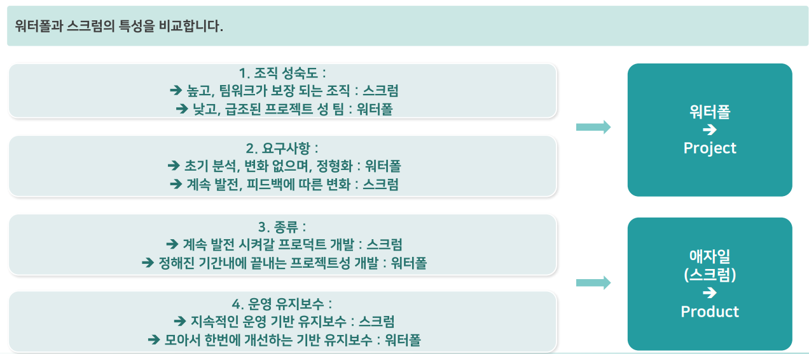

 

**두 방법론의 핵심은 요구사항을 바라보는 태도의 차이**

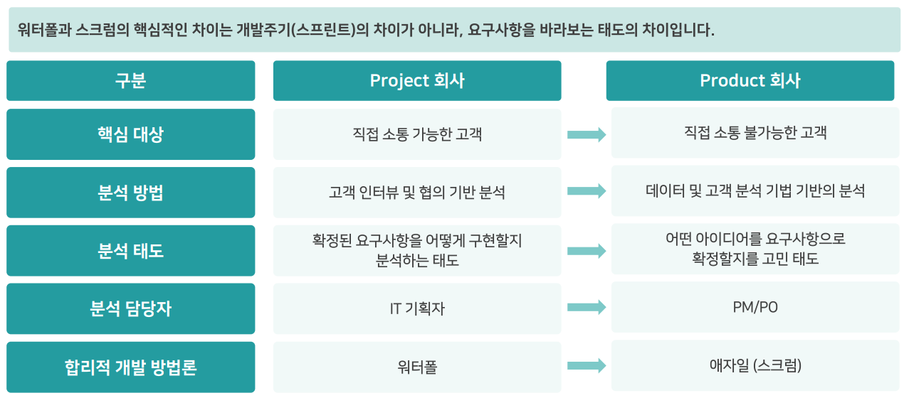

## 애자일 (스크럼) 요구사항 분석

**제품 백로그와 우선순위에 대한 이해가 우선 필요함**

- 습관적으로 먼저 나은 기능을 순자적으로 개발하려는 특징
- 제품 백로그의 핵심은 [ 기능 정의 ]가 나오면 [ 무조건 담아두는 것 ]
- 이를 통해 누락되는 기능 없이 기능 관리
- 단, 이해관계자 ( 업무 관련자 ) 간 합의된 규칙에 따른
- 제품 백로그의 우선순위를 정하고 담아두는 것이 핵심

## 애자일 (스크럼) 요구사항 우선순위

### 스크럼의 핵심은 어떻게 서비스에 성과를 낼 수 있는 요구사항을 바람직한 타이밍에 스프린트로 진행할 지 결정하는 것*

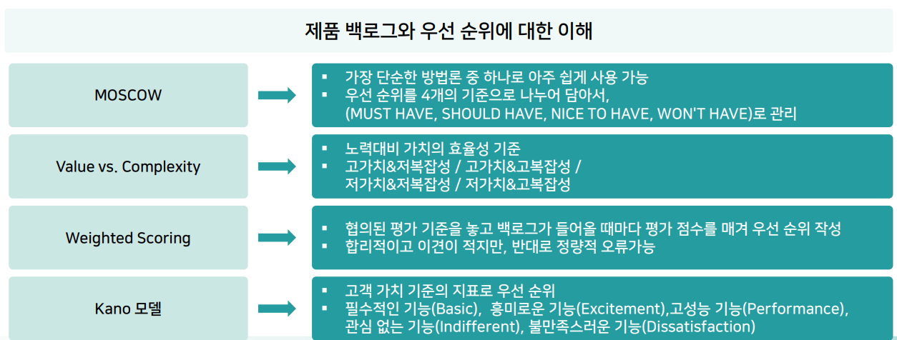

# 3. WBS 작업 분해 및 일정 관리 이해

## WBS 기본 개념

**IT Project 관리에서 가장 중요한 문서**

- **WBS(Work Breakdown Structure) : 작업 분류 체계**
    - 프로젝트 진행 중 해야할 업무를 상세하게 분류하고 관리를 위해 구조화시킨 것

 

1. **업무 식별 :** 관리할 업무를 식별하는 역할
2. **일정 계획 :** 식별된 업무별 작업 일정 계획
3. **업무 배분 :** 각 일정 별 업무 담당자와 산출물 등록 관리
4. **진적 관리 :** 작성된 일정에 따른 진행 경과 등록 및 관리

## WBS 기반 개발 일정 작성

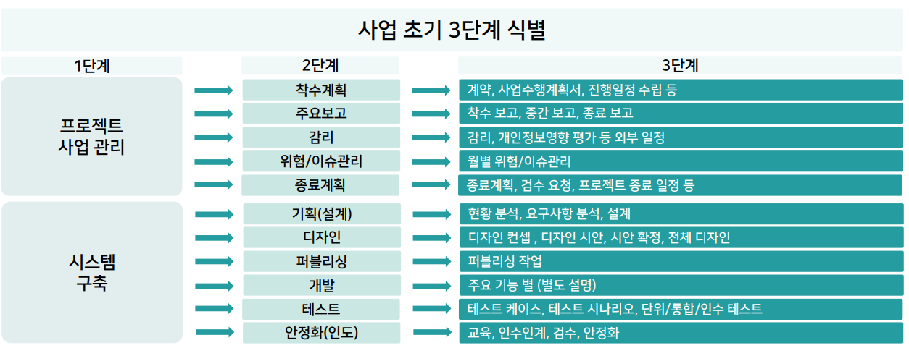

## 초기 일정 계획

**본격적인 개발 전 사업을 준비 협의하는 단계**

- 프로젝트 초기 단계에서 반드시 나오는 것이 일정 초안
- 향후 프로젝트를 진행하면서 상세화
- 간단 일정 작성하는 방법
- WBS 초안 작성하는 방법

### 초기 일정 계획 기본 가이드

- **기획(설계)** 
    - 프로젝트 기간의 대략 시작부터 1/3 기간
- **디자인**
    - 기획이 끝나는 시점 2주 전 부터 시작 1/4 기간 (대략 보통 기5개월 ~ 3.5개월 정도 )
- **퍼블리싱**
    - 디자인이 상서만이 나오는 1개월 전부터 순차적
- **개발**
    - 메인 개발자의 백엔드 개발은 초기부터 끝까지
    - 나머지는 순차적으로
- **테스트**
    - 오픈 1 달 전부터, 단위테스트, 통합테스트
    - 상황에 따라서는 인수 테스트
- **안정화(인도)**
    - 오픈 이후 1-2주 상황에 따라서는 1 개월 이상
    - 인도(인수인계) 단계는 오픈 1개월 전부터

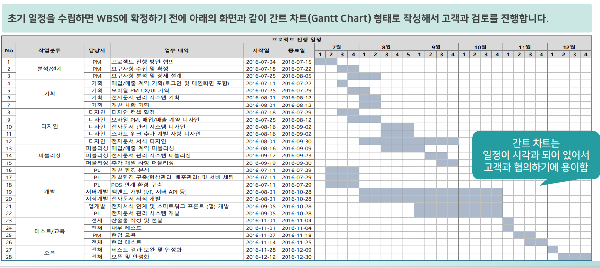

## WBS 초안 작성

**간단 일정을 기본으로, 프로젝트 관리 일정 추가**
- 주요 보고 (착수, 중간, 종료), 감리일정, 교육 일정, 인수인계 일정, 전환 계획

**추가 내용 정리**
- 각 단계 작업 별 담당자, 산출물
- 과업 진적 정보

**[WBS 초안 구조]**

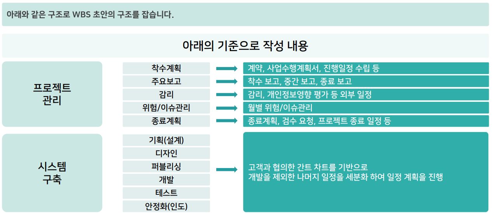

**[WBS 초안 예시]**

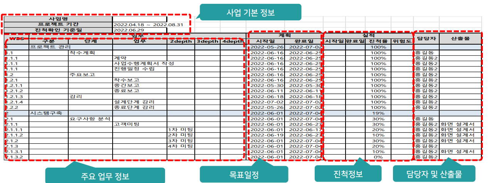

## 상세 일정 작성

**기획 (설계) 단계 진행중 혹은 진행 완료 후, 다른 일정은 변경 없는 한 유지, 개발은 4~5단계 상세화**

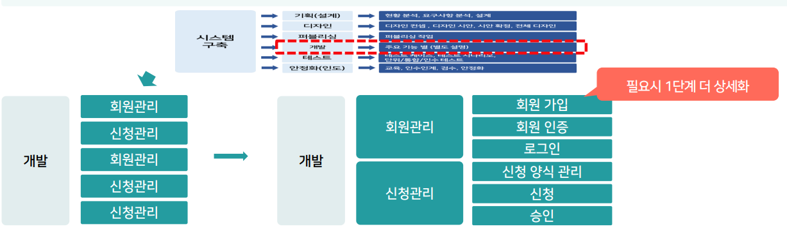

## WBS 개발 상세 일정 확정 방법

**WBS는 단순 보여주기 용도가 아님** 
**실제 작업 관리를 위한 용도, 시간을 덜여 상세히 작성**

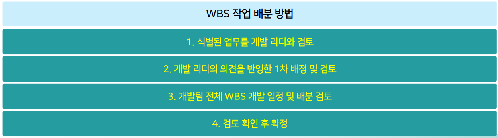

## WBS 관리 방법

- 사업 초기 작성 WBS는 고객에게 메일로 공유
- 고객과 리뷰 회의를 통해 확정 1.0 버전
- 기획(분석-설계) 단계까지 유지 하며 진적 업데이트
- 기획 단계 이후 WBS 상세화 후 고객에게 메일 공유
- 고객과 리뷰 회의를 통해 상세화 확인 2.0 버전
- 이후 일정에 따른 진적 사항 업데이트 관리
- **[ WBS는 고객과 협의 없이 임의 변경 불가 ]**

## WBS 기반 개발 일정 관리 방법

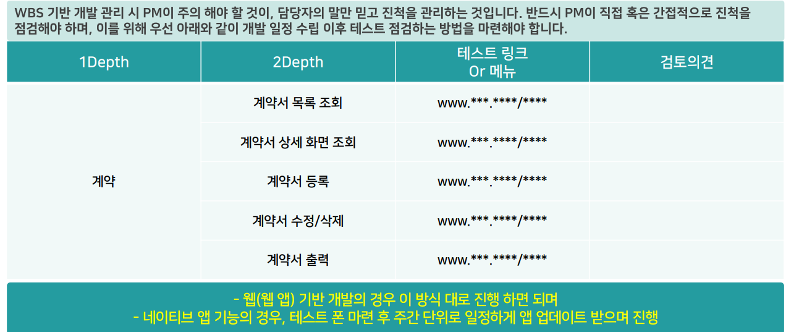

## WBS 기반 개발 점검 방법

- WBS 일정에 따라 직접 점검
    - 피곤한 일이지만 반드시 확인 필요
- 점검 내용
    - 기획 문서와 동일하게 개발이 잘 되었는지 확인
- 주의 사항
    - 가벼운 오류 사항은 PASS, 별도의 테스트 기간에
    - 단, 핵심 기능 자체가 동작 안 할 때는 확인
- 대응 방법
    - 약간의 근소한 문제는 [검토 의견]에 정리만 하고 PASS
    - 생각보다 많은 미개발 발생시 PM은 이슈 관리를 해야 함

## WBS 기반 개발 지연 대응 방법

- 1차적으로 개발PL등 개발 리더와 협의 대응
- 개발 리더가 이슈에 대한 명확한 방안 및 합리적인 일정 기반의 계획안 가져올 경우
    - 인정해주고 지속적인 모니터링 진행
- 개발 리더 및 개발 팀의 이슈 대응이 부족할 경우
    - 반복적인 이슈 대응 안 요청 및 점검
- 개발 리더 및 팀의 대응 약속 미 이행 혹은 지속적 문제 시
    - 사업 관리 담당자 에게 이슈 알림 및 대응 방안 상의

# 4. IT 프로젝트 주요 보고

## 주요 보고 개념

- **보고는 단순하게 개발이 진행되는 과정에 대한 보고가 목적이 아니라 개발의 방향성 공유, 지원 요청, 협의 사항 검토 등 다양한 목적**
- 그리고 가장 중요한 **[이슈/리스크]** 해결을 위한 협의 과정
- 그래서 주요 보고의 명확한 목적과 활용 방법을 알고 일하는 것이 정말 중요함

## 보고의 종류

**1. 정기보고**
- **진척을 위한 정규적인 보고**
- 주간보고, 월간보고

**2. 비정기보고**
- **문제상황으로 인한 수시 보고**
- 이슈 및 위험 관리 보고

**3. 주요 보고**
- **전체 관계자들에게 하는 주요 보고**
- 착수보고, 중간보고, 종료보고

## 정기/비정기 보고

### 주간 보고 (정기)
- 프로젝트 진행을 위해서 시작 단계부터 끝까지 **매주 정해진 시간 동안** 진행하는 보고
- 참석자는 수행사PM 및 진행 리더, 고객사 사업 관리 담당자 및 관계자
- 전체 진적도, 금주진행 결과, 자주 진행 예정 내용, 주요 협의 사항, 이슈 사항 보고

### 월간 보고 (정기)
- 프로젝트 진행을 위해서 시작 단계부터 끝까지 **매월 정해진 시간 동안** 진행하는보고
- 주간보고 양식에 월 기준 보고 혹은 별도보고 양식
- 관계자들이 모두 주간보고 참석 시 협의 하에 생략 하기도 하며, 매월 보고를 받는 고객사 상위 관리자 있을 경우 진행

### 이슈 및 리스크 관리 보고 (비정기)
- 일반적인 상황에서는 진행하지 않음
- 주간보고를 통해 관리되던 **이슈나 위험요소가 심각할경우** 별도 보고를 진행하여 문제 해결  
(이때, 정기 보고 멤버 외에 **이슈 관계자 모두 모임**)
- 갑작스러운 이슈 및 위험 발견으로 프로젝트 진적에 문제가 될 경우 즉시 진행하는 경우도 있음

## 주요 보고

### 착수 보고
- 프로젝트 시작 시, 수행사 PM이 사업과 관련된 고객사 전원에게 진행하는 보고
- **사업의 개요 설명을 통해 이런 사업이 진행되고 있고, 이런 개발이 될 것인데, 이런 일정으로 될 것이며, 이때 여러분들은 이런 것을 도와줘야 합니다.**

### 중간 보고
- 프로젝트 중간에, 수행사PM이 사업과관련된 고객사 전원에게 진행하는보고  
(통상 분석 설계 단계 이후, 본격적 개발 시작 시점)
- **착수보고를통해 진행된 사업이 어떠한 상황 (진행의 안정성)으로 되고 있으며, 여러분과 협의를 통해 어떻게 진행되고 있음을 공유합니다.**

### 종료 보고
- 프로젝트 종료 시점에, 수행사 PM이 사업과관련된! 고객사전원에게 진행하는보고  
(통상 시스템 오픈 전, 상황에 따라서 오픈 안정화 후)
- **전체 프로젝트가 어떠한 일정과 협의를 통해 진행되었으며, 최종적으로 어떠한 결과로 진행되었는지 보고 드립니다.**

## 주간 보고 작성 방법

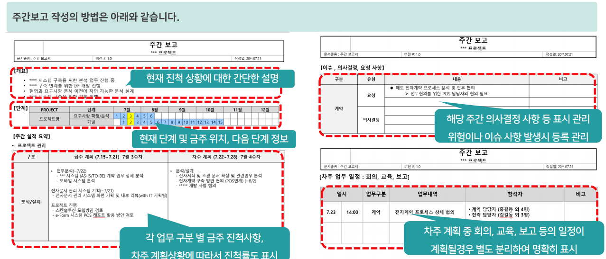

## 주간보고 vs 월간보고

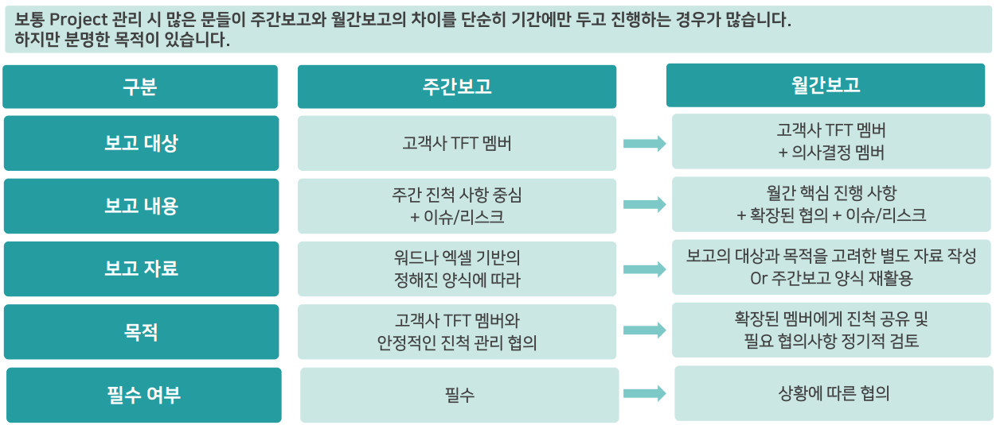

## 월간 보고 작성 방법

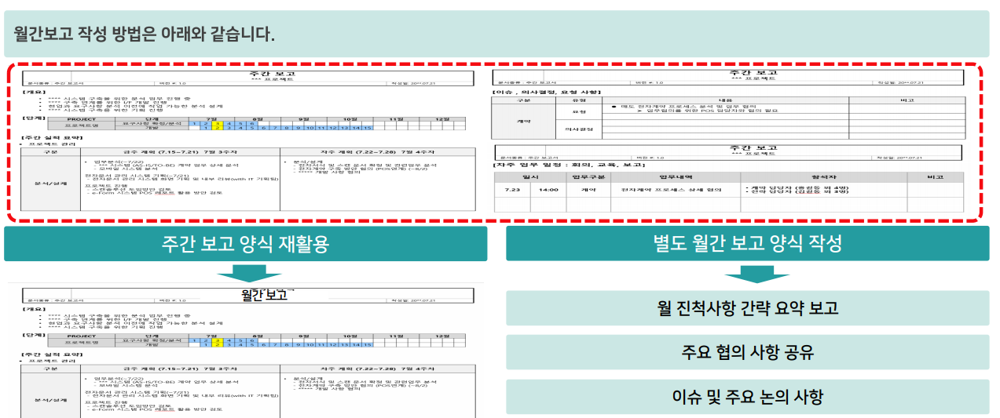

## 착수보고

**[ 사업 시작 시, 관련 담당자 전원에게 사업 진행의 전반을 설명 하는 보고 ]**
- 보통은 Kickoff 미팅 (착수 회의)시 일정 협의
- 보통은 착수 후 2주 정도 있다 진행 상황에 따라 즉시 혹은 지연 진행하기도 함

**목적은 관련 담당자들에게 프로젝트의 시작을 알리고, 지원 필요 사항을 공유 (언제, 무슨 일을, 어떻게 지원)**

## 착수보고 작성 방법

### 1. 프로젝트 개요
- 추진 배경, 시스템 개요, 도입 이점 등

### 2. 프로젝트 구축 범위
- 시스템 구성, 주요 개발 내용, 개발 방법 등

### 3. 프로젝트 관리 방안
- 보고 및 회의, 품질보증, 교육계획 등

### 4. 프로젝트 추진 계획
- 진행 조직, 진행 일정, 투입인력, 기타 사항 등 (참석자들의 역할, 지원 일정, 지원 필요 내용 공유)

## 중간보고 

- 사업 시작 중반에, 관련 담당자 전원에게 현재 사업의 진행상대 및 의사결정 사항 공유
- 보통은 분석-설계 이후 본격 개발 시작 시점
- 고객사 상황에 따라서 자유롭게 조절

**목적은 현재 진행이 원활히 잘 되고 있는지에 대한 중간 공유, 시스템 구축과 관련된 협의 사항을 전체 공유 검증**

## 중간보고 작성 방법

### 1. 프로젝트 진행 상황
- 계획일정, 현재 단계, 진행 상태 (원활, 이상 등)
### 2. 프로젝트 구축 내용
- 시스템 구성, 주요 개발 내용, 개발 방법, 주요 이슈 등
- 착수 보고는 계획이면, 중간 보고는 결과를 좀 더 상세히

**착수 보고 시 : 전자 계약을 잘 하려고 계획 중입니다.**  
**중간 보고 시 : 판매계약은 모바일 및 PC로, 매입 계약은 모바일로만**

### 3. 이후 진행 계획
- 잔여 진행 일정에 대한 계획 및 이후 고객사 담당자들의 역할

## 이슈 보고(회의)

- 이슈보고는 저음부터 진행되지 않아야 함
- **반드시 주간보고/월간보고를 통해 이슈가 발생하기 사전에 충분히 보고하고 공유하고 노력을 하다가 그래도 해결이 안되는 경우 진행하는 것이 필요**

**기본적으로 보고(회의) 자체가 해결을 위한 명확한 주제가 있음**  
**반드시 사전에 문제에 대한 내용을 정리하여 참석자들에게 사전 공유하는 것이 중요함**

### 이슈 보고(회의록) 작성 방법

 작성 방법")

## 주요 보고의 핵심

#### 모든 보고에서 제일 중요한 것은
### 1. 보고할 내용에 대한 사전 공유
### 2.보고 및 협의 후 결과를 상세히 정리
### 3.정리된 결과를 반드시 공유 확인

# 5. 요구사항 분석단계 관리

## 요구사항 분석

**[ 고객으로부터 개발할 시스템의 기능 요구사항을 듣고, 분석하는 것 ]**

- 요구사항 의견을 내고, 검토하고, 승인할 업무 담당자 정의 필요 (이해관계자 그룹)
- 정의된 이해관계자 그룹에 따라 요구사항 분석 진행

>**SI/에이전시 프로젝트 : 요구사항 분석서**  
>**솔루션 : GAP 분석서**

## 시장에 따른 요구사항 분석

### 프로젝트형 개발
- 고객사 직원
- **요구사항 분석 미팅**

### 프로덕트형 개발
- 타겟화, 비대면 고객
- **팀내 분석 회의** ( 데이터 기반, 문제 정의 )

### 기술 개발
- 내부 기술 리더
- ** 기술 리더의 요구**

## 이해관계자 개념 이해

- 프로젝트 개발에서 이해관계자는 다양한 관점의 다양한 사람이 있음
- 그중 가장 중요한 이해관계자 종류 중 하나가 **요구사항을 분석 정의하는 이해관계자**임
- 이해관계자의 개념을 모르고 개발을 진행 했을 때 항상 발생하는 문제가  
“왜 한쪽 의견만 듣고 개발하셨어요? 그러면 안되요. 다시 개발 해주세요” 입니다.

## 요구사항 분석 단계 이해관계자 종류

**이해관계자 그룹별 분석 일정 정리 후 공유, 분석 순서는 상황에 따름**  
\- 아래는 필자가 주로 하는 순서 및 방식

### 관리자 그룹
- 시스템 구축 중심 멤버
- 구체적인 설계 가능한 상세 요구 사항 확인
- **전체적인 시스템의 기능 설계 정보 획득**

### 사용자 그룹
- 구축 시스템 이용자 그룹
- 시스템에 핵심 요구 사항 확인
- **개별 기능 중 사용자 편의쯩요사항검토**

### 정책 수렴 그룹
- 정책 검토 그룹 (법무, 전략기획 등)
- **구축 시스템 관련 정책 및 법률적 검토**

### 의사 결정 그룹
- 고객사의사결정 담당자 (팀장, 부장, 임원)
- 취합 분석된 요구사항 정리 및 보고 방식
- **요구 사항 및 이슈 사항에 대한 의사결정**

## 이해관계자 분석 양식 샘플

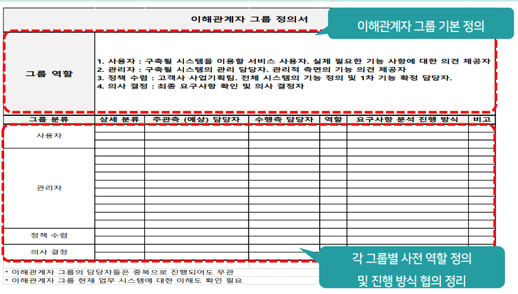

## 이해관계자 분석 작업 방법

**1. 가장 먼저 그룹 역할 부분에 이해관계자의 종류를 고객과 협의하여 확정**  
**2. 확정된 이해관계자 및 해당 관리 정보를 작성 (아래와 같음)**

### 담당자 지정
• 역할만정의하는것이 아니라, 실제그업무를진행할담당자를상세정의해야함
• 주관(고객)측과수행측모두부서, 이름까지

### 역할 작성
• 역할걸럼에실제그이해관계자가해야할역할을상세하게 적음  
(예시는 화면 크기 문제로 역할 컬럼 좁지만, 실제로 넓게 상세하게)

### 요구사항 분석 진행 방식
- 각각의 이해관계자와 요구 사항을 분석할 방법 (대면/비대면 등)과 시점 (가능한 정확한 일시)을 정리함

### 비고
- 비고란은 필요에 따라 작성하면 되지만, 기본적으로 최종 요구 사항에 대한
의사결정 확인을 받는 방법을 작성하면 유용함

## 요구사항 분석

- **사전에 고객이 RFP에 정의한 요구사항을 요구사항 정의서에 작성**
- 각 요구사항을 분석하는 별도의 요구사항 분석서를 만들어서 고객의 상세한 기능 요구사항 분석
- 요구사항이 단순할 때는 엑셀과 같은 간단한 양식 복잡할 때는 PPT와 같은 상세 정보 작성 가능 양식
    - 도구는 다양함 프로젝트 관리도구, 노션 등
- 실제 IT 현장에서 고객이 RFP에 정확한 요구사항을 작성하지 않는 경우, 요구사항정의서/분석서를 큰 분리 없이 쓰기도 함

## 요구사항 분석 시 필요한 정보

**1. 요구사항 ID**
- RFP에 작성된 고객의 요구사항 ID

**2. 요구사항 명**
- RFP에 작성된 고객의 요구사항 명

**3. 요구사항 내용**
- RFP에 작성된 요구사항의 기본 내용

**4. 요구사항 상세**
- 실제 요구사항 분석을 통해서 고객이 요구하는 상세한 요구사항 정보를 정리

**5. 이슈 사항**
- 요구 사항 분석 중 이슈가 될 만한 요구사항에 대해서 정리

**6. 이해관계 그룹**
- 해당 요구 사항과 관련된 이해관계자 그룹 정의

**7. 요구사항 협의자 / 일시**
- 실제 요구사항을 제공하고 협의한 담당자 및 일시 정보

**8. 추가**
- 요구사항에 대한 고객 관점의 중요도와 개발 관점의 난이도 정의 등, 프로젝트 상황에 따라 필요한 추가 정보

## 프로세스 흐름도
**[ 고객이 요구하는 내용이 복잡하고, 오해의 소지가 있을 경우 작성하기도 함 ]**

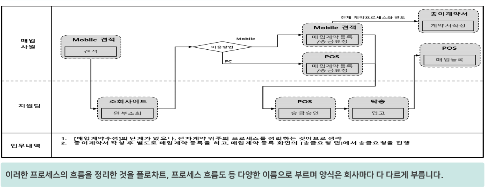

## 요구사항 분석 관리 핵심

### 요구사항 분석 단계는 제일 중요한 단계
- 고객으로부터 받은 요구사항은 정리 후 반드시 공유 및 확인
- 정리된 요구사항은 향후 검수 시 기준이 되므로 잘 관리
- 공공은 별도 요구 사항 추적표 관리, 민간은 규모에 따라서 다름