# 1. RFP 상세 이해하기

## RFP 이해하기

### 고객이 시스템 도입을 위해서 사업을 발주 할 때 만드는 문서
- **사업의 개요를 설명 및 입찰 정보 명세** 
    - 사업안내. 현황. 추진방안. 제안 요정 내용. 제안서 작성 가이드, 제안 안내 사항
- **제안 요청 내용**
    - 목표 시스템 및 상세 요구사항 정의
- **제안서 작성 가이드**
    - 제안서 목차 및 세부 작성 지침
- **제안서 안내 사항**
    - 사업자 선정 방법, 평가 기준, 평가 방식 등

 

## RFP 구성

### [ 공공 ]
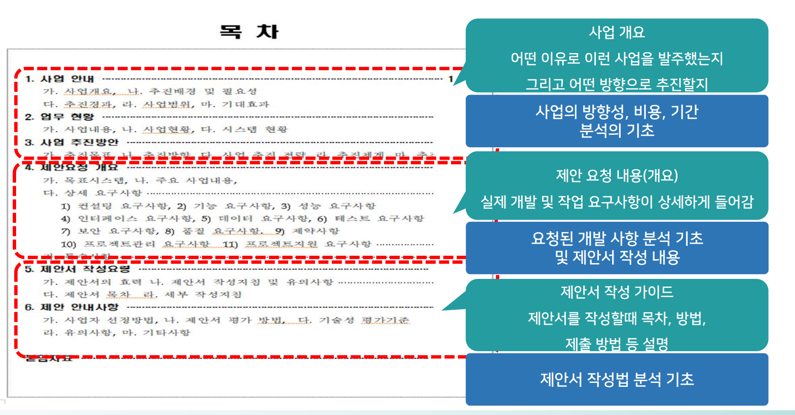

 

### [ 민간 ]
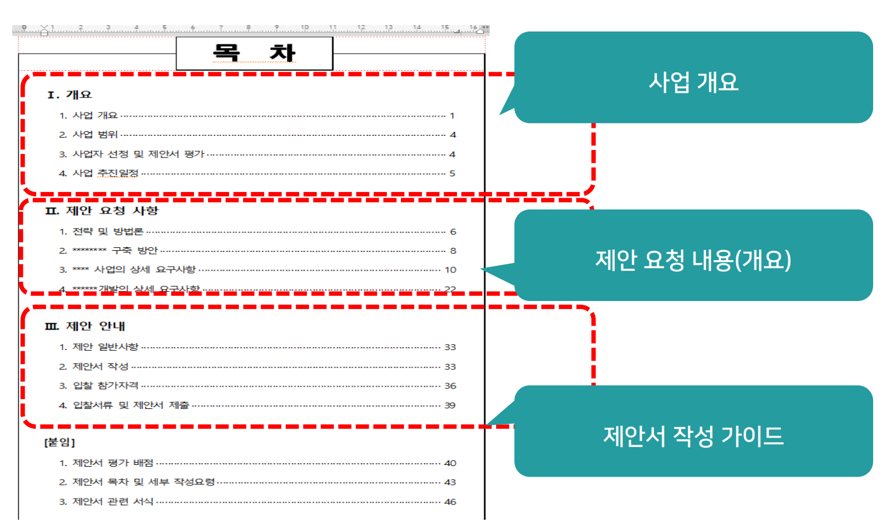

 

### RFP 기본 구성
**1. 사업 개요**
- 고객이 발주하려고 하는 사업의 기본적인 개요가 작성되어 있음
- 사업명, 비용, 기간, 목표. 택심 기능, 전체 구성 등

**2. 제안 요청 내용**
- 상세한 제안 요구사항이 작성되어 있음
- 기능요구사항
- 비기능 요구사함

**3. 제안서 작성 가이드**
- 제안서를 작성하기 위해 필요한 다양한 가이드
- 작성 방법, 제출 방법. 입찰 방식. 자격 요건 등

 

## RFP - 제안서 - 제안발표자료

**1. RFP**
- 고객이 발주하려는 사업의 모든 내용이 작성
- 즉 수행하는 업체는 RFP에서 요구하는 모든 과업(요구사항)을 수행해야 할 의무가 있음

**2. 제안서**
- 제안서는 RFP를 보고 고객이 요구하는 것을 어떻게 수행할지 모두 작성하는 것이 기본
- 즉 RFPOI서 100개의 요구사항이 있으면, 제안서에는 반드시 100개의 요구사항에 대한 제안이 있어야 하는 것이 기본

**3. 제안발표자료**
- **설명을 잘 하기 위한 자료**
- 제안 발표자료는 RFP에서 요구하는 모든 기능에 대해서 작성하는 것이 아니라. 사업의 **핵심이 되는 요구사항**, 문제해결, 수행 등을 어떻게 살 할지 발표를 위한 문서의 형식으로 작성
- 즉 모두가 아니라 핵심만 작성

------------------------------------------
 

일반적으로 많은 회사에서 RFP 분석 후 모든 내용에 대해서 꼼꼼히 제안서를 작성 
이후 중요한 내용을 제안 발표 자료로 작성 
이때, 제안서의 내용을 그대로 추출해서 제안 발표 자료를 만들기도 하고, 별도의 제안 발표 문서를 만드는 경우도 있음 
전략적으로 RFP의 핵심 내용을 제안 발표자료로 만들고 제안서를 만드는 경우도 있음 (추천)

 

-------------------------------------------
 

## 제안 요청서 분석 순서

**1. 사업 개요**
- 사업 내용. 기간 및 비용 확인
- 우리 회사의 사업 지원 여부 판단

**2. 제안 요청 내용**
- 기술 검토
    - 우리 회사가 할 수 있는 작업인지
- 비용 분석
    - 제안요청에 있는 개발을 하는데 비용이 일마나 들지 분석 후 수익성 검토, 통상 PM은 예상 투입 공수 전달, 영업이 비용(수익성) 분석

**3. 제안서 작성 가이드**
- 제안 참여 확정 후 상세 확인
    - 참가자격. 평가방법. 제출방법. 제안 목차 자세히 확인해야 함

 

## 사업 개요 부분 분석

**1. 사업 내용**
- 발주된 사업이 우리 회사의 방향과 맞는지 판단 (개발 사업 형에 솔루션 보유. 기술보유 등)

**2. 기간 및 비용**
- 기간검토
    - 요청한 기간에 우리 회사가 참여할 환경이 되는지 (특히 개발 인력 확보 가능 여부)
- 비용 분석
    - 수행할 개발 대비 비용의 매력

**3. 회사 지원 여부**
- 대표. 영업. 사업관리. PMS 핵심 영버들 검토를 통한 지원 여부 검토

 

## 제안 요청 내용 분석

**1.기술 검토 및 요구사항 분석**
- 개발 과업을 상세히 분석하여 자사가 해당 과업을 수행할 기술력이 있는지 검토
- 상세하게 정리된 요구사항을 분석하여, 과업의 규모, 제약, 기타 조건 등 분석

**2.비용분석**
- 기술 및 요구사항 분석을 통해 정리된 과업을 중심으로 실제 투입될 개발 인력에 대한 대략적인 투입 공수를 도출
- 산출된 투입 공수를 기반으로 수익성을 분석하여 최종 확정

 

## 투입 공수 산정

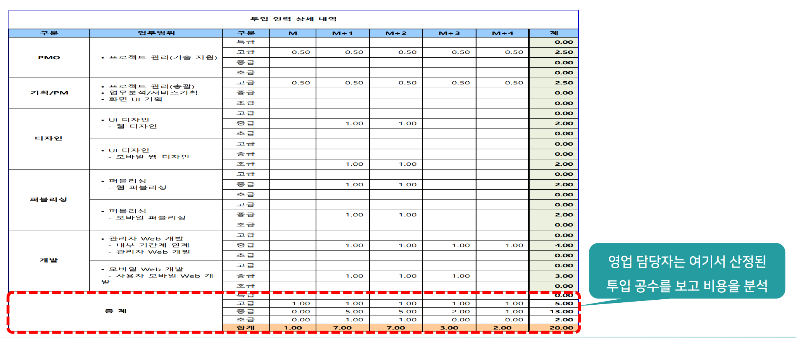

 

## 제안서 작성 가이드 분석
**1. 참가 자격**
- 우리 회사의 자격 조건 점검
- 가장 우선으로 뵈아 하는 항목

**2. 평가 방법**
- 보통은 기술 (\*%) 가격 (\*%)
- 기술력 높으면 가격 강하게

**3. 제안서 목차**
- 제안서 목자에 대한 가이드 여부 점검. 있을 경우 반드시 준수

**4. 세부 작성 지침**
- 세부 작성 지침 꼼꼼히 체크
- 주의 사항 놓치지 않도록

**5. 발표 및 제출 방법**
- 제출 일정. 방법 확인
- 발표 방법 확인

 

## 사업 개요 부분 분석

**1. 기본 정보**
- RFP에서 바로 옮겨 적을 수 있는 기본적인 정보들을
한눈에 불 수 있도록 정리합니다.

**2. 상세 정보**
- 상세한 고객의 요구사항을 분석하여. 액심이 되는 과제와 기능에 대해 검토 기준으로 정리합니다.

**3. 기타 정보**
- RFP 내부에서 확인되는 다양한 이슈나 특이 사함을 정리하고, 
이와 함께 예상 경쟁업체, 사업과 관련된 상황 정보 등을 가능한 상세하게 적습니다.

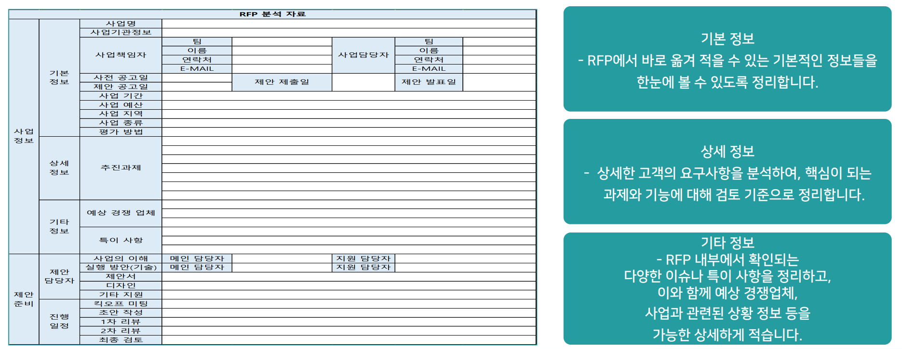

 

## 제안요청서 분석 순서

**1. 사업 수행 가능 검토**
-  가장 먼저 검토할 내용은 해당 사업을 우리 회사가 수행 가능한지에 대한 검토
-  단지 회사 내부 역량을 넘어 협력 업체들과 함께 수행 가능한지까지 검토
-  여기서 어렵다고 판단되면 더 이상 검토 의미 없음

**2. 사업 수익성 검토**
- 본 사업에 참여 했을 때. 충분한 수익이 나을만한 사업인지 검토
- 매출은 RFP에 사업 비용으로 나와있고, 내부 매입(원가)에 대한 분석을 통해 대략적 수익률 계산
- 감으로 판단하는 경우 있으나, 빈대함

**3. 최종 의사 결정**
- 사업 수행 가능 여부와 수익성, 그리고 다양한 리스코 등을 분석하며, 제안 참여에 대한 최종 의사결정

  

# 2. 제안서 작성 방법

## 제안서 개념

### 고객이 제안요청서를 통해 발주한 사업에 참여하기 위해 만드는 문서
**고객에게 **
우리가 정말 **좋은 것을 (기능) **
우리가 정말 **경쟁력 있게 (비용) **
우리가 정말 **문제 없이 만들 것을 (관리)**

 

## 제안서 작성 주요 사항

**1. RFP분석**
- 고객이 중요하게 여기는 것이 나음

**2. 고객이 무엇을 중요 하게 여기는지**
- 기능? 비용? 특정 이슈 해결?

**3. 필수 조건 체크**
- RFP 기능, 제안 조건. 회사 기준 등

**4. 상황에 맞게**
- 30장~ 100장 . 또는 그 이상

 

## 제안서 작성 방식

**1. PPT 발표 자료 형태의 제안서만 작성**
- 간단한 프로젝트의 경우 많이 진행

**2. PPT 제안서 및 PPT 제안 발표 자료**
- 중소 규모의 프로젝트. 제안 발표 자료는 요약 자료 개념

**3. 문서형태 제안서 및 PPT 발표자료**
- 가장 많이 진행되는 형태
- 세로형대 100장 이상, 발표자료 가로 PPT 30장 내외

**4. 대형 프로젝트는 RFP 기준에 따라**

 

## 제안서 작성 핵심

### 제안서는 경쟁을 기본으로 하는 문서

**[ 경쟁에서 이기지 못하면 아무 의미 없는 문서 ]** 
즉, **경쟁에서 이기기 위한 목적**을 가지고 모든 문서 내에 경쟁에서 이길 수 있는 **상세한 자별화**를 가지고 작성해아 하는 문서

 

## 제안서 전략 개념

### 제안서는 반드시 승리를 위한 전략 수립이 우선

- **고객이 필요로 하는 기술과 역량 중심 전략**
- **고객이 수행하는 업체를 평가하는 기준 중심 전략**
- **고객이 수행하는 업체를 평가하는 기준 방법 전략**

 

## 제안서 전략 구분

**1. 기술과 역량**
- 고객이 발주하는 사업에서 가장 중요하게 여기는 기능과 기술이 무엇인지 확인
- 해당 기능과 기술에 대한 자별화 포인트를 만들고 해당 내용을 어필하는 제안 전락

**2. 평가 기준**
- RFP에 고객사마다 평가를 하는 기준을 작성하는 것이 일반적
- 고객의 평가 기준을 분석하예 해당 부분에 따른 제안을 하는 전략

**3. 평가 방식**
- 고객이 업체를 평가하는 방식에 따른 전락적 제안 작업

 

## 주요 사업별 제안 전략

### [ SI 사업 제안 전략 ]

#### PM 및 핵심 인력
- SI의 경우 PM의 역할이 정말 중요
- PM을 역량이 있고 졸은 사람을 구하고, 프로젝트의 핵심 인력들을 배지하는 것을 중요 전략으로 수립
- 인력불이 풍부하고, 기술력이 좋음을 어필

#### 레퍼런스 (경험)
- SI 사업의 평가에 가장 큰 영향을 주는 요소 중의 하나가 레퍼런스
- 해당 업체가 본 사업과 유사하거나, 본사업보다 큰 사업에 대한 경험이 많으면
평가자 입장에서 신뢰를 가짐

#### 구체적인 기술적 제안
- RFP에서 요구하는 택심 기능에 대해서 구체적으로 어떤 식으로 개발을 할지
그 상세한 방안에 대한 제안을 하는 전략
- 생각보다 현장에서 이런 구체성 없이, 일반적인 [살 하겠음] 이라는 형태의 제안 않음

### [ 솔루션 사업 제안 전략 ]

#### PM 및 핵심 인력
- 솔루션도 PM의 역할이 정말 중요
- PM을 역량이 있고 졸은 사람을 구하고, 프로책트의 핵심 인력들을 배치하는 것을 중요 전략으로 수립
- 인력물이 풍부하고. 기술력이 좋음을 어필

#### 레퍼런스 (경험)
- 솔루션도 사업의 평가에 가장 큰 영향을 주는 요소 중의 하나가 레퍼런스
- 해당 솔루션 업체가 본 사업과 유사하거나, 본사업보다 큰 사업에 대한 경험이 많으면 평가사 입장에서 신뢰를 가

#### 솔루션 제공 기능의 차별화
- 솔루션 프로젝트의 경우 솔루션이 가진 핵심 기능과 함께 일부 기능에 대한 커스터마이징을 기본으로 함
- 그래서 자사의 솔루션의 강점 어필이 핵심
- 자사 솔루션의 기능, 성능의 차별화중심

### [ 웹 에이전시 사업 제안 전략 ]

#### 전문 제안 PM
- 웹 에이전시 사업의 경우 제안 발표를 하는 전문 제안 PM이 일반적으로 있음
- 고객이  모르는 UI/UX 부문에 대해서 명확하게 해결하고 설명할 수 있는 전문가 중심의 제안

#### 레퍼런스 (경험)
- 웹 에이전시 사업도 평가에 가장 큰 영향을 주는 요소 중의 하나가 레퍼런스
- 해당 웹 에이전시 업체가 본 사업과 유사하거나, 본사업보다 큰 사업에 대한 경험이 많으면 평가자 입장에서 신뢰를 가짐

#### 구체적인 UI / UX 제안
- RFP에서 요구하는 핵심 요구 사항에 대해서 실제 UI/UX를 분석하고, 작성하고,
디자인까지 해서 제안 하는 경우 많음
- 그래서 웹 에이전시 제안서의 경우 디자인 문서로 보일 정도 수준의 작업을 함

### [ 공공 VS 민간 ]

#### 공공 VS 민간
- 공공과 민간은 평가 방식에 큰 사이가 있음
- 민간은 RFP를 작성하고 발주하는 **담당자**, 혹은 그 담당자와 가까운 직무의 평가자가 **평가**
- 공공은 **공정성**을 위해 **RFP 작성자와 다른** 별도의 사업과 관계 없는 평가자 **평가**

#### 민간 전략
- 민간은 평가자가 이미 사업에 대한 이해가 충분한 상태에서, 구체적으로 어떤 식으로 할지에 대한 관심이 높음
- 즉, 구체적인 수행 방법, 기술, 내용 중심의 제안 전략이 필수

#### 공공 전략
- 공공은 평가자가 사업에 대한 충분한 이해 없이 평가하는 경우 많음
- 심지어 제안서는 제대로 볼 시간이 없음
- 즉, 사업에 대한 이해와 사업 자체에 대한 전문성을 어필하는 것이 중요
- 기술 부분은 차별화 중심의 전략 수립이 필수

---------------------------------------------

## 제안서 작성 방법

- 제안서는 **양이** 일반적으로 **많음**
- 모든 내용에 차별화 전략을 작성하기 어려움
- 그래서 제안 전략에 따라 **중요하게 여기는 부분에 차별화를 집중**해서 **눈에 띄게** 하는 것 중요

--------------------------------------------

## 제안서 기본 목차

### RFP에 제안 목차가 있는 경우 - 가능한 가이드 목차 그대로 작성

**1. 회사 소개**
- 일반 현황, 조직 구성, 주요사업, 주요실적

**2. 제안 개요**
- 배경 및 목적, 범위, 기본 전략, 기대효과

**3. 기술 부분**
- RFP 기능 구현 방안

**4. 사업관리 방안**
- 프로젝트 관리 방안
- 추진일정. 비용, 조직, 산출물, 품질보증안 등

**5. 지원부문**
- 교육 및 기술 이전 계획
- 유지보수, 보안, CS 방안 등

-------------------------------------------

### 1. 회사 소개

- **회사 개요**
    - 회사 일반 현황
- **조직 및 인원 현황**
    - 시스템 구축 가능한 조직임 어필
- **주요 사업 내용**
    - 주요 사업 솔루션, 경험 등 기술 기반 설명
- **주요 사업 실적**
    - 주요 사업 레퍼런스

#### 1-1. 회사 개요

[ 경영 이념 ]

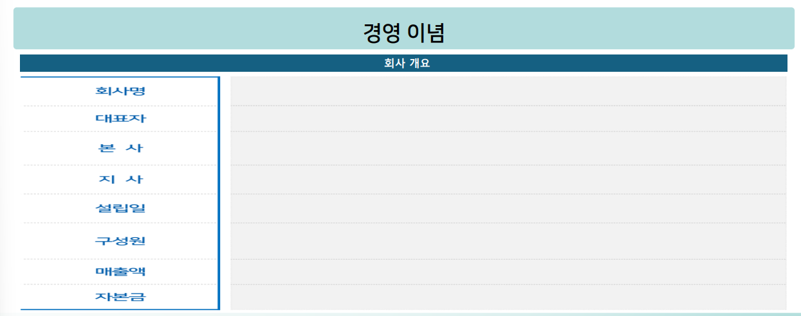

#### 1-2. 조직 및  현황

[ 조직에 대한 간단 설명 ]

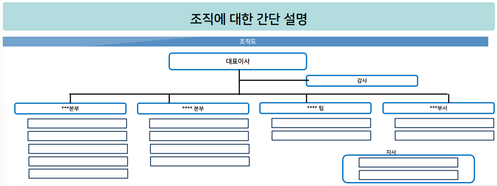

#### 1-3. 주요 사업 내용

[ 주요 사업 내역 설명 ]

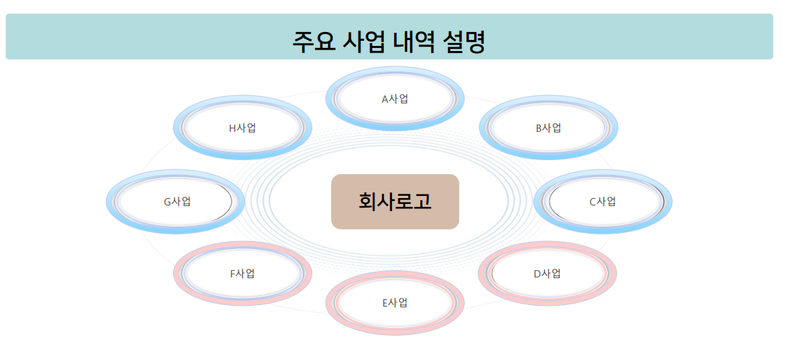

#### 1-4. 주요 사업 실적

[ 주요 사업 실적 ]

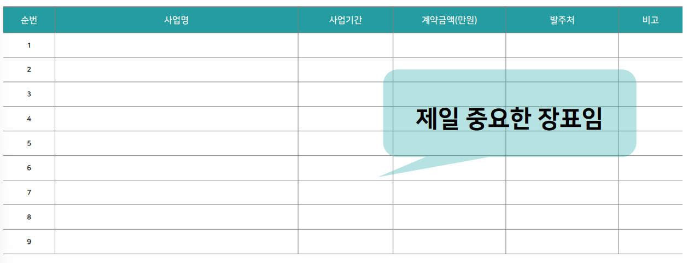

 

### 2. 제안 개요

- **배경 및 목적**
    - 제안 시스템이 필요한 이유 서술
- **제안 서비스 or 제안 범위**
    - 제안 시스템의 간단한 요약 설명
- **기대효과**
    - 제안된 시스템을 쓰면 좋아지는 점
- **추진전략 (특장점)**
    - 우리는 이렇게 잘 할 수 있어요

#### 2-1. 제안 배경 및 목적

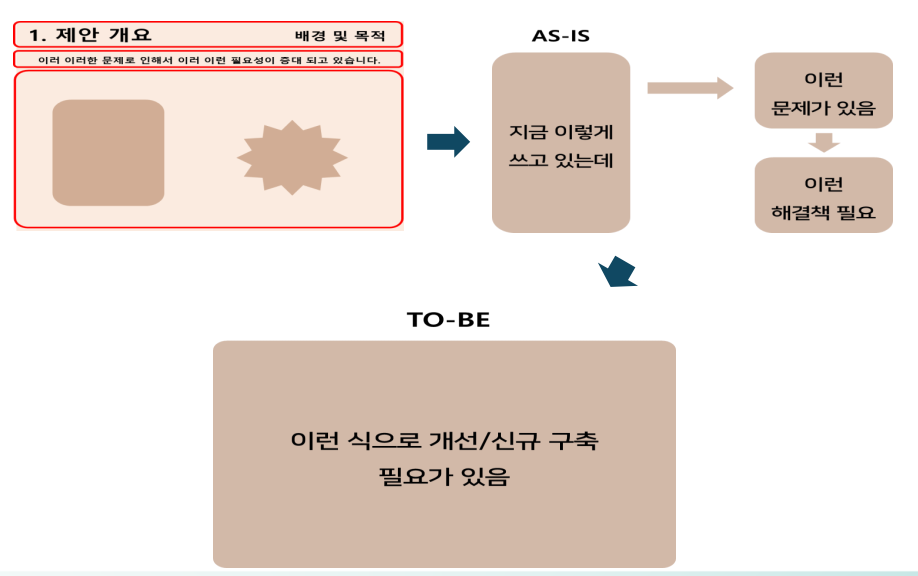

#### 2-2. 제안 서비스 or 범위

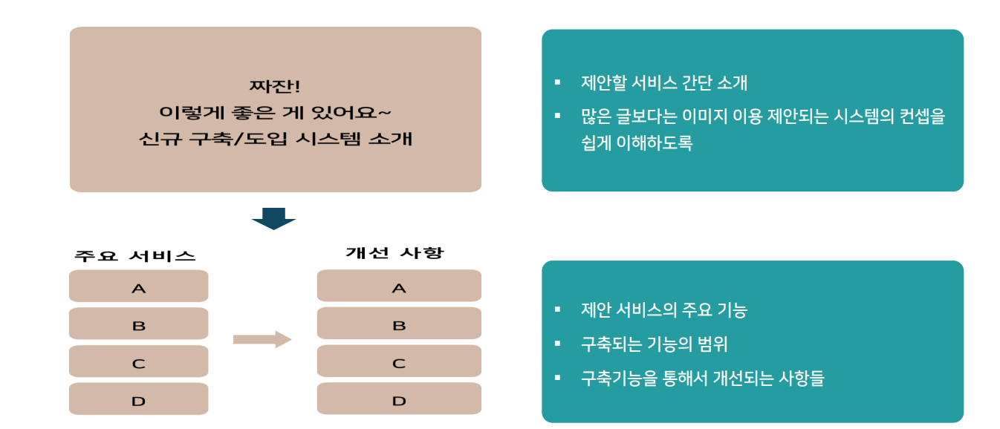

#### 2-3. 기대효과
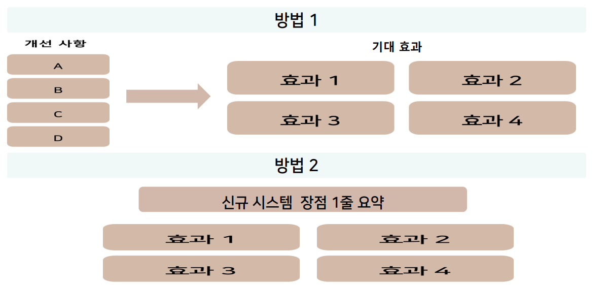

#### 2-4. 추진 전략 

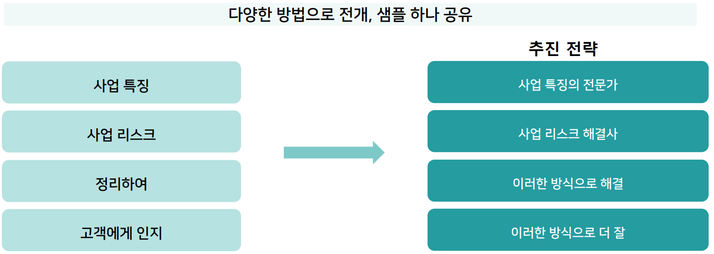

 

### 3. 기술 부분

- **프로젝트 추진 방법론**
    - 프로젝트의 특징에 맞는 방법론 (생략되기도 함)
- **시스템 구성도**
    - 구축할 시스템에 대한 구성도
- **시스템 구축 방안**
    - 구축을 위한 상세 방안 (제안서의 핵심부분)
- **전략 계획 수립 방안**
    - 테스트, 오픈, 운영 안정화 계획 등

#### 3-1. 프로젝트 추진 방법론

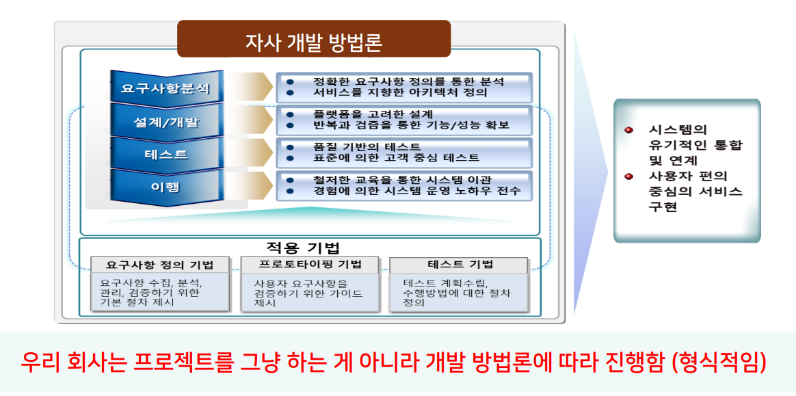

#### 3-2. 시스템 구성도

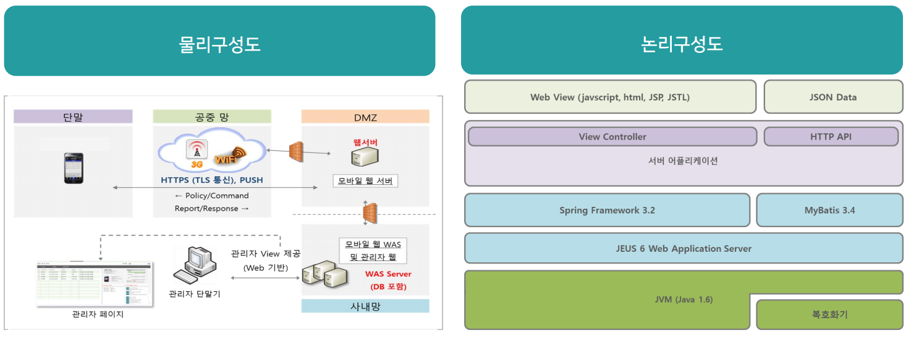

#### 3-3. 시스템 구축 방안

**[ 주요 시스템 별 구축 개발 방안 ]**

**SI : 무->유**
- 분석/설계/개발 - 상세 진행 방안

**솔루션 : 유->유(고객사 전용)**
- 자사 솔루션과 고객 요구 시스템 GAP 분석 개발

**핵심 사항** 
- RFP에 맞게, 구체적으로, 특징있게
 

#### 3-4. 전략 계획 수립 방안
- **시스템 테스트 방안** 
- **시스템 오픈 방안** 
- **시스템 안정화 방안** 
- **시스템 향후 발전 방안(옵션)**

 

### 4. 사업 관리

- **수행 조직**
    - 프로젝트 수행 조직도, 업무 분장 내역
- **추진 일정 계획**
    - 시스템 구축에 대한 주요 업무 단위 일정
- **업무보고 계획**
    - 진행을 위한 주요 보고 계획
- **품질 보증 방안**
    - 산출물 및 개발 시스템의 품질 보증 방안
 

#### 4-1. 수행 조직

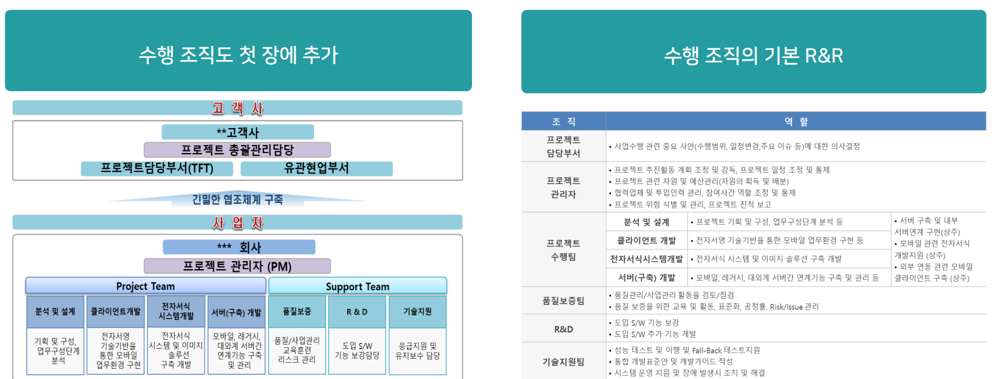

#### 4-2. 추진 일정 계획

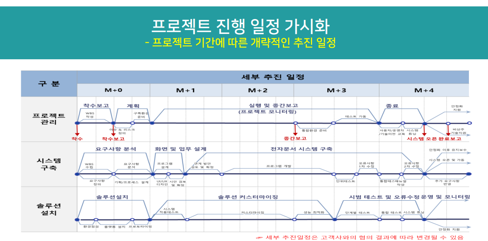

#### 4-3. 업무보고 계획

**정기보고**
- **착수보고** - **중간보고** - **완료보고**
- **주간업무보고** - **월간업무보고**

**비정기 보고**
- **수시보고**

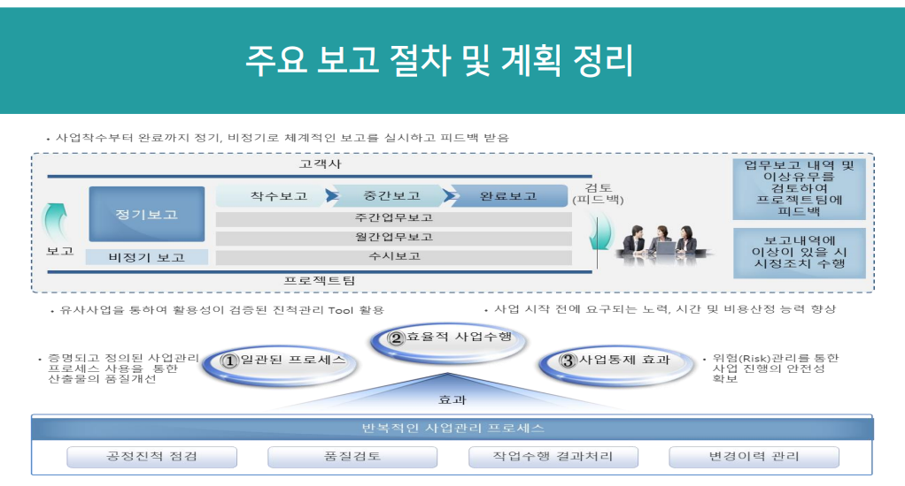

#### 4-4. 품질 보증 방안

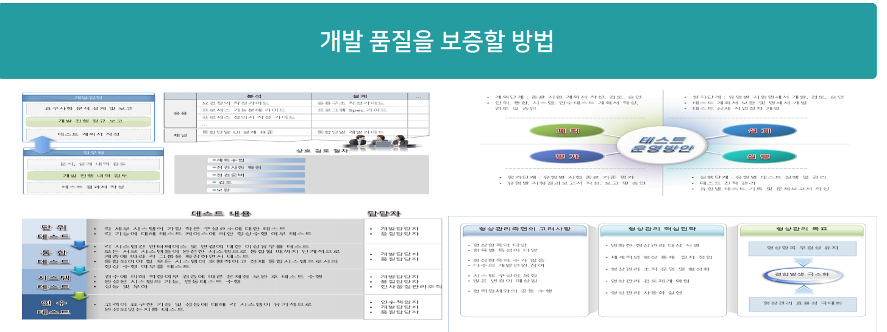

#### 4-5. 참여 인력 이력

**공공은 안씀, 민간은 제안할 경우**

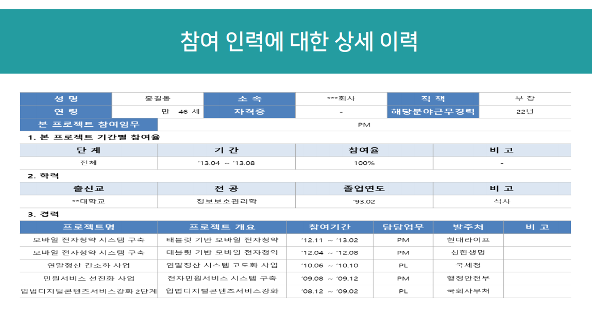
  

### 5. 지원 부문

- **교육 및 기술 이전 계획**
    - 구축된 시스템의 인수인계 방안
- **유지보수 계획**
    - 오픈 이후 유지보수 방안
- **기밀보안**
    - 내부 시스템 산출물 등 내용에 대한 보안 방안
- **기타 지원사항**
    - 장아l복구 절자, 고객센터 운영 등

#### 5-1. 교육 및 기술 이전 계획

**[ 전략, 내용, 절차 ]**

- 기본적으로는 우리 회사의 프로세스대로

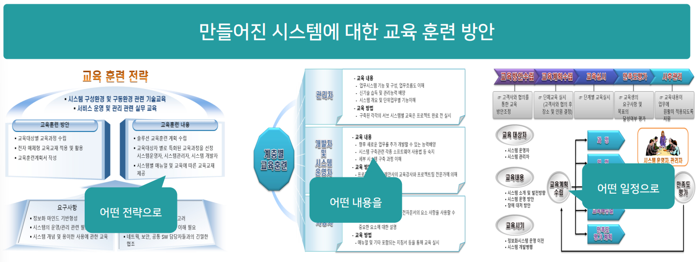

#### 5-2. 유지보수 계획

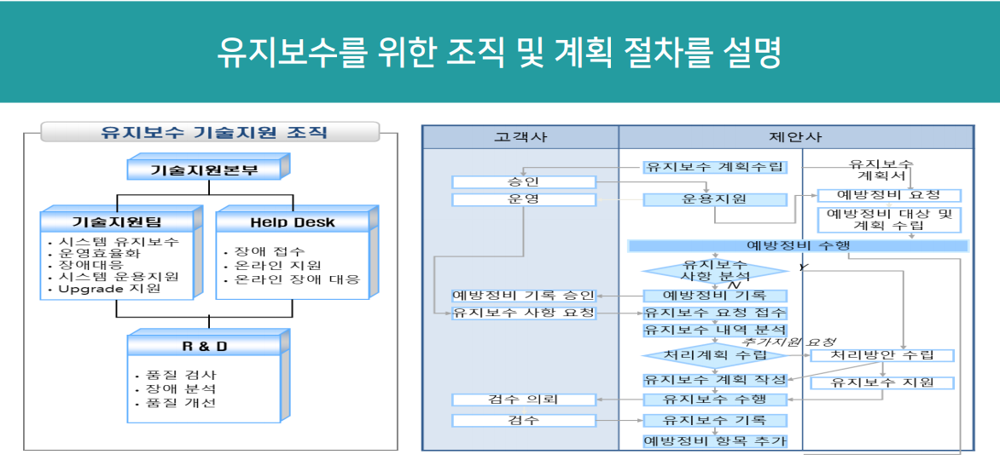

#### 5-3. 기타 지원 사항

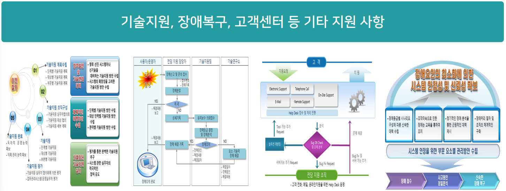

  

# 3. 제안 발표 자료 작성 방법

## 제안 발표 자료 개념

- 일반적으로 제안의 과정에서 제안서와 함께 제안 발표 자료를 제출
- **제안서**는 **문서만으로** 평가자들이 내용을 확인 평가하고
- **제안 발표 자료**는 "**별도의 제안 발표의 과정**"을 가짐
- 대부분의 프로젝트는 **"PM"이 제안 발표를 진행**하고
- 실질적으로 이 제안 발표를 통해 **"기업의 기술 역량"에 대한 평가를 진행**하게 됨

## 제안 발표 자료 작성 방법

**1. 제안서와 동일**
- **민간 회사 프로젝트** 중에서 **사업의 규모가 크지 않거나**, 고객이 굳이 제안서와 발표자료를 분리해서 제출하는 것을 **원하지 않는 경우**, 제안서와 발표자료를 동일하게 작성
- 일반적으로 **웹 에이전시 프로젝트에서 많음**

**2. 제안서의 요약본**
- RFP에 제안서와 제안 발표 자료를 **별도로 작성하도록 하는 경우** 별도 작성
- 제안서를 작성하는 수행사가 굳이 별도의 자료를 만드는 것이 아니라, **제안서의 주요 장표를 추출**해서 발표 자료로 만드는 방식

**3. 제안서와 별개로 작성**
- RFP에 제안서와 제안 발표 자료를 별도로 작성하도록 하는 경우 별도 작성
- 제안서를 작성하는 수행사가 보다 효과적인 제안 발표를 위해서 제안서에 있는 내용을 기초로 별도의 최적화 된 발표 자료를 만드는 방식

 

## 제안 발표 자료 작성 전략

### 보통 제안 발표는 15분에서 30분 정도의 시간으로 진행
**실제 발표를 하다 보면 결코 충분한 시간이 아님**  
그래서 **제한된 시간** 안에 **우리의 차별성**을 **최대한 효과적**으로 발표 할 수 있도록 구성하는 것이 핵심 
그리고 제안 발표 자료의 작성과 함께 **실제 제안 발표에 대한 준비**가 함께 되어야 함

 

## 사업별 제안 발표 자료 작성 전략

### [ SI 개발 프로젝트 ]
- 사업에 대한 이해도와 경험이 높으며, 관련된 전문 인력을 갖춘 회사라는 내용 필요
- 실제 기능 요구 사항에 대해서 보다 구체적인 수행 방안을 작성하는 것이 필요
- PM의 전문성과 핵심 인력의 전문성 표현

### [ 솔루션 기반 개발 프로젝트 ]
- 솔루션의 차별화가 핵심
- 본 사업에서 핵심으로 여기는 사항에 대해, 자사의 솔루션만 제공하는 기능 혹은
자사의 솔루션이 더 좋은 명확한 내용 중심의 설명
- 솔루션과 관련된 도메인의 전문성을 표현

### [ 웹 에이전시 개발 프로젝트 ]
- 웹 에이전시 개발의 경우 대부분 사용자의 경험을 고려한 UI/UX 기획 디자인이
핵심인 경우 많음
- 본 사업과 유사한 레퍼런스 정보 표현
- 사업의 요구 사항에 따른 UI/UX 작업이 이미 된 자료 기반의 경쟁력 어필

## 제안서 & 제안 발표 자료 작성 노하우

### 강사님의 경험으로 가장 효과적인 방법
1. **RFP에서 가장 중요하게 여기는 핵심 요소가 무엇인지 확인**
2. **확인된 핵심 요소를 기준으로 제안 발표 자료를 경쟁력 있게 작성 (가장 큰 평가 영향)**
3. **제안 발표 자료 작성 완료 후 제안서 작성 발표 자료 내용은 그대로 가져가서 작성, 신규 작성은 큰 에너지를 들이지 않고 필요 수준으로 작성**

## 제안 발표 자료 작성 방법

**1. 제안 전략 회의**
- 제안을 준비하는 팀 내에서 제안을 위한 전략을 수립하는 회의
- 발표 자료를 3개의 카테고리로 구분

**2. 사업의 이해**
- 민간과 공공의 경우 다른 전략
- 민간은 가볍게, 공공은 집중해서 중요하게
- 이 사업이 무엇이며, 우리가 잘할수 있는 이유

**3. 기술 전략**
- RFP 중에서 중요한 핵심 기능 중심 추출
- 전체 시스템 구조도를 먼저 작성, 구조도 내에 핵심 기능 사항 표시, 이후 각 핵심 기능 사항에 대한 보다 구체적인 내용 작성

**4. 사업 관리**
- 양쪽 모두 PM의 역량에 대한 강조 소개
- 민간의 경우, 사업에 투입되는 인력과 조직에 대한과 함께 관리 역량에 대한 어필
- 공공은 가볍게 기본이 되는 관리 전략

**5. 제안 발표 리뷰**
- 완성된 제안 발표 자료를 기준으로 실제 발표를 하면서 제안 발표자료의 보완점을 파악 및 보완

> **사업의 이해, 기술 전략, 사업 관리** 부분은 전략에 따라서 양을 다르게 배분

 

## 제안 발표 자료 기술 전략 작성 방법

**1. 전체 시스템 구성도**
- 많은 발표 시간을 할해하는 장표
- 기술 전략 초반 부분에 구축할 시스템을 전체적으로 이해하고 설명할 수 있는
시스템 구성도 작성
- 구성도 작성 이후 해당 **구성도에 핵심 서비스가 보이도록 함**

**2. 핵심 기능에 대한 주요 전략**
- 핵심 기능 부분이 6개라면, 6개 **핵심 기능 모두**에 대해서 **어떤 기술**을 사용해서 적용할지를 **한눈에 볼 수 있도록** 작성
- 이 장표에서 자사의 **반드시 [차별화] 포인트가 큰 그림으로 보이도록** 작성

**3. 각 핵심 기능별 작업 장표**
- **핵심 기능을 구축**하기 위한 **상세한 내용** 작성
- 일반적인 내용으로 잘 하겠다가 아니라, 실제 해당 케이스를 분석해서, 그 **케이스별 대안**을 작성하는 것이 필수적인 요소
- 우리는 역량이 좋아서 잘할수 있습니다 (X)
- 우리 강점인 머신러닝 AI를 OO 항목에 적용 (O)

 

## 기본 장표 작성 방법

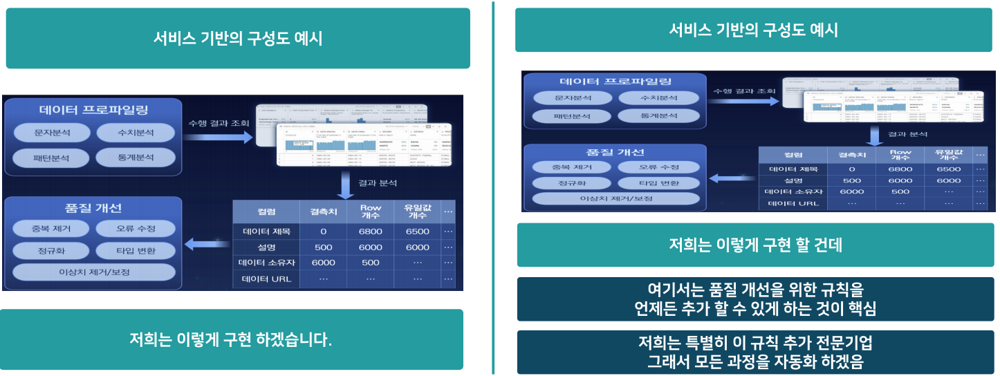

## 주요 사업에 따른 제안 전략

### [ SI 개발 프로젝트 ]
- **사업에 대한 이해도와 경험**이 높으며, **관련된 전문 인력**을 갖춘 회사라는 내용 필요
- 실제 기능 요구 사항에 대해서 **보다 구체적인 수행 방안**을 작성하는 것이 필요
- **PM의 전문성**과 **핵심 인력의 전문성** 표현

### [ 솔루션 기반 개발 프로젝트 ]
- **솔루션의 차별화**가 핵심
- 본 사업에서 핵심으로 여기는 사항에 대해, **자사의 솔루션만 제공하는 기능** 혹은 **자사의 솔루션이 더 좋은 명확한 내용** 중심의 설명
- 솔루션과 **관련된 도메인의 전문성**을 표현

### [ 웹 에이전시 개발 프로젝트 ]
- 웹 에이전시 개발의 경우 대부분 사용자의 경험을 고려한 **[UI/UX]** **기획 디자인이 핵심**인 경우 많음
- 본 사업과 유사한 레퍼런스 정보 표현
- 사업의 **요구 사항**에 따른 **UI/UX 작업이 이미 된 자료** 기반의 **경쟁력** 어필

## 제안 발표 방법

### [ 발표 스타일 ]
- 너무 딱딱하고 정중한 발표 보다, **자연스러운 발표**가 효과적
- 딱딱하고 정중하면, 자신감이 없거나 여유가 없어 보임
- 자연스러우면 **여유가 느껴지고 경험이 많아 보임**

### [ 발표 속도 ]
- 모두가 이해하기 쉽게 느리게 하는 게 좋다는, 의견도 있으나 실제 효과적인 것은 **강약**을 주는 방식
- 일반 속도로 진행하다가, **강조 포인트**에서 **속도를 조금 늦게 억양은 강하게**

### [ 발표 방법 ]
- 모든 페이지를 국어책 읽듯이 다 중요하다는 느낌으로 발표하는 것보다, **전체 페이지의 흐름을 이해**하고, 해당 흐름에 따라 **가볍게 설명**하고 넘어갈 페이지와 **아주 강조**해아 할 페이지를 **구분하여 설명**

## Q&A

### [ Q&A 개념 ]

**[제안발표] 는 사전에 준비된 내용, [Q&A]는 발표자가 미리 준비하기 힘든 질문에 대응**

- PM의 역할이 중요한 **SI 프로젝트 시**, 실제 평가자 중에 Q&A를 통해서 **PM의 경험과 역량을 확인하려는 시도**

- **"여유있게", "충분히 설득력 있는", "정확한"** 답을 줄 경우 평가에 큰 영향

 

### [ Q&A 준비 ]

**< 본 프로젝트 기술 부문 확인 질문 >**
- 제안 발표 자료에 나오는 기술이나 방법에 대한 질문
- 보통 발표 자료에서 설명한 내용을 다시 한번 확인 하거나 좀 더 기술적으로 점검하는 질문
- 제안 자료에 작성된! 내용에 대해서는, 단지 발표 입장에서 이해가 아니라 기술적인 이해도를 가능한 높여서 대비

 

**< 프로젝트 관리 역량 >**
- 특정 프로젝트의 종류와 관계 없이 일반적으로 프로젝트 관리 시 발생할 수 있는 상황에 대한 대응 역량 질문
- 보통은 사업과 관련해서 예상되는 이슈/리스크/문제 상황에 대한 대응 방법에 대한 질문이 많음
- 사전 질의로 준비해서 대응

---