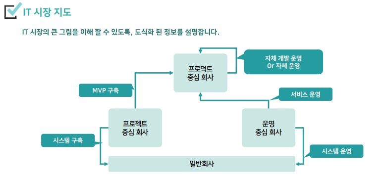

# IT 비즈니스 컨설팅 이해

## 기본 개념 이해하기
### IT 비즈니스 컨설팅의 역할
고객에게 **[ 서비스 기획 ]** 에 대한 컨설팅, 회사의 영업 기회를 높여주는 일을 함.

### IT 사업 주요 단계
사업 발주 → 수행업체 선정 → 발주 관점 프로젝트 관리

IT 서비스 기획 → IT 서비스 제안 → 프로젝트 관리

### IT 비즈니스 컨설턴트의 핵심 역량
1. 기술 영업 역할 - 고객이 원하는 서비스를 구체적으로 기획하는 역할
2. 기획 제안 역할 - 고객이 운하는 서비스를 구체적으로 기획하는 역할
3. 사업 기획 역할 - 다양한 사업의 전략적 구조 및 협업 관계 기획 역할
4. 사업 관리 역할 - 사업 수주 과정부터, 수행, 수행이후까지 관리하는 역할

- 개발자를 이해하는 것이 필요
- 실제에서는 넓은 범위의 역할을 진행. 
- 넓은 범위를 수행하거나, 특정 역할만 집중적으로 수행할 수도 있음.

1. 기술 영업
- 고객 요구사항 분석 - 어떻게 대응할 지 생각
- 기술적 질의 응답 및 설득 - 고객 입장에서는 IT 전문가라고 인식할 가능성이 높음
- 비용 분석 및 영업 과정 전략적 관리 - 사업의 모양을 전략적으로 기획
- 기본 고객 관리
2. 기획 제한
- 고객 요구에 따른 서비스 기획 - 고객이 원하는 것을 매력적으로 만드는 역할
- 개발과의 기술 검토 - 우리 회사에서 개발 가능한 범주 내에서 사업을 기획해야 함.
- 제안 자료 작성 역할 - 고객의 제안서 작성을 돕는 역할
- RFI 작성 역할
3. 사업 기획 역할
> 전략을 설계하고 협업을 계획하는 역할
- 진행중 발생하는 다양한 전략적 사업 구조 설계
- 협력사 검색 및 협업 구조 설계
- 제안 전략 수립 및 수행
- 계약 진행 및 관리
4. 사업 관리 역할
- 계약 이후 사업 수행 시 진행 관리
- PM으로 직접 관리 가능
- 별도 PM으로 진행되는 프로젝트 사업관리
- 프로젝트 완료 이후 관리 및 2차 영업

#### 핵심 역량
1. 기획을 위한 IT 지식 역량
2. 문서를 만드는 역량 - 기획 문서, 제안서, 발표 자료 등
3. 소통 역량 - 이해관계자들 간의 소통 역량 / 고객, 내부 개발팀, 협력회사 등
4. 프로젝트 관리 역량 - 프로젝트 진행 관리, 이슈/문제 해결, 새로운 기회 탐색

### IT 시장 지도

#### BM 관점 이해
1. 프로젝트 회사 - 많은 프로젝트 수주, 많은 개발
- [눈 앞에 있는 기업 고객] 사업을 잘 수주하는 방법 중심의 비즈니스 컨설팅
2. 프로덕트 회사 - 매력 있는 서비스, 더 많은 유저 더 많은 이용
- [눈에 보이지 않는 일반 고객] 서비스를 매력있게 기획하는 중심의 비즈니스 컨설팅
