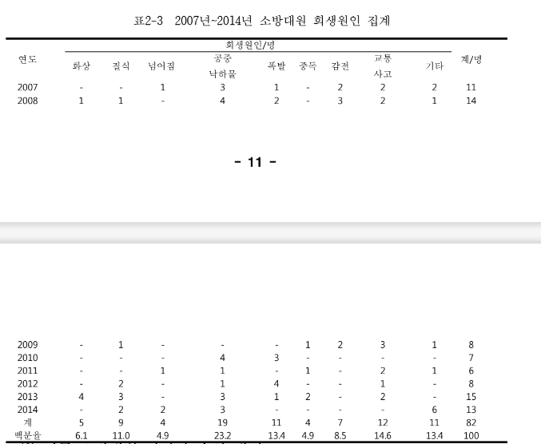
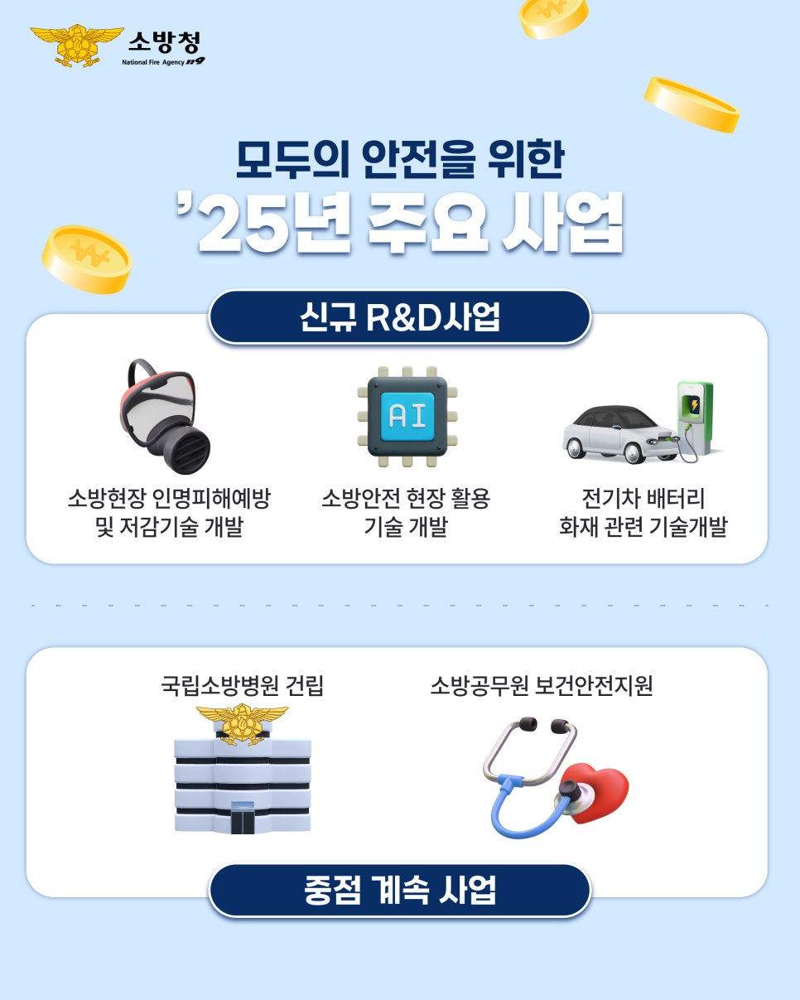

# 개인 자료 조사 모음

##  소방 관련 근거

### 순직 원인
중국인의 한국 대학교에서의 중국에 대한 연구




2025년도 소방청 예산안이 3,311억 원으로 편성

### 2025 소방청 R&D



### 관련 뉴스 자료

[동아일보] 전북소방본부가 전통시장 화재에 신속 대응하기 위해 전자지도 기반 '지능형 출동 시스템'을 구축해 출동 시간을 단축.<br>
https://www.donga.com/news/Society/article/all/20250630/131904577/2

[한국일보] 평택 냉동창고 화재 현장 소방관 3명 순직, 안전 미확보 상태에서 성급한 투입 명령 논란.<br>
https://www.hankookilbo.com/News/Read/A2022010717220003187

```
화재 인명구조에 특화된 부서에만 스마트 헬멧을 보급할 경우, 예상되는 비용을 추정해 보겠습니다. 정확한 통계가 없어 대략적인 추정치임을 감안해 주세요.

1. 인명구조 특화 부서 인력 추정
119구조대원: 전국 소방공무원 중 인명구조 활동을 주 임무로 하는 119구조대원은 약 5천 명에서 6천 명 수준으로 추정됩니다. (정확한 최신 인원은 소방청 내부 자료를 통해 확인해야 합니다.)

2023년 통계에서 119구조대가 연간 11만 3천여 명을 구조했다고 언급된 점, 그리고 커리어넷 직업정보에서 119구조대원이 소방관의 유사직업명으로 언급되는 점 등을 종합해 보면, 소방관 전체 인력 중 상당수가 119구조대 관련 임무를 수행합니다.

특수구조단/특수구조대: 중앙119구조본부 및 각 시도별로 운영되는 특수구조단/특수구조대는 고난도 재난에 대응하는 정예 인력입니다. 이들의 수는 119구조대원 전체보다는 훨씬 적습니다. 각 시도별로 1개 특수구조단이 운영되며, 각 단의 인원은 수십 명에서 백여 명 수준으로 예상됩니다. 전국적으로 따지면 수천 명을 넘지 않을 것입니다.

가장 보수적으로 "화재 인명구조에 특화된 곳"을 좁게 정의하여, 전국 특수구조단 및 주요 소방서의 핵심 인명구조대원 약 2,000명 ~ 5,000명으로 가정해 보겠습니다.

2. 헬멧 단가 추정 (열화상 + 통신 모듈)
이전 답변에서 열화상과 통신 모듈을 통합한 스마트 헬멧의 예상 단가를 **최소 미화 $1,500 ~ $5,000 (한화 약 200만 원 ~ 700만 원)**으로 추정했습니다. 중간값을 기준으로 개당 400만원으로 가정해 보겠습니다.

3. 총 예산 추정
가장 보수적인 추정 (2,000명 보급 시):

2,000명 * 4,000,000원/개 = 80억 원

보다 넓은 추정 (5,000명 보급 시):

5,000명 * 4,000,000원/개 = 200억 원

4. 추가 고려사항 (간접 비용)
위의 금액은 헬멧 자체의 구매 비용입니다. 여기에 다음 비용이 추가될 수 있습니다:

유지보수 및 수리 비용: 전자 장비이므로 고장 시 수리 및 부품 교체 비용이 발생합니다. 연간 총 구매 비용의 5~10% 이상을 예상할 수 있습니다.

소프트웨어 라이선스 및 업데이트: 예측 AI 솔루션 연동 및 헬멧 내 소프트웨어 업데이트 비용.

훈련 비용: 장비 사용법 교육, 유지보수 교육 등에 필요한 인건비 및 시설비.

물류 및 관리 비용: 장비 배포, 재고 관리 등에 필요한 비용.

결론
화재 인명구조에 특화된 부서(약 2,000명 ~ 5,000명)에 개당 400만원 상당의 스마트 헬멧을 보급한다고 가정할 경우, 초기 도입 비용은 최소 약 80억 원에서 최대 200억 원 수준이 될 것으로 예상됩니다.

여기에 유지보수, 훈련, 소프트웨어 등 간접 비용까지 고려하면 총 예산은 이보다 더 늘어날 것입니다.

이 정도 규모의 예산은 여전히 상당하지만, 전국 소방공무원 전체에 보급하는 3,300억 원에 비하면 훨씬 현실적인 규모이며, 특수 임무를 수행하는 소방관들의 안전과 효율성 향상이라는 측면에서 투자 가치가 충분히 있을 수 있는 금액입니다. 정부와 소방 당국의 의지에 따라 충분히 추진 가능한 사업 규모가 될 수 있습니다.
```